```mermaid
graph LR
    nemo_rl_utils_config["nemo_rl.utils.config"]
    nemo_rl_distributed_virtual_cluster["nemo_rl.distributed.virtual_cluster"]
    nemo_rl_distributed_worker_groups["nemo_rl.distributed.worker_groups"]
    nemo_rl_distributed_named_sharding["nemo_rl.distributed.named_sharding"]
    nemo_rl_distributed_batched_data_dict["nemo_rl.distributed.batched_data_dict"]
    nemo_rl_distributed_worker_group_utils["nemo_rl.distributed.worker_group_utils"]
    nemo_rl_utils_config -- "provides foundational configuration for" --> nemo_rl_distributed_virtual_cluster
    nemo_rl_utils_config -- "provides foundational configuration for" --> nemo_rl_distributed_worker_groups
    nemo_rl_utils_config -- "interacts with" --> nemo_rl_distributed_worker_group_utils
    nemo_rl_distributed_virtual_cluster -- "provisions resources for" --> nemo_rl_distributed_worker_groups
    nemo_rl_distributed_worker_groups -- "relies on" --> nemo_rl_distributed_batched_data_dict
    nemo_rl_distributed_worker_groups -- "utilizes functions from" --> nemo_rl_distributed_worker_group_utils
    nemo_rl_distributed_batched_data_dict -- "uses" --> nemo_rl_distributed_named_sharding
```

## Details

The Configuration & System Orchestration subsystem encompasses the nemo_rl.utils.config package for centralized configuration management and the nemo_rl.distributed package for coordinating distributed resources and data.

### nemo_rl.utils.config
Centralized management of project configurations, including loading from YAML files, handling inheritance, resolving paths, and parsing command-line overrides (Hydra). It serves as the single source of truth for system parameters, crucial for an ML toolkit with highly configurable experiments and model architectures.

**Related Classes/Methods**:

- <a href="https://github.com/NVIDIA-NeMo/RL/blob/main/nemo_rl/utils/config.py" target="_blank" rel="noopener noreferrer">`nemo_rl.utils.config`</a>

### nemo_rl.distributed.virtual_cluster
Orchestrates the allocation and management of distributed computing resources, specifically Ray placement groups. It handles the initialization, creation, and shutdown of these groups, providing the foundational infrastructure for distributed training and inference, aligning with the "Distributed Computing Pattern."

**Related Classes/Methods**:

- <a href="https://github.com/NVIDIA-NeMo/RL/blob/main/nemo_rl/distributed/virtual_cluster.py" target="_blank" rel="noopener noreferrer">`nemo_rl.distributed.virtual_cluster`</a>

### nemo_rl.distributed.worker_groups
Manages the lifecycle and execution of distributed workers within the Ray environment. It handles the creation of individual workers, distributes tasks, and collects results, supporting various data distribution strategies. This is a direct implementation of the "Actor-Learner" pattern common in RL.

**Related Classes/Methods**:

- <a href="https://github.com/NVIDIA-NeMo/RL/blob/main/nemo_rl/distributed/worker_groups.py" target="_blank" rel="noopener noreferrer">`nemo_rl.distributed.worker_groups`</a>

### nemo_rl.distributed.named_sharding
Defines and manages named sharding dimensions for distributed tensors, enabling flexible and explicit control over how data is distributed across different ranks and devices. This is vital for optimizing memory usage and computation in distributed deep learning.

**Related Classes/Methods**:

- <a href="https://github.com/NVIDIA-NeMo/RL/blob/main/nemo_rl/distributed/named_sharding.py" target="_blank" rel="noopener noreferrer">`nemo_rl.distributed.named_sharding`</a>

### nemo_rl.distributed.batched_data_dict
Manages and prepares batched data for distributed processing. This includes functionalities for chunking, sharding data by batch size, and creating efficient microbatch iterators. Efficient data handling is paramount for large-scale RLHF.

**Related Classes/Methods**:

- <a href="https://github.com/NVIDIA-NeMo/RL/blob/main/nemo_rl/distributed/batched_data_dict.py" target="_blank" rel="noopener noreferrer">`nemo_rl.distributed.batched_data_dict`</a>

### nemo_rl.distributed.worker_group_utils
Offers helper functions for merging configuration options and dictionaries, primarily used to consolidate settings for distributed worker groups. This supports the highly configurable nature of the project.

**Related Classes/Methods**:

- <a href="https://github.com/NVIDIA-NeMo/RL/blob/main/nemo_rl/distributed/worker_group_utils.py" target="_blank" rel="noopener noreferrer">`nemo_rl.distributed.worker_group_utils`</a>

### [FAQ](https://github.com/CodeBoarding/GeneratedOnBoardings/tree/main?tab=readme-ov-file#faq)