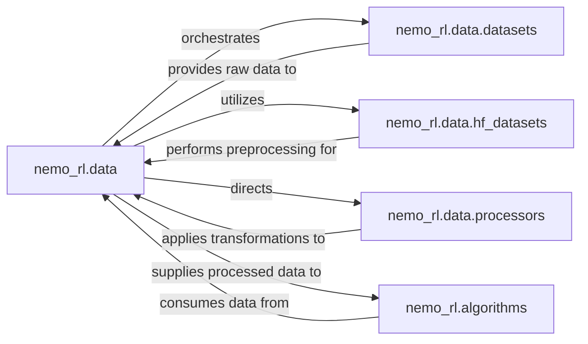

## Details

The `nemo_rl.data` subsystem is central to the `nemo_rl` project, managing the entire data lifecycle from raw ingestion to model-ready batches. It orchestrates several key internal components to achieve this. The `nemo_rl.data.datasets` module provides an abstraction for loading diverse datasets, acting as the initial entry point for raw data. For specialized preprocessing, particularly for Large Language Models, `nemo_rl.data.hf_datasets` integrates with the Hugging Face `transformers` library for tokenization and feature extraction. The `nemo_rl.data.processors` component is responsible for applying various data transformations and heavily leverages `torch` for efficient tensor operations and data manipulation. Finally, the prepared data batches are consumed by `nemo_rl.algorithms` for training and evaluation of Reinforcement Learning models. This structured approach ensures efficient and flexible data handling throughout the `nemo_rl` framework.

### nemo_rl.data
The overarching component responsible for orchestrating the entire data pipeline within `nemo_rl`. It manages the flow from raw data ingestion to the preparation of efficient batches for model training.

**Related Classes/Methods**:

- <a href="https://github.com/NVIDIA-NeMo/RL/blob/main/nemo_rl/data" target="_blank" rel="noopener noreferrer">`nemo_rl.data`</a>

### nemo_rl.data.datasets
This internal module acts as an abstraction layer for accessing and managing various datasets, including those from external libraries. It defines the structure and methods for loading raw, untransformed data into the `nemo_rl` data pipeline.

**Related Classes/Methods**:

- <a href="https://github.com/NVIDIA-NeMo/RL/blob/main/nemo_rl/data/datasets.py" target="_blank" rel="noopener noreferrer">`nemo_rl.data.datasets`</a>

### nemo_rl.data.hf_datasets
This module specifically integrates with the Hugging Face `transformers` library, providing functionalities for tokenization, feature extraction, and other model-specific preprocessing steps crucial for Large Language Models (LLMs).

**Related Classes/Methods**:

- <a href="https://github.com/NVIDIA-NeMo/RL/blob/main/nemo_rl/data/hf_datasets/" target="_blank" rel="noopener noreferrer">`nemo_rl.data.hf_datasets`</a>

### nemo_rl.data.processors
This component is responsible for applying various data transformations and preprocessing steps. It heavily utilizes `torch` for tensor operations, data manipulation, and preparing data into the required tensor format for deep learning models.

**Related Classes/Methods**:

- <a href="https://github.com/NVIDIA-NeMo/RL/blob/main/nemo_rl/data/processors.py" target="_blank" rel="noopener noreferrer">`nemo_rl.data.processors`</a>

### nemo_rl.algorithms
Represents the various Reinforcement Learning algorithms (e.g., PPO, DPO, SFT) within the `nemo_rl` framework. These components consume the prepared data batches from `nemo_rl.data` for model training and evaluation.

**Related Classes/Methods**:

- <a href="https://github.com/NVIDIA-NeMo/RL/blob/main/nemo_rl/algorithms" target="_blank" rel="noopener noreferrer">`nemo_rl.algorithms`</a>

### [FAQ](https://github.com/CodeBoarding/GeneratedOnBoardings/tree/main?tab=readme-ov-file#faq)