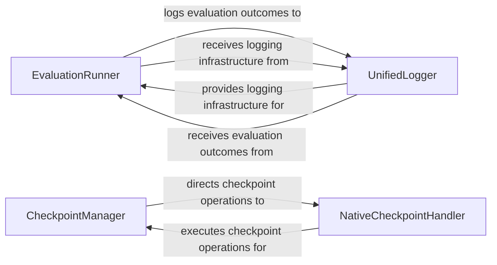

## Details

The `Evaluation & Observability` subsystem is defined by the following core modules and their functionalities: `nemo_rl.evals`: Handles the execution and orchestration of model evaluations. `nemo_rl.utils.checkpoint`: Manages the high-level logic for saving and restoring training checkpoints. `nemo_rl.utils.native_checkpoint`: Provides the low-level mechanisms for checkpoint serialization and deserialization. `nemo_rl.utils.logger`: Offers a unified interface for logging, monitoring, and metric collection.

### EvaluationRunner
Orchestrates and executes various evaluation passes (e.g., `eval_pass_k`, `eval_cons_k`) to assess the performance of fine-tuned LLMs in an RLHF context. It generates text responses for assessment, processes evaluation results, and incorporates mechanisms like majority voting for robust assessment. This component is crucial for an ML Toolkit as it provides the means to quantify model performance.

**Related Classes/Methods**:

- <a href="https://github.com/NVIDIA-NeMo/RL/blob/main/nemo_rl/evals" target="_blank" rel="noopener noreferrer">`nemo_rl.evals`</a>

### CheckpointManager
Manages the lifecycle of model and optimizer checkpoints, including saving, finalizing, removing older checkpoints, and providing access to the best or latest saved states. This ensures fault tolerance, enables resuming training from a specific point, and facilitates the deployment of specific model versions. In a Deep Learning Library, robust checkpointing is fundamental for long-running, resource-intensive training jobs.

**Related Classes/Methods**:

- <a href="https://github.com/NVIDIA-NeMo/RL/blob/main/nemo_rl/utils/checkpoint.py" target="_blank" rel="noopener noreferrer">`nemo_rl.utils.checkpoint`</a>

### NativeCheckpointHandler
Provides the underlying mechanism for the serialization and deserialization of the model's and optimizer's internal states. It is responsible for the direct data persistence of training progress, abstracting the storage details from the higher-level `CheckpointManager`. This component is vital for abstracting the persistence layer, allowing `CheckpointManager` to focus on policy rather than mechanism.

**Related Classes/Methods**:

- <a href="https://github.com/NVIDIA-NeMo/RL/blob/main/nemo_rl/utils/native_checkpoint.py" target="_blank" rel="noopener noreferrer">`nemo_rl.utils.native_checkpoint`</a>

### UnifiedLogger
Offers a comprehensive and unified interface for logging, monitoring, and metric collection across the system. It integrates with various external logging backends (e.g., Weights & Biases, Tensorboard, MLflow), logs training metrics, hyperparameters, and collects system-level information such as GPU metrics, crucial for understanding distributed training performance. For any ML Toolkit, comprehensive logging and observability are essential for debugging, performance tuning, and tracking experimental results.

**Related Classes/Methods**:

- <a href="https://github.com/NVIDIA-NeMo/RL/blob/main/nemo_rl/utils/logger.py" target="_blank" rel="noopener noreferrer">`nemo_rl.utils.logger`</a>

### [FAQ](https://github.com/CodeBoarding/GeneratedOnBoardings/tree/main?tab=readme-ov-file#faq)