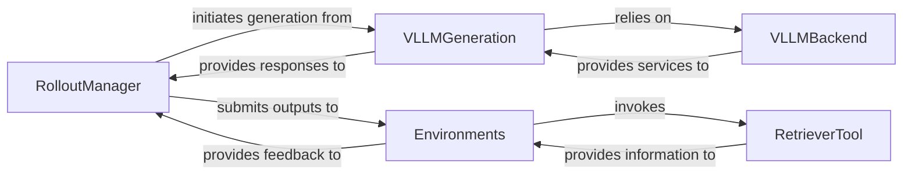

## Details

The `Experience Generation & Environments` subsystem is responsible for generating interaction data (rollouts) by having policy models interact with various task environments, leveraging an optimized inference engine (vLLM) for generation.

### RolloutManager
The central orchestrator for generating experience data (rollouts). It manages the sequence of interactions, prompts the policy model for responses, submits these responses to various environments for evaluation, and collects feedback (rewards, next states) to construct the rollout trajectories. This component embodies the "Actor" role in an Actor-Learner RL architecture.

**Related Classes/Methods**:

- <a href="https://github.com/NVIDIA-NeMo/RL/blob/main/nemo_rl/experience/rollouts.py" target="_blank" rel="noopener noreferrer">`nemo_rl.experience.rollouts.RolloutManager`</a>

### VLLMGeneration
Provides the high-level interface for policy inference, leveraging the vLLM engine for efficient and scalable text generation. It abstracts the complexities of the underlying vLLM library, managing worker allocation and asynchronous requests to generate responses based on prompts from the `RolloutManager`.

**Related Classes/Methods**:

- <a href="https://github.com/NVIDIA-NeMo/RL/blob/main/nemo_rl/models/generation/vllm/vllm_generation.py#L41-L751" target="_blank" rel="noopener noreferrer">`nemo_rl.models.generation.vllm.vllm_generation.VLLMGeneration`:41-751</a>

### Environments [[Expand]](./Environments.md)
A conceptual component representing the collection of various task environments (e.g., `CodeEnvironment`, `MathEnvironment`, `VLMEnvironment`, `SlidingPuzzleEnvironment`). Each environment simulates a specific task, receives policy outputs, executes them within its domain, and returns structured feedback (e.g., correctness, score, reward) to the `RolloutManager`. This is critical for the "Environment" aspect of RL.

**Related Classes/Methods**:

- <a href="https://github.com/NVIDIA-NeMo/RL/blob/main/nemo_rl/environments/code_environment.py" target="_blank" rel="noopener noreferrer">`nemo_rl.environments.code_environment`</a>
- <a href="https://github.com/NVIDIA-NeMo/RL/blob/main/nemo_rl/environments/math_environment.py" target="_blank" rel="noopener noreferrer">`nemo_rl.environments.math_environment`</a>
- <a href="https://github.com/NVIDIA-NeMo/RL/blob/main/nemo_rl/environments/vlm_environment.py" target="_blank" rel="noopener noreferrer">`nemo_rl.environments.vlm_environment`</a>
- <a href="https://github.com/NVIDIA-NeMo/RL/blob/main/nemo_rl/environments/games/sliding_puzzle.py" target="_blank" rel="noopener noreferrer">`nemo_rl.environments.games.sliding_puzzle`</a>

### VLLMBackend
Handles low-level backend operations for the vLLM inference engine, specifically concerning the updating and management of model weights across distributed devices. It ensures efficient model serving and provides the foundational infrastructure for `VLLMGeneration`.

**Related Classes/Methods**:

- <a href="https://github.com/NVIDIA-NeMo/RL/blob/main/nemo_rl/models/generation/vllm/vllm_backend.py" target="_blank" rel="noopener noreferrer">`nemo_rl.models.generation.vllm.vllm_backend.VLLMBackend`</a>

### RetrieverTool
Functions as an integrated utility within specific environments (e.g., `CodeEnvironment`, `MathEnvironment`, `VLMEnvironment`) to provide information retrieval capabilities. It allows environments to access external knowledge or data based on an index, enriching the complexity and realism of the evaluation tasks.

**Related Classes/Methods**:

- <a href="https://github.com/NVIDIA-NeMo/RL/blob/main/nemo_rl/environments/tools/retriever.py" target="_blank" rel="noopener noreferrer">`nemo_rl.environments.tools.retriever.RetrieverTool`</a>

### [FAQ](https://github.com/CodeBoarding/GeneratedOnBoardings/tree/main?tab=readme-ov-file#faq)