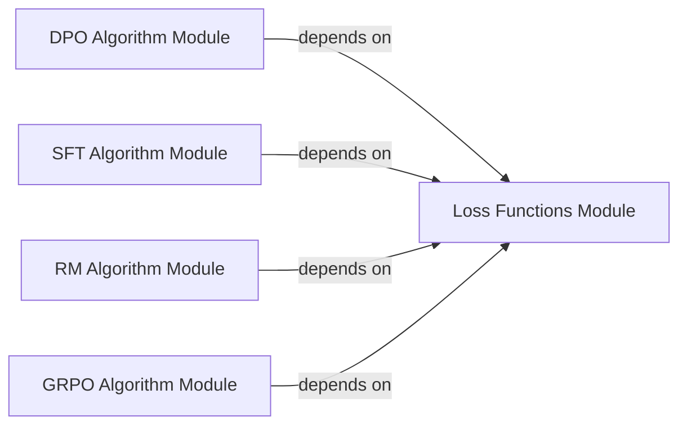

## Details

The `RL Algorithm Engine` subsystem is a core part of the project, responsible for implementing and orchestrating various Reinforcement Learning algorithms for large language models.

### SFT Algorithm Module
Orchestrates the supervised fine-tuning process for language models. Its responsibilities include managing the training loop, handling validation, and implementing checkpointing mechanisms.

**Related Classes/Methods**:

- <a href="https://github.com/NVIDIA-NeMo/RL/blob/main/nemo_rl/algorithms/sft.py" target="_blank" rel="noopener noreferrer">`sft`</a>

### GRPO Algorithm Module
Implements the Generalized Reinforcement Policy Optimization algorithm. It is responsible for managing policy updates, orchestrating experience rollouts, performing validation, and ensuring state persistence.

**Related Classes/Methods**:

- <a href="https://github.com/NVIDIA-NeMo/RL/blob/main/nemo_rl/algorithms/grpo.py" target="_blank" rel="noopener noreferrer">`grpo`</a>

### DPO Algorithm Module
Manages the Direct Preference Optimization training process. This includes preparing data (e.g., adding reference log-probabilities), computing DPO-specific losses, handling validation, and managing checkpointing.

**Related Classes/Methods**:

- <a href="https://github.com/NVIDIA-NeMo/RL/blob/main/nemo_rl/algorithms/dpo.py" target="_blank" rel="noopener noreferrer">`dpo`</a>

### RM Algorithm Module
Handles the training of Reward Models. Its responsibilities encompass the training loop, validation using specific metrics (e.g., `RMValMetrics`), and saving the model's state.

**Related Classes/Methods**:

- <a href="https://github.com/NVIDIA-NeMo/RL/blob/main/nemo_rl/algorithms/rm.py" target="_blank" rel="noopener noreferrer">`rm`</a>

### Loss Functions Module
Provides a collection of mathematical functions essential for computing various losses required by the RL algorithms, such as preference loss and DPO loss. It also handles necessary data manipulation for these calculations.

**Related Classes/Methods**:

- <a href="https://github.com/NVIDIA-NeMo/RL/blob/main/nemo_rl/algorithms/loss_functions.py" target="_blank" rel="noopener noreferrer">`loss_functions`</a>

### [FAQ](https://github.com/CodeBoarding/GeneratedOnBoardings/tree/main?tab=readme-ov-file#faq)