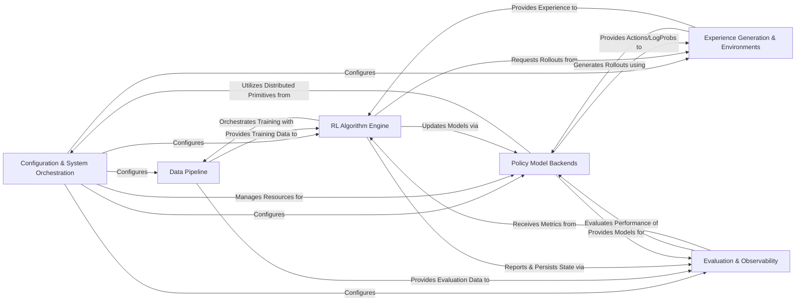

## Details

The `RL` project is architected as a highly modular and scalable deep learning library for Reinforcement Learning from Human Feedback (RLHF) on large language models. At its core, the **Configuration & System Orchestration** component provides the foundational setup, dynamically configuring all other modules and managing distributed computing resources. The **Data Pipeline** efficiently handles data ingestion and preprocessing, supplying both training and evaluation datasets. The central **RL Algorithm Engine** orchestrates the entire training process, implementing various RL algorithms and interacting with the **Policy Model Backends** for model updates and distributed training. To generate interaction data, the **Experience Generation & Environments** component simulates the "actor" role, leveraging the policy models and an optimized inference engine to interact with diverse task environments. All training progress, model performance, and system health are meticulously tracked and managed by the **Evaluation & Observability** component, which also handles checkpointing for fault tolerance. This architecture emphasizes clear component boundaries, enabling flexible integration of different models, algorithms, and distributed backends, making it ideal for large-scale, configurable RLHF experiments.

### Configuration & System Orchestration [[Expand]](./Configuration_System_Orchestration.md)
Centralized management of project configurations (YAML) and coordination of distributed resources (Ray placement groups, worker groups) for training and inference.

**Related Classes/Methods**:

- <a href="https://github.com/NVIDIA-NeMo/RL/blob/main/nemo_rl/utils/config.py" target="_blank" rel="noopener noreferrer">`nemo_rl.utils.config`</a>
- <a href="https://github.com/NVIDIA-NeMo/RL/blob/main/nemo_rl/distributed/" target="_blank" rel="noopener noreferrer">`nemo_rl.distributed`</a>

### Data Pipeline [[Expand]](./Data_Pipeline.md)
Handles loading, preprocessing, and batching of multimodal and conversational datasets for training and evaluation.

**Related Classes/Methods**:

- <a href="https://github.com/NVIDIA-NeMo/RL/blob/main/nemo_rl/data/" target="_blank" rel="noopener noreferrer">`nemo_rl.data`</a>

### RL Algorithm Engine [[Expand]](./RL_Algorithm_Engine.md)
Implements the core logic for various RL algorithms (SFT, GRPO, DPO, RM), managing the training loop, loss computation, and model updates.

**Related Classes/Methods**:

- <a href="https://github.com/NVIDIA-NeMo/RL/blob/main/nemo_rl/algorithms/" target="_blank" rel="noopener noreferrer">`nemo_rl.algorithms`</a>

### Policy Model Backends
Manages and trains large language models using either PyTorch DTensor or NVIDIA Megatron Core for distributed operations, including model loading and log-probability calculations.

**Related Classes/Methods**:

- <a href="https://github.com/NVIDIA-NeMo/RL/blob/main/nemo_rl/models/policy/" target="_blank" rel="noopener noreferrer">`nemo_rl.models.policy`</a>
- <a href="https://github.com/NVIDIA-NeMo/RL/blob/main/nemo_rl/models/dtensor/" target="_blank" rel="noopener noreferrer">`nemo_rl.models.dtensor`</a>
- <a href="https://github.com/NVIDIA-NeMo/RL/blob/main/nemo_rl/models/megatron/" target="_blank" rel="noopener noreferrer">`nemo_rl.models.megatron`</a>

### Experience Generation & Environments [[Expand]](./Experience_Generation_Environments.md)
Generates interaction data (rollouts) by having policy models interact with various task environments, leveraging an optimized inference engine (vLLM) for generation.

**Related Classes/Methods**:

- <a href="https://github.com/NVIDIA-NeMo/RL/blob/main/nemo_rl/experience/rollouts.py" target="_blank" rel="noopener noreferrer">`nemo_rl.experience.rollouts`</a>
- <a href="https://github.com/NVIDIA-NeMo/RL/blob/main/nemo_rl/environments/" target="_blank" rel="noopener noreferrer">`nemo_rl.environments`</a>
- <a href="https://github.com/NVIDIA-NeMo/RL/blob/main/nemo_rl/models/generation/vllm" target="_blank" rel="noopener noreferrer">`nemo_rl.models.generation.vllm`</a>

### Evaluation & Observability [[Expand]](./Evaluation_Observability.md)
Conducts comprehensive model evaluations, manages checkpointing for fault tolerance, and provides logging/monitoring of training progress and system metrics.

**Related Classes/Methods**:

- <a href="https://github.com/NVIDIA-NeMo/RL/blob/main/nemo_rl/evals/" target="_blank" rel="noopener noreferrer">`nemo_rl.evals`</a>
- <a href="https://github.com/NVIDIA-NeMo/RL/blob/main/nemo_rl/utils/checkpoint.py" target="_blank" rel="noopener noreferrer">`nemo_rl.utils.checkpoint`</a>
- <a href="https://github.com/NVIDIA-NeMo/RL/blob/main/nemo_rl/utils/native_checkpoint.py" target="_blank" rel="noopener noreferrer">`nemo_rl.utils.native_checkpoint`</a>
- <a href="https://github.com/NVIDIA-NeMo/RL/blob/main/nemo_rl/utils/logger.py" target="_blank" rel="noopener noreferrer">`nemo_rl.utils.logger`</a>

### [FAQ](https://github.com/CodeBoarding/GeneratedOnBoardings/tree/main?tab=readme-ov-file#faq)