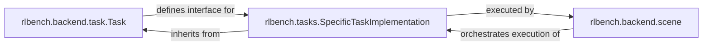

## Details

The "Modular Task Definitions" subsystem in RLBench is built around a clear separation of concerns. The `rlbench.backend.task.Task` component serves as an abstract blueprint, defining the common interface and foundational structure for all robotic manipulation tasks. Concrete task implementations, represented by `rlbench.tasks.SpecificTaskImplementation`, extend this blueprint, providing the specific logic and parameters for individual tasks. The `rlbench.backend.scene` component acts as the central orchestrator of the simulation environment. It is responsible for loading and managing the lifecycle of these specific task implementations, invoking their methods to drive the simulation, and ensuring their proper execution within the broader RLBench framework. This architecture promotes modularity, reusability, and extensibility, allowing new tasks to be easily integrated into the simulation environment.

### rlbench.backend.task.Task
This is the foundational abstract class that all specific robotic manipulation tasks must inherit from. It establishes a standardized interface and provides common utilities, state management, and object handling mechanisms that promote code reuse and ensure consistency across different task implementations. It acts as the blueprint for defining any new task within the RLBench environment.

**Related Classes/Methods**:

- <a href="https://github.com/stepjam/RLBench/blob/master/rlbench/backend/task.py#L25-L415" target="_blank" rel="noopener noreferrer">`rlbench.backend.task.Task`:25-415</a>

### rlbench.tasks.SpecificTaskImplementation
This component represents the collection of concrete classes, each defining the precise details of a particular robotic manipulation task. Each class implements the abstract methods defined in `rlbench.backend.task.Task`, such as `init_task()` for static setup (e.g., loading models) and `init_episode()` for dynamic initialization (e.g., randomizing object positions). They also define task-specific success conditions, reward functions, and any necessary helper methods. These are the pluggable modules that encapsulate distinct learning problems.

**Related Classes/Methods**:

- <a href="https://github.com/stepjam/RLBench/blob/master/rlbench/tasks/empty_container.py" target="_blank" rel="noopener noreferrer">`rlbench.tasks.empty_container`</a>
- <a href="https://github.com/stepjam/RLBench/blob/master/rlbench/tasks/place_cups.py" target="_blank" rel="noopener noreferrer">`rlbench.tasks.place_cups`</a>

### rlbench.backend.scene
While external to the core `Modular Task Definitions` subsystem, `rlbench.backend.scene` is a critical component that manages the overall simulation environment. It is responsible for loading the chosen task, orchestrating its lifecycle, and invoking its `init_task`, `init_episode`, and other methods during simulation execution. It acts as the primary client and executor of the modular task definitions, integrating them into the broader RLBench environment.

**Related Classes/Methods**:

- <a href="https://github.com/stepjam/RLBench/blob/master/rlbench/backend/scene.py" target="_blank" rel="noopener noreferrer">`rlbench.backend.scene`</a>

### [FAQ](https://github.com/CodeBoarding/GeneratedOnBoardings/tree/main?tab=readme-ov-file#faq)