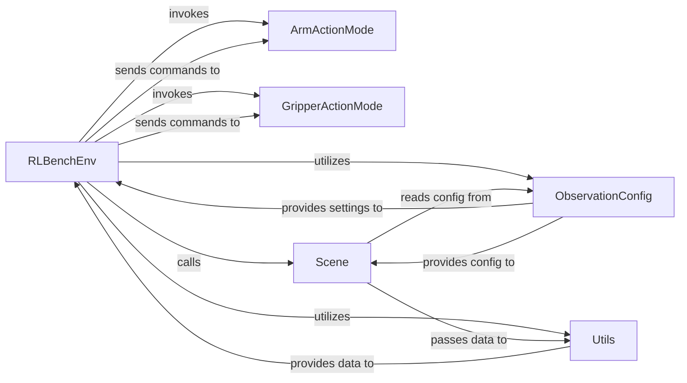

## Details

The RLBenchEnv acts as the central orchestrator, implementing the OpenAI Gym interface to manage the simulation lifecycle. It delegates the translation of high-level agent actions to ArmActionMode and GripperActionMode, which convert these into low-level commands for the simulation. For observations, RLBenchEnv interacts with the Scene component to retrieve raw simulation data, configured by ObservationConfig. The Scene further utilizes Utils to process this raw data before it is provided back to RLBenchEnv for agent consumption. ObservationConfig also directly provides settings to RLBenchEnv to guide observation collection.

### RLBenchEnv
The core orchestrator, implementing the OpenAI Gym interface. It manages the step() and reset() methods, coordinating the execution of actions and the collection of observations. It serves as the primary interface for the agent.

**Related Classes/Methods**:

- <a href="https://github.com/stepjam/RLBench/blob/master/rlbench/gym.py#L20-L121" target="_blank" rel="noopener noreferrer">`rlbench.gym.RLBenchEnv`:20-121</a>

### ArmActionMode
Responsible for translating high-level arm action commands (e.g., desired pose, joint velocities) from the RLBenchEnv into low-level commands executable by the simulation core. It encapsulates the specific logic for arm control.

**Related Classes/Methods**:

- <a href="https://github.com/stepjam/RLBench/blob/master/rlbench/action_modes/arm_action_modes.py#L45-L65" target="_blank" rel="noopener noreferrer">`rlbench.action_modes.arm_action_modes.ArmActionMode`:45-65</a>

### GripperActionMode
Processes high-level gripper action commands (e.g., open/close state) from the RLBenchEnv and converts them into low-level simulation commands. It handles the specific logic for gripper control.

**Related Classes/Methods**:

- <a href="https://github.com/stepjam/RLBench/blob/master/rlbench/action_modes/gripper_action_modes.py#L16-L37" target="_blank" rel="noopener noreferrer">`rlbench.action_modes.gripper_action_modes.GripperActionMode`:16-37</a>

### Scene
Acts as the direct interface to the CoppeliaSim environment for data retrieval. It fetches raw observation data, including camera images (RGB, depth, mask) and miscellaneous simulation states, based on the configured observation settings.

**Related Classes/Methods**:

- <a href="https://github.com/stepjam/RLBench/blob/master/rlbench/backend/scene.py#L25-L561" target="_blank" rel="noopener noreferrer">`rlbench.backend.scene.Scene`:25-561</a>

### ObservationConfig
Defines and holds the configuration for what types of observations (e.g., camera views, low-dimensional states) should be collected from the simulation. This allows for flexible and customizable observation spaces.

**Related Classes/Methods**:

- <a href="https://github.com/stepjam/RLBench/blob/master/rlbench/observation_config.py#L35-L108" target="_blank" rel="noopener noreferrer">`rlbench.observation_config.ObservationConfig`:35-108</a>

### Utils
Provides helper functions for processing raw simulation data into structured and usable formats. This includes tasks like converting raw float arrays into image formats (RGB, grayscale) suitable for consumption by the agent or further processing.

**Related Classes/Methods**: _None_

### [FAQ](https://github.com/CodeBoarding/GeneratedOnBoardings/tree/main?tab=readme-ov-file#faq)