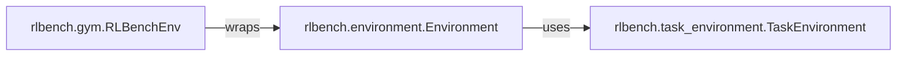

## Details

The RLBench Environment API subsystem is a core part of the RLBench project, serving as the primary interface for external agents to interact with the simulation. It encapsulates the environment's lifecycle, task management, and the standardized interaction points for reinforcement learning algorithms.

### rlbench.environment.Environment
The central component acting as the primary interface for external agents. It manages the simulation lifecycle (launch, shutdown), provides task instances, and orchestrates the flow of observations and actions between the agent and the simulation. It also handles task loading and state management, embodying the "Environment Abstraction Layer" pattern.

**Related Classes/Methods**:

- <a href="https://github.com/stepjam/RLBench/blob/master/rlbench/environment.py#L27-L205" target="_blank" rel="noopener noreferrer">`rlbench.environment.Environment`:27-205</a>

### rlbench.task_environment.TaskEnvironment
Encapsulates the specific logic, state, and variations for an individual reinforcement learning task. It manages task-specific resets and handles different task configurations (variations). This component implements the "Modular Task Design" pattern, allowing for distinct and pluggable learning problems within the RLBench framework.

**Related Classes/Methods**:

- <a href="https://github.com/stepjam/RLBench/blob/master/rlbench/task_environment.py#L23-L169" target="_blank" rel="noopener noreferrer">`rlbench.task_environment.TaskEnvironment`:23-169</a>

### rlbench.gym.RLBenchEnv
Provides a standardized Gymnasium (formerly OpenAI Gym) API for interacting with the RLBench environment. It translates the internal state and action spaces of RLBench into the widely adopted Gym format, ensuring compatibility with various reinforcement learning algorithms and frameworks. This component is crucial for the "Agent-Environment Interaction" aspect of an ML Toolkit, facilitating seamless integration with existing RL ecosystems.

**Related Classes/Methods**:

- <a href="https://github.com/stepjam/RLBench/blob/master/rlbench/gym.py#L20-L121" target="_blank" rel="noopener noreferrer">`rlbench.gym.RLBenchEnv`:20-121</a>

### [FAQ](https://github.com/CodeBoarding/GeneratedOnBoardings/tree/main?tab=readme-ov-file#faq)