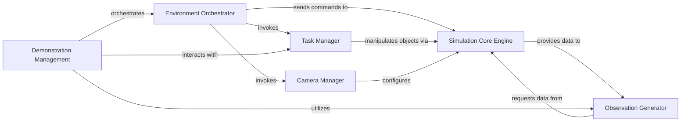

## Details

The RLBench simulation environment is orchestrated by the `Environment Orchestrator`, which manages the overall lifecycle, including scene setup and episode advancement. It delegates specific responsibilities such as task object placement to the `Task Manager` and camera configuration to the `Camera Manager`. The `Simulation Core Engine` serves as the direct interface to the underlying CoppeliaSim/PyRep backend, executing commands from the `Environment Orchestrator` and `Task Manager`, and producing raw simulation data based on configurations set by the `Camera Manager`. The `Observation Generator` is responsible for retrieving and processing this raw data from the `Simulation Core Engine` to form structured observations for the agent. Finally, `Demonstration Management` oversees the entire process for recording or replaying expert trajectories, coordinating with the `Environment Orchestrator`, `Observation Generator`, and `Task Manager`.

### Simulation Core Engine
The lowest-level interface to the CoppeliaSim/PyRep backend. It directly handles physics updates, rendering, robot joint control, and scene graph manipulation. It is the direct executor of simulation commands.

**Related Classes/Methods**:

- <a href="https://github.com/stepjam/RLBench/blob/master/rlbench/backend/scene.py#L25-L561" target="_blank" rel="noopener noreferrer">`rlbench.backend.scene.Scene`:25-561</a>

### Environment Orchestrator
Manages the overall lifecycle of the simulation environment. This includes initial setup of the scene, preparing for new learning episodes (e.g., resetting the environment, initializing tasks), and advancing the simulation by single time steps.

**Related Classes/Methods**:

- <a href="https://github.com/stepjam/RLBench/blob/master/rlbench/backend/scene.py" target="_blank" rel="noopener noreferrer">`rlbench.backend.scene.Scene:__init__`</a>
- <a href="https://github.com/stepjam/RLBench/blob/master/rlbench/backend/scene.py" target="_blank" rel="noopener noreferrer">`rlbench.backend.scene.Scene:init_episode`</a>
- <a href="https://github.com/stepjam/RLBench/blob/master/rlbench/backend/scene.py" target="_blank" rel="noopener noreferrer">`rlbench.backend.scene.Scene:step`</a>

### Observation Generator
Responsible for gathering and processing all types of sensory data from the simulation, such as RGB images, depth maps, semantic masks, and miscellaneous robot/scene state data. It aggregates raw simulation outputs into structured observations for the agent.

**Related Classes/Methods**:

- <a href="https://github.com/stepjam/RLBench/blob/master/rlbench/backend/scene.py" target="_blank" rel="noopener noreferrer">`rlbench.backend.scene.Scene:get_observation`</a>
- <a href="https://github.com/stepjam/RLBench/blob/master/rlbench/backend/scene.py" target="_blank" rel="noopener noreferrer">`rlbench.backend.scene.Scene:retrieve_rgb_depth`</a>
- <a href="https://github.com/stepjam/RLBench/blob/master/rlbench/backend/scene.py" target="_blank" rel="noopener noreferrer">`rlbench.backend.scene.Scene:retrieve_misc_data`</a>
- <a href="https://github.com/stepjam/RLBench/blob/master/rlbench/backend/scene.py" target="_blank" rel="noopener noreferrer">`rlbench.backend.scene.Scene:retrieve_mask`</a>
- <a href="https://github.com/stepjam/RLBench/blob/master/rlbench/backend/scene.py" target="_blank" rel="noopener noreferrer">`rlbench.backend.scene.Scene:retrieve_camera_data`</a>

### Task Manager
Handles the initialization and placement of task-specific objects within the virtual scene. It ensures that the environment is correctly configured for a given learning task at the start of each episode.

**Related Classes/Methods**:

- <a href="https://github.com/stepjam/RLBench/blob/master/rlbench/backend/scene.py" target="_blank" rel="noopener noreferrer">`rlbench.backend.scene.Scene:initialize_task`</a>
- <a href="https://github.com/stepjam/RLBench/blob/master/rlbench/backend/scene.py" target="_blank" rel="noopener noreferrer">`rlbench.backend.scene.Scene:place_task_objects`</a>

### Camera Manager
Manages the configuration and properties of virtual cameras within the simulation. This includes setting camera positions, orientations, and specific rendering properties (e.g., for RGB, depth, or mask generation).

**Related Classes/Methods**:

- <a href="https://github.com/stepjam/RLBench/blob/master/rlbench/backend/scene.py" target="_blank" rel="noopener noreferrer">`rlbench.backend.scene.Scene:set_camera_properties`</a>
- <a href="https://github.com/stepjam/RLBench/blob/master/rlbench/backend/scene.py" target="_blank" rel="noopener noreferrer">`rlbench.backend.scene.Scene:set_rgb_properties`</a>
- <a href="https://github.com/stepjam/RLBench/blob/master/rlbench/backend/scene.py" target="_blank" rel="noopener noreferrer">`rlbench.backend.scene.Scene:set_mask_properties`</a>

### Demonstration Management
Facilitates the recording and handling of expert demonstrations. It orchestrates the simulation steps, observation capture, and state logging required to generate or replay pre-recorded trajectories.

**Related Classes/Methods**:

- <a href="https://github.com/stepjam/RLBench/blob/master/rlbench/backend/scene.py" target="_blank" rel="noopener noreferrer">`rlbench.backend.scene.Scene:record_demonstration`</a>
- <a href="https://github.com/stepjam/RLBench/blob/master/rlbench/backend/scene.py" target="_blank" rel="noopener noreferrer">`rlbench.backend.scene.Scene:handle_demo_record_step`</a>

### [FAQ](https://github.com/CodeBoarding/GeneratedOnBoardings/tree/main?tab=readme-ov-file#faq)