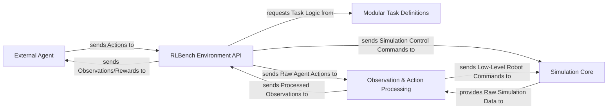

## Details

The RLBench system is designed with a clear separation of concerns, facilitating modularity and extensibility for robotic reinforcement learning research. At its core, the RLBench Environment API acts as the central orchestrator, providing a high-level interface for an External Agent to interact with the simulated environment. This API manages the simulation lifecycle and coordinates data flow. The Simulation Core, powered by CoppeliaSim and PyRep, handles the low-level physics, rendering, and robot control, serving as the backbone for the virtual world. Modular Task Definitions encapsulate specific robotic manipulation problems, allowing for easy addition and modification of tasks. Bridging the gap between the high-level agent actions and low-level simulation commands, and vice-versa, is the Observation & Action Processing layer, which ensures data is correctly transformed for both the agent and the simulator. This architecture promotes a clear data flow, enabling researchers to focus on agent development while RLBench handles the complexities of the simulation environment.

### External Agent
Represents the learning algorithm (e.g., a reinforcement learning agent) or a human operator that interacts with the RLBench environment. This component is external to the RLBench codebase itself, hence no internal source code references are provided. Its inclusion is for illustrating the system's interaction with external entities.

**Related Classes/Methods**: _None_

### RLBench Environment API [[Expand]](./RLBench_Environment_API.md)
The primary interface for external agents to interact with the RLBench simulation. It manages the simulation lifecycle (launch, shutdown), provides task instances, and orchestrates the flow of observations and actions between the agent and the simulation. It also handles task loading and state management.

**Related Classes/Methods**:

- <a href="https://github.com/stepjam/RLBench/blob/master/rlbench/environment.py#L30-L78" target="_blank" rel="noopener noreferrer">`rlbench.environment.__init__`:30-78</a>
- <a href="https://github.com/stepjam/RLBench/blob/master/rlbench/environment.py#L141-L154" target="_blank" rel="noopener noreferrer">`rlbench.environment.get_task`:141-154</a>
- <a href="https://github.com/stepjam/RLBench/blob/master/rlbench/environment.py#L97-L134" target="_blank" rel="noopener noreferrer">`rlbench.environment.launch`:97-134</a>
- <a href="https://github.com/stepjam/RLBench/blob/master/rlbench/gym.py#L101-L114" target="_blank" rel="noopener noreferrer">`rlbench.gym.reset`:101-114</a>
- <a href="https://github.com/stepjam/RLBench/blob/master/rlbench/gym.py#L116-L118" target="_blank" rel="noopener noreferrer">`rlbench.gym.step`:116-118</a>
- <a href="https://github.com/stepjam/RLBench/blob/master/rlbench/task_environment.py#L75-L90" target="_blank" rel="noopener noreferrer">`rlbench.task_environment.reset`:75-90</a>
- <a href="https://github.com/stepjam/RLBench/blob/master/rlbench/task_environment.py#L65-L70" target="_blank" rel="noopener noreferrer">`rlbench.task_environment.set_variation`:65-70</a>

### Simulation Core [[Expand]](./Simulation_Core.md)
The low-level simulation engine, primarily powered by CoppeliaSim via PyRep. It is responsible for physics simulation, rendering, robot control, and managing the virtual scene. It executes low-level commands and provides raw simulation data.

**Related Classes/Methods**:

- <a href="https://github.com/stepjam/RLBench/blob/master/rlbench/backend/scene.py#L30-L80" target="_blank" rel="noopener noreferrer">`rlbench.backend.scene.__init__`:30-80</a>
- <a href="https://github.com/stepjam/RLBench/blob/master/rlbench/backend/scene.py#L114-L151" target="_blank" rel="noopener noreferrer">`rlbench.backend.scene.init_episode`:114-151</a>
- <a href="https://github.com/stepjam/RLBench/blob/master/rlbench/backend/scene.py#L314-L318" target="_blank" rel="noopener noreferrer">`rlbench.backend.scene.step`:314-318</a>
- <a href="https://github.com/stepjam/RLBench/blob/master/rlbench/backend/scene.py#L173-L312" target="_blank" rel="noopener noreferrer">`rlbench.backend.scene.get_observation`:173-312</a>

### Modular Task Definitions [[Expand]](./Modular_Task_Definitions.md)
A collection of specific robotic manipulation tasks, each implemented as a distinct module. These modules define the initial conditions, success criteria, reward functions, and specific logic for a given learning problem. They are designed to be pluggable and extensible.

**Related Classes/Methods**:

- <a href="https://github.com/stepjam/RLBench/blob/master/rlbench/tasks/empty_container.py#L22-L32" target="_blank" rel="noopener noreferrer">`rlbench.tasks.empty_container.init_task`:22-32</a>
- <a href="https://github.com/stepjam/RLBench/blob/master/rlbench/tasks/empty_container.py#L34-L79" target="_blank" rel="noopener noreferrer">`rlbench.tasks.empty_container.init_episode`:34-79</a>
- <a href="https://github.com/stepjam/RLBench/blob/master/rlbench/tasks/place_cups.py#L14-L28" target="_blank" rel="noopener noreferrer">`rlbench.tasks.place_cups.init_task`:14-28</a>
- <a href="https://github.com/stepjam/RLBench/blob/master/rlbench/tasks/place_cups.py#L30-L55" target="_blank" rel="noopener noreferrer">`rlbench.tasks.place_cups.init_episode`:30-55</a>

### Observation & Action Processing [[Expand]](./Observation_Action_Processing.md)
This layer is responsible for translating high-level actions from the agent into low-level robot commands for the Simulation Core, and for processing raw simulation data from the Simulation Core into structured observations suitable for the agent. It acts as a crucial data transformation pipeline.

**Related Classes/Methods**: _None_

### [FAQ](https://github.com/CodeBoarding/GeneratedOnBoardings/tree/main?tab=readme-ov-file#faq)