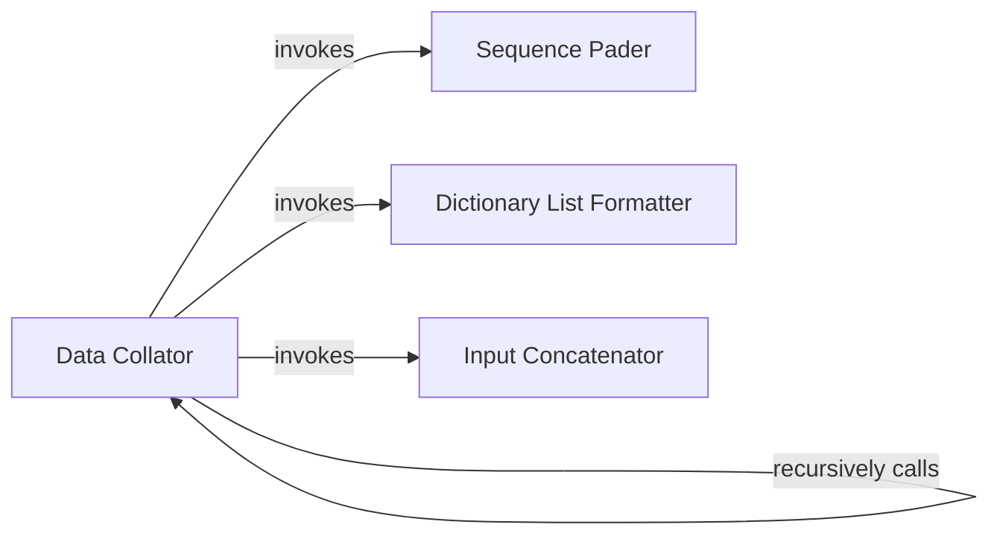

## Details

The Data Pipeline & Batcher subsystem, primarily within `roll/datasets/collator.py`, transforms raw data into a batched format for training. It is centered around the `Data Collator`, which orchestrates data collation and batching, delegating tasks like padding, formatting, and concatenation to specialized helper functions (`pad_sequences`, `collate_fn_to_dict_list`, `concatenated_inputs`). This design promotes modularity and reusability.

### Data Collator
This is the central orchestrator of the data pipeline. It is responsible for taking raw, heterogeneous experiences (e.g., trajectories, observations, actions, rewards) from various sources and transforming them into a uniform, batched format. This component is crucial for preparing data for efficient consumption by large language models (LLMs) during distributed training, handling aspects like variable-length sequences and structuring diverse input elements.

**Related Classes/Methods**:

- <a href="https://github.com/alibaba/ROLL/blob/main/roll/datasets/collator.py" target="_blank" rel="noopener noreferrer">`roll.datasets.collator.Collator`</a>

### Sequence Pader
A specialized utility component that handles the padding of sequences to a uniform length. This is vital for ensuring consistent tensor shapes across a batch, which is a prerequisite for efficient processing on hardware accelerators like GPUs, especially when dealing with variable-length data common in NLP-heavy RL tasks.

**Related Classes/Methods**:

- <a href="https://github.com/alibaba/ROLL/blob/main/roll/datasets/collator.py#L50-L52" target="_blank" rel="noopener noreferrer">`roll.datasets.collator.pad_sequences`:50-52</a>

### Dictionary List Formatter
This component is responsible for standardizing the output format of collated data. It transforms the processed data into a consistent list of dictionaries, which facilitates flexible and uniform handling of heterogeneous data within complex RL pipelines, ensuring downstream components receive data in an expected structure.

**Related Classes/Methods**:

- <a href="https://github.com/alibaba/ROLL/blob/main/roll/datasets/collator.py#L15-L41" target="_blank" rel="noopener noreferrer">`roll.datasets.collator.collate_fn_to_dict_list`:15-41</a>

### Input Concatenator
This utility component focuses on combining various individual input elements (e.g., state, action, next state, rewards) into a single, unified input tensor. This streamlines the input interface for policy or value networks, simplifying model design and data flow.

**Related Classes/Methods**:

- <a href="https://github.com/alibaba/ROLL/blob/main/roll/datasets/collator.py#L54-L59" target="_blank" rel="noopener noreferrer">`roll.datasets.collator.concatenated_inputs`:54-59</a>

### [FAQ](https://github.com/CodeBoarding/GeneratedOnBoardings/tree/main?tab=readme-ov-file#faq)