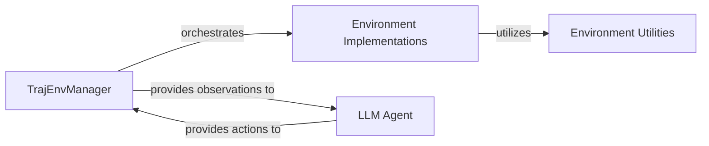

## Details

The `roll.pipeline.agentic.env_manager` subsystem, centered around the `TrajEnvManager`, orchestrates the interaction between an external `LLM Agent` and various `Environment Implementations`. The `TrajEnvManager` acts as the central coordinator, managing the simulation lifecycle by providing observations from the environment to the `LLM Agent` and receiving actions or decisions back. These `Environment Implementations` (e.g., Alfworld, Bandit) define the specific simulation dynamics and leverage `Environment Utilities` for common helper functions. This setup facilitates the generation of complete experience trajectories for training or evaluating LLM agents within diverse simulated environments.

### TrajEnvManager
This is the core orchestration component of the subsystem. It manages the lifecycle of interactions, including resetting environments, stepping through simulations, and collecting observations, actions, and rewards to form complete experience trajectories. It acts as the central coordinator for the agent-environment loop.

**Related Classes/Methods**:

- <a href="https://github.com/alibaba/ROLL/blob/main/roll/pipeline/agentic/env_manager/traj_env_manager.py" target="_blank" rel="noopener noreferrer">`roll.pipeline.agentic.env_manager.traj_env_manager`</a>

### Environment Implementations
These components represent the specific simulation environments (e.g., Alfworld, Bandit, Frozen Lake) with which the LLM agent interacts. Each implementation defines the state space, action space, transition dynamics, and reward function for a particular task or domain. They provide the interface for the `TrajEnvManager` to interact with the simulated world.

**Related Classes/Methods**:

- <a href="https://github.com/alibaba/ROLL/blob/main/roll/agentic/env/alfworld_old/env.py" target="_blank" rel="noopener noreferrer">`roll.agentic.env.alfworld_old.env`</a>
- <a href="https://github.com/alibaba/ROLL/blob/main/roll/agentic/env/bandit/env.py" target="_blank" rel="noopener noreferrer">`roll.agentic.env.bandit.env`</a>
- <a href="https://github.com/alibaba/ROLL/blob/main/roll/agentic/env/frozen_lake/env.py" target="_blank" rel="noopener noreferrer">`roll.agentic.env.frozen_lake.env`</a>

### LLM Agent
While an external component to this specific subsystem's codebase, the LLM Agent represents the policy or decision-making entity. It receives observations from the environment (via `TrajEnvManager`) and provides actions or decisions back, driving the interaction within the simulation. It's a critical dependency for trajectory generation.

**Related Classes/Methods**:

- <a href="https://github.com/alibaba/ROLL/blob/main/roll/pipeline/agentic/env_manager/traj_env_manager.py" target="_blank" rel="noopener noreferrer">`roll.pipeline.agentic.env_manager.traj_env_manager`</a>

### Environment Utilities
This component provides a collection of reusable helper functions and common utilities that support the various `Environment Implementations`. This can include functions for state manipulation, observation processing, or common environment-related operations, promoting code reuse and modularity across different environments.

**Related Classes/Methods**:

- <a href="https://github.com/alibaba/ROLL/blob/main/roll/agentic/env/static/utils.py" target="_blank" rel="noopener noreferrer">`roll.agentic.env.static.utils`</a>

### [FAQ](https://github.com/CodeBoarding/GeneratedOnBoardings/tree/main?tab=readme-ov-file#faq)