```mermaid
graph LR
    roll_models_model_providers["roll.models.model_providers"]
    mcore_adapter_src_mcore_adapter_models_model_factory["mcore_adapter.src.mcore_adapter.models.model_factory"]
    mcore_adapter_src_mcore_adapter_models_model_config["mcore_adapter.src.mcore_adapter.models.model_config"]
    mcore_adapter_src_mcore_adapter_models_converter_model_converter["mcore_adapter.src.mcore_adapter.models.converter.model_converter"]
    mcore_adapter_src_mcore_adapter_models_converter_dist_converter["mcore_adapter.src.mcore_adapter.models.converter.dist_converter"]
    mcore_adapter_src_mcore_adapter_models_converter_template["mcore_adapter.src.mcore_adapter.models.converter.template"]
    mcore_adapter_src_mcore_adapter_models_auto_config_auto["mcore_adapter.src.mcore_adapter.models.auto.config_auto"]
    mcore_adapter_src_mcore_adapter_models_auto_modeling_auto["mcore_adapter.src.mcore_adapter.models.auto.modeling_auto"]
    roll_models_model_providers -- "orchestrates calls to" --> mcore_adapter_src_mcore_adapter_models_model_factory
    roll_models_model_providers -- "orchestrates calls to" --> mcore_adapter_src_mcore_adapter_models_model_config
    mcore_adapter_src_mcore_adapter_models_model_factory -- "leverages" --> mcore_adapter_src_mcore_adapter_models_auto_modeling_auto
    mcore_adapter_src_mcore_adapter_models_model_factory -- "leverages" --> mcore_adapter_src_mcore_adapter_models_auto_config_auto
    mcore_adapter_src_mcore_adapter_models_model_config -- "relies on" --> mcore_adapter_src_mcore_adapter_models_auto_config_auto
    mcore_adapter_src_mcore_adapter_models_converter_model_converter -- "uses" --> mcore_adapter_src_mcore_adapter_models_converter_template
    mcore_adapter_src_mcore_adapter_models_converter_dist_converter -- "extends" --> mcore_adapter_src_mcore_adapter_models_converter_model_converter
    mcore_adapter_src_mcore_adapter_models_converter_dist_converter -- "utilizes patterns from" --> mcore_adapter_src_mcore_adapter_models_converter_template
    mcore_adapter_src_mcore_adapter_models_converter_template -- "serves as a base for" --> mcore_adapter_src_mcore_adapter_models_converter_model_converter
    mcore_adapter_src_mcore_adapter_models_converter_template -- "serves as a base for" --> mcore_adapter_src_mcore_adapter_models_converter_dist_converter
    mcore_adapter_src_mcore_adapter_models_auto_config_auto -- "provides dynamic lookup services for" --> mcore_adapter_src_mcore_adapter_models_model_factory
    mcore_adapter_src_mcore_adapter_models_auto_config_auto -- "provides dynamic lookup services for" --> mcore_adapter_src_mcore_adapter_models_model_config
    mcore_adapter_src_mcore_adapter_models_auto_modeling_auto -- "provides dynamic lookup services for" --> mcore_adapter_src_mcore_adapter_models_model_factory
```

## Details

The `LLM Model Manager` subsystem is responsible for the lifecycle management of Large Language Models (LLMs) within the ROLL project, encompassing their loading, configuration, and format conversion, particularly for distributed training and inference. This subsystem is critical for providing the necessary LLM instances (actor, reward, value models) to the broader RL system and ensuring their proper setup and compatibility across different environments.

### roll.models.model_providers
Serves as the primary interface for the ROLL system to acquire configured LLM instances (e.g., actor, reward, value models), including their associated tokenizers and processors. It also manages initial model setup, such as LoRA training configuration and model freezing, which is crucial for RL fine-tuning.

**Related Classes/Methods**:

- <a href="https://github.com/alibaba/ROLL/blob/main/roll/models/model_providers.py" target="_blank" rel="noopener noreferrer">`roll.models.model_providers`</a>

### mcore_adapter.src.mcore_adapter.models.model_factory
Encapsulates the core logic for instantiating and loading LLM models from pre-trained weights. It handles the management of model parameters and provides utilities for calculating floating-point operations (FLOPs), vital for performance optimization in large-scale ML.

**Related Classes/Methods**:

- <a href="https://github.com/alibaba/ROLL/blob/main/mcore_adapter/src/mcore_adapter/models/model_factory.py" target="_blank" rel="noopener noreferrer">`mcore_adapter.src.mcore_adapter.models.model_factory`</a>

### mcore_adapter.src.mcore_adapter.models.model_config
Manages the configuration aspects of LLMs, including saving and loading configurations from JSON files and handling Hugging Face auto-map files. This ensures consistent and reproducible model setups.

**Related Classes/Methods**:

- <a href="https://github.com/alibaba/ROLL/blob/main/mcore_adapter/src/mcore_adapter/models/model_config.py" target="_blank" rel="noopener noreferrer">`mcore_adapter.src.mcore_adapter.models.model_config`</a>

### mcore_adapter.src.mcore_adapter.models.converter.model_converter
Facilitates the conversion of model state dictionaries between `mcore_adapter`'s internal format and external formats (e.g., Hugging Face). It also handles sharded saving, which is essential for managing large models.

**Related Classes/Methods**:

- <a href="https://github.com/alibaba/ROLL/blob/main/mcore_adapter/src/mcore_adapter/models/converter/model_converter.py" target="_blank" rel="noopener noreferrer">`mcore_adapter.src.mcore_adapter.models.converter.model_converter`</a>

### mcore_adapter.src.mcore_adapter.models.converter.dist_converter
Specializes in adapting and converting models specifically for distributed training and inference environments. This component manages various parallelization strategies (e.g., column, row, SwiGLU, grouped, duplicated) and ensures correct weight distribution across different ranks/nodes, directly supporting the project's distributed architecture.

**Related Classes/Methods**:

- <a href="https://github.com/alibaba/ROLL/blob/main/mcore_adapter/src/mcore_adapter/models/converter/dist_converter.py" target="_blank" rel="noopener noreferrer">`mcore_adapter.src.mcore_adapter.models.converter.dist_converter`</a>

### mcore_adapter.src.mcore_adapter.models.converter.template
Provides a generic and extensible framework for model conversion operations. It defines common patterns and interfaces for converting between Hugging Face and `mcore_adapter` formats for both model weights and configurations, promoting code reusability and consistency.

**Related Classes/Methods**:

- <a href="https://github.com/alibaba/ROLL/blob/main/mcore_adapter/src/mcore_adapter/models/converter/template.py" target="_blank" rel="noopener noreferrer">`mcore_adapter.src.mcore_adapter.models.converter.template`</a>

### mcore_adapter.src.mcore_adapter.models.auto.config_auto
Offers auto-loading capabilities for model configurations. It abstracts away the need for explicit specification of model architectures, enabling dynamic loading based on the model type.

**Related Classes/Methods**:

- <a href="https://github.com/alibaba/ROLL/blob/main/mcore_adapter/src/mcore_adapter/models/auto/config_auto.py" target="_blank" rel="noopener noreferrer">`mcore_adapter.src.mcore_adapter.models.auto.config_auto`</a>

### mcore_adapter.src.mcore_adapter.models.auto.modeling_auto
Provides auto-loading capabilities for models themselves. Similar to `config_auto`, it simplifies model instantiation by allowing dynamic loading based on model type.

**Related Classes/Methods**:

- <a href="https://github.com/alibaba/ROLL/blob/main/mcore_adapter/src/mcore_adapter/models/auto/modeling_auto.py" target="_blank" rel="noopener noreferrer">`mcore_adapter.src.mcore_adapter.models.auto.modeling_auto`</a>

### [FAQ](https://github.com/CodeBoarding/GeneratedOnBoardings/tree/main?tab=readme-ov-file#faq)