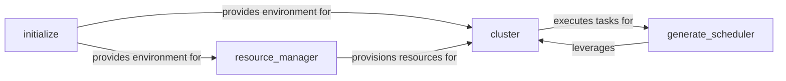

## Details

These four components are selected as central to the `Orchestration & Resource Manager` subsystem due to their fundamental roles in establishing, managing, and utilizing the distributed Ray environment for large-scale RL and LLM operations.

### initialize
Initializes and configures the foundational Ray cluster environment, including starting the Ray head node and setting up initial cluster parameters. It serves as the entry point for bringing the distributed system online.

**Related Classes/Methods**:

- <a href="https://github.com/alibaba/ROLL/blob/main/roll/distributed/scheduler/initialize.py#L1-L1000" target="_blank" rel="noopener noreferrer">`roll.distributed.scheduler.initialize`:1-1000</a>

### resource_manager
Manages the dynamic allocation and deallocation of computational resources (e.g., CPU, GPU memory) within the Ray cluster. It specifically handles the creation and management of Ray placement groups to ensure efficient and co-located resource provisioning for distributed tasks.

**Related Classes/Methods**:

- <a href="https://github.com/alibaba/ROLL/blob/main/roll/distributed/scheduler/resource_manager.py#L1-L1000" target="_blank" rel="noopener noreferrer">`roll.distributed.scheduler.resource_manager`:1-1000</a>

### cluster
Serves as the central coordinator for managing a pool of distributed workers. It handles worker creation, method binding, assignment of ranks (for collective communication), and the dispatching and execution of general distributed tasks across these workers. It acts as the primary interface for running computations on the distributed worker pool.

**Related Classes/Methods**:

- <a href="https://github.com/alibaba/ROLL/blob/main/roll/distributed/executor/cluster.py#L1-L1000" target="_blank" rel="noopener noreferrer">`roll.distributed.executor.cluster`:1-1000</a>

### generate_scheduler
A specialized scheduler dedicated to orchestrating LLM generation requests. It manages the entire lifecycle of these requests, from batching and dispatching them to appropriate workers (via the `cluster` component) to processing and returning the generated responses. This component is critical for the LLM inference stage within the RL pipeline.

**Related Classes/Methods**:

- <a href="https://github.com/alibaba/ROLL/blob/main/roll/distributed/scheduler/generate_scheduler.py#L1-L1000" target="_blank" rel="noopener noreferrer">`roll.distributed.scheduler.generate_scheduler`:1-1000</a>

### [FAQ](https://github.com/CodeBoarding/GeneratedOnBoardings/tree/main?tab=readme-ov-file#faq)