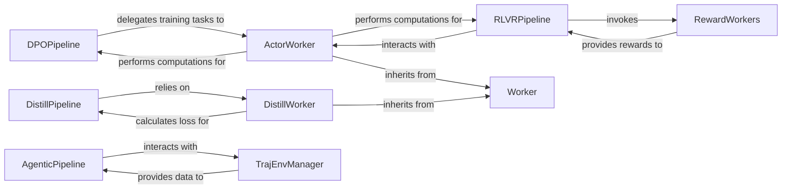

## Details

The `roll.pipeline` subsystem orchestrates various machine learning training workflows, primarily focusing on Direct Preference Optimization (DPO), Knowledge Distillation, Reinforcement Learning with Value Reward (RLVR), and Agentic Reinforcement Learning. At its core, the system leverages a set of specialized `Worker` components, which inherit from a common `Worker` base class, to handle distributed computational tasks. The `DPOPipeline` and `RLVRPipeline` utilize the `ActorWorker` for model forward passes and loss computation, while the `DistillPipeline` relies on the `DistillWorker` for inference and distillation loss. The `RLVRPipeline` further integrates with `RewardWorkers`, a collection of modules responsible for calculating diverse reward signals. For agentic learning, the `AgenticPipeline` interacts with the `TrajEnvManager` to manage environment interactions and generate rollouts. This modular design allows for distinct training methodologies to share a common distributed execution framework, ensuring efficient and scalable operations.

### DPOPipeline
Orchestrates the Direct Preference Optimization (DPO) training workflow, defining its unique training objectives and data processing stages. It acts as the central coordinator for the DPO algorithm.

**Related Classes/Methods**:

- <a href="https://github.com/alibaba/ROLL/blob/main/roll/pipeline/dpo/dpo_pipeline.py#L92-L289" target="_blank" rel="noopener noreferrer">`DPOPipeline`:92-289</a>

### DistillPipeline
Manages the knowledge distillation training process, including the setup for model inference and distillation loss computation. It defines the flow for distillation-based learning.

**Related Classes/Methods**:

- <a href="https://github.com/alibaba/ROLL/blob/main/roll/pipeline/distill/distill_pipeline.py#L132-L247" target="_blank" rel="noopener noreferrer">`DistillPipeline`:132-247</a>

### RLVRPipeline
Coordinates the Reinforcement Learning with Value Reward (RLVR) training. This pipeline integrates actor computations with various reward mechanisms to drive learning.

**Related Classes/Methods**:

- <a href="https://github.com/alibaba/ROLL/blob/main/roll/pipeline/rlvr/rlvr_pipeline.py#L121-L589" target="_blank" rel="noopener noreferrer">`RLVRPipeline`:121-589</a>

### AgenticPipeline
Implements the training workflow for agentic reinforcement learning. It focuses on managing interactions with environments and generating rollouts for policy optimization.

**Related Classes/Methods**:

- <a href="https://github.com/alibaba/ROLL/blob/main/roll/pipeline/agentic/agentic_pipeline.py#L36-L399" target="_blank" rel="noopener noreferrer">`AgenticPipeline`:36-399</a>

### Worker
An abstract base class (from `roll.distributed.executor.worker`) defining common interfaces and functionalities for algorithm-specific workers. It establishes a consistent structure for distributed computational tasks across different pipelines, serving as the foundation for `ActorWorker` and `DistillWorker`.

**Related Classes/Methods**:

- <a href="https://github.com/alibaba/ROLL/blob/main/roll/distributed/executor/worker.py#L41-L210" target="_blank" rel="noopener noreferrer">`roll.distributed.executor.worker.Worker`:41-210</a>

### ActorWorker
Specializes `Worker` for DPO and RLVR pipelines. Its primary responsibility is handling model forward passes and computing loss specific to these algorithms in a distributed manner.

**Related Classes/Methods**:

- <a href="https://github.com/alibaba/ROLL/blob/main/roll/pipeline/base_worker.py#L32-L386" target="_blank" rel="noopener noreferrer">`ActorWorker`:32-386</a>

### DistillWorker
Specializes `Worker` for distillation tasks. It executes model inference and computes the distillation loss, serving as the core computational unit for the `DistillPipeline`.

**Related Classes/Methods**:

- <a href="https://github.com/alibaba/ROLL/blob/main/roll/pipeline/distill/distill_worker.py" target="_blank" rel="noopener noreferrer">`DistillWorker`</a>

### TrajEnvManager
Manages environment interactions and rollout generation specifically for agentic pipelines. It provides the necessary data from the environment to the `AgenticPipeline` for training.

**Related Classes/Methods**:

- <a href="https://github.com/alibaba/ROLL/blob/main/roll/pipeline/agentic/env_manager/traj_env_manager.py#L29-L364" target="_blank" rel="noopener noreferrer">`TrajEnvManager`:29-364</a>

### RewardWorkers
A collection of specialized modules responsible for reward calculation within the RLVR pipeline. These workers compute various types of rewards based on specific criteria.

**Related Classes/Methods**:

- <a href="https://github.com/alibaba/ROLL/blob/main/roll/pipeline/rlvr/rewards/code_sandbox_reward_worker.py" target="_blank" rel="noopener noreferrer">`code_sandbox_reward_worker`</a>
- <a href="https://github.com/alibaba/ROLL/blob/main/roll/pipeline/rlvr/rewards/llm_judge_reward_worker.py" target="_blank" rel="noopener noreferrer">`llm_judge_reward_worker`</a>

### [FAQ](https://github.com/CodeBoarding/GeneratedOnBoardings/tree/main?tab=readme-ov-file#faq)