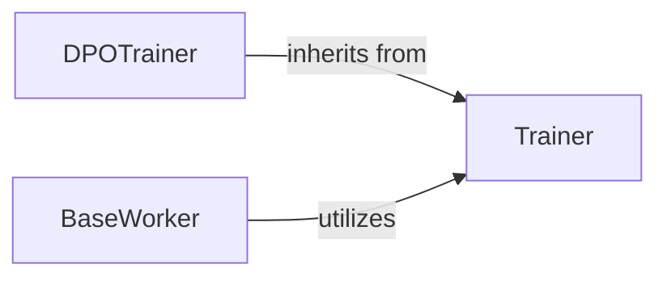

## Details

The `RL Training Engine` subsystem is responsible for the core training logic of reinforcement learning models, particularly within a distributed, pipeline-driven architecture for LLMs. Its boundaries are primarily defined by the `mcore_adapter.trainer` package and the `roll.pipeline.base_worker` module.

### Trainer
This component orchestrates the fundamental reinforcement learning training lifecycle. It manages model setup, prepares input data, executes forward and backward passes, computes loss, performs optimization steps, and handles distributed training operations. It also controls iterative training processes such as logging, checkpointing, and evaluation.

**Related Classes/Methods**:

- <a href="https://github.com/alibaba/ROLL/blob/main/mcore_adapter/src/mcore_adapter/trainer/trainer.py" target="_blank" rel="noopener noreferrer">`mcore_adapter.trainer.trainer.Trainer`</a>

### DPOTrainer
This component specializes the core training logic of the `Trainer` for Direct Preference Optimization (DPO). It incorporates DPO-specific loss functions (e.g., `odds_ratio_loss`, `dpo_loss`) and handles log probability computations essential for preference-based reinforcement learning.

**Related Classes/Methods**:

- <a href="https://github.com/alibaba/ROLL/blob/main/mcore_adapter/src/mcore_adapter/trainer/dpo_trainer.py#L27-L264" target="_blank" rel="noopener noreferrer">`mcore_adapter.trainer.dpo_trainer.DPOTrainer`:27-264</a>

### BaseWorker
This component acts as an abstract base class within the ROLL pipeline, defining a standardized interface for training-related operations. These operations include `train_step`, `compute_log_probs`, `compute_values`, and `compute_rewards`. It serves as a crucial intermediary, bridging higher-level pipeline orchestration with specific training engine implementations.

**Related Classes/Methods**:

- <a href="https://github.com/alibaba/ROLL/blob/main/roll/pipeline/base_worker.py" target="_blank" rel="noopener noreferrer">`roll.pipeline.base_worker.BaseWorker`</a>

### [FAQ](https://github.com/CodeBoarding/GeneratedOnBoardings/tree/main?tab=readme-ov-file#faq)