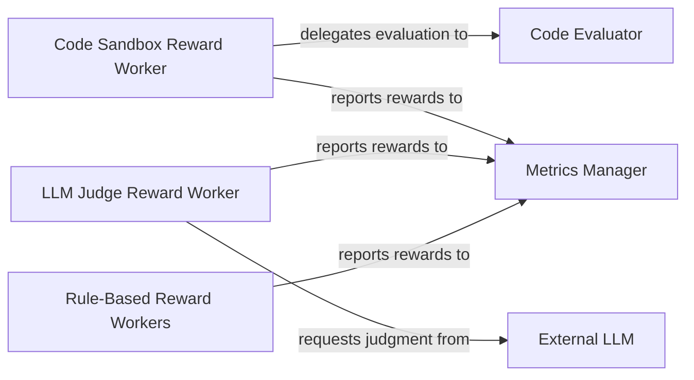

## Details

The `ROLL` project's reward calculation subsystem is designed around a modular architecture, with the `Metrics Manager` serving as the central hub for aggregating performance metrics. Various `Reward Worker` components, including `Code Sandbox Reward Worker`, `LLM Judge Reward Worker`, and `Rule-Based Reward Workers`, are responsible for computing rewards based on different criteria. The `Code Sandbox Reward Worker` relies on the `Code Evaluator` for secure code execution and assessment. The `LLM Judge Reward Worker` interacts with an `External LLM` service to obtain AI-driven judgments for complex evaluations. All reward workers report their computed rewards to the `Metrics Manager`, which provides a unified view of the agent's performance.

### Metrics Manager
The central aggregation point for all computed rewards and performance metrics. It provides a unified view of the training process, crucial for monitoring and analyzing RL agent performance.

**Related Classes/Methods**:

- <a href="https://github.com/alibaba/ROLL/blob/main/roll/utils/metrics/metrics_manager.py#L10-L412" target="_blank" rel="noopener noreferrer">`MetricsManager`:10-412</a>

### Code Sandbox Reward Worker
A specialized worker responsible for computing rewards based on the correctness and performance of generated code. This component is vital for tasks where agents produce executable code.

**Related Classes/Methods**:

- <a href="https://github.com/alibaba/ROLL/blob/main/roll/pipeline/rlvr/rewards/code_sandbox_reward_worker.py#L660-L749" target="_blank" rel="noopener noreferrer">`CodeSandboxRewardWorker`:660-749</a>

### LLM Judge Reward Worker
A specialized worker that leverages an external Large Language Model (LLM) to judge agent outputs and assign rewards. This enables subjective or complex evaluations that are difficult to codify with explicit rules.

**Related Classes/Methods**:

- <a href="https://github.com/alibaba/ROLL/blob/main/roll/pipeline/rlvr/rewards/llm_judge_reward_worker.py#L25-L246" target="_blank" rel="noopener noreferrer">`LLMJudgeRewardWorker`:25-246</a>

### Rule-Based Reward Workers
A composite component representing various specialized workers that compute rewards based on adherence to predefined, explicit rules. This includes workers for mathematical rules, detection tasks, and specific QA rules (e.g., Crossthink QA, IfEval, Multiple Choice Boxed). This component highlights the modularity for diverse evaluation criteria.

**Related Classes/Methods**:

- <a href="https://github.com/alibaba/ROLL/blob/main/roll/pipeline/rlvr/rewards/math_rule_reward_worker.py#L119-L217" target="_blank" rel="noopener noreferrer">`MathRuleRewardWorker`:119-217</a>
- <a href="https://github.com/alibaba/ROLL/blob/main/roll/pipeline/rlvr/rewards/detection_reward_worker.py#L1620-L1703" target="_blank" rel="noopener noreferrer">`DetectionRewardWorker`:1620-1703</a>
- <a href="https://github.com/alibaba/ROLL/blob/main/roll/pipeline/rlvr/rewards/crossthinkqa_rule_reward_worker.py#L146-L265" target="_blank" rel="noopener noreferrer">`CrossthinkQARuleRewardWorker`:146-265</a>
- <a href="https://github.com/alibaba/ROLL/blob/main/roll/pipeline/rlvr/rewards/ifeval_rule_reward_worker.py" target="_blank" rel="noopener noreferrer">`IfEvalRuleRewardWorker`</a>
- <a href="https://github.com/alibaba/ROLL/blob/main/roll/pipeline/rlvr/rewards/multiple_choice_boxed_rule_reward_worker.py#L85-L163" target="_blank" rel="noopener noreferrer">`MultipleChoiceBoxedRuleRewardWorker`:85-163</a>

### Code Evaluator
A utility component providing the core logic for securely executing and evaluating code snippets. It serves as a dependency for the `Code Sandbox Reward Worker`, ensuring robust code assessment.

**Related Classes/Methods**:

- <a href="https://github.com/alibaba/ROLL/blob/main/roll/utils/local_code/evaluator.py" target="_blank" rel="noopener noreferrer">`CodeEvaluator`</a>

### External LLM
Represents an external Large Language Model service that provides judgment capabilities. It is a crucial external dependency for the `LLM Judge Reward Worker`, enabling advanced, AI-driven reward assignments.

**Related Classes/Methods**:

- <a href="https://github.com/alibaba/ROLL/blob/main/roll/pipeline/rlvr/rewards/llm_judge_reward_worker.py#L50-L85" target="_blank" rel="noopener noreferrer">`LLMJudgeRewardWorker._call_api_model`:50-85</a>

### [FAQ](https://github.com/CodeBoarding/GeneratedOnBoardings/tree/main?tab=readme-ov-file#faq)