```mermaid
graph LR
    Orchestration_Resource_Manager["Orchestration & Resource Manager"]
    LLM_Model_Manager["LLM Model Manager"]
    Environment_Interaction_Trajectory_Generator["Environment Interaction & Trajectory Generator"]
    Reward_Metric_Calculator["Reward & Metric Calculator"]
    Data_Pipeline_Batcher["Data Pipeline & Batcher"]
    RL_Training_Engine["RL Training Engine"]
    RL_Algorithm_Pipelines["RL Algorithm Pipelines"]
    Orchestration_Resource_Manager -- "controls deployment of" --> LLM_Model_Manager
    Orchestration_Resource_Manager -- "controls deployment of" --> Environment_Interaction_Trajectory_Generator
    Orchestration_Resource_Manager -- "controls deployment of" --> Reward_Metric_Calculator
    Orchestration_Resource_Manager -- "controls deployment of" --> RL_Training_Engine
    RL_Algorithm_Pipelines -- "receives configuration from" --> Orchestration_Resource_Manager
    LLM_Model_Manager -- "provides models to" --> Environment_Interaction_Trajectory_Generator
    RL_Training_Engine -- "receives updated models from" --> LLM_Model_Manager
    Environment_Interaction_Trajectory_Generator -- "requests LLM actions from" --> LLM_Model_Manager
    Environment_Interaction_Trajectory_Generator -- "generates trajectories for" --> Data_Pipeline_Batcher
    Environment_Interaction_Trajectory_Generator -- "sends outcomes to" --> Reward_Metric_Calculator
    Reward_Metric_Calculator -- "receives outcomes from" --> Environment_Interaction_Trajectory_Generator
    Reward_Metric_Calculator -- "provides rewards to" --> RL_Training_Engine
    Data_Pipeline_Batcher -- "receives raw data from" --> Environment_Interaction_Trajectory_Generator
    Data_Pipeline_Batcher -- "supplies batched data to" --> RL_Training_Engine
    RL_Training_Engine -- "consumes batched data from" --> Data_Pipeline_Batcher
    RL_Training_Engine -- "receives rewards from" --> Reward_Metric_Calculator
    RL_Training_Engine -- "updates models in" --> LLM_Model_Manager
    RL_Training_Engine -- "implements objectives from" --> RL_Algorithm_Pipelines
    RL_Algorithm_Pipelines -- "configures" --> RL_Training_Engine
    RL_Algorithm_Pipelines -- "orchestrates overall flow via" --> Orchestration_Resource_Manager
    click Orchestration_Resource_Manager href "https://github.com/CodeBoarding/GeneratedOnBoardings/blob/main/ROLL/Orchestration_Resource_Manager.md" "Details"
    click LLM_Model_Manager href "https://github.com/CodeBoarding/GeneratedOnBoardings/blob/main/ROLL/LLM_Model_Manager.md" "Details"
    click Environment_Interaction_Trajectory_Generator href "https://github.com/CodeBoarding/GeneratedOnBoardings/blob/main/ROLL/Environment_Interaction_Trajectory_Generator.md" "Details"
    click Reward_Metric_Calculator href "https://github.com/CodeBoarding/GeneratedOnBoardings/blob/main/ROLL/Reward_Metric_Calculator.md" "Details"
    click Data_Pipeline_Batcher href "https://github.com/CodeBoarding/GeneratedOnBoardings/blob/main/ROLL/Data_Pipeline_Batcher.md" "Details"
    click RL_Training_Engine href "https://github.com/CodeBoarding/GeneratedOnBoardings/blob/main/ROLL/RL_Training_Engine.md" "Details"
    click RL_Algorithm_Pipelines href "https://github.com/CodeBoarding/GeneratedOnBoardings/blob/main/ROLL/RL_Algorithm_Pipelines.md" "Details"
```

## Details

The project's architecture is centered around a robust `Orchestration & Resource Manager` that oversees the deployment and scheduling of distributed components within a Ray cluster. This manager is responsible for initiating and coordinating the `LLM Model Manager`, which handles the lifecycle of Large Language Models, from loading and configuration to conversion and providing them for inference. The `Environment Interaction & Trajectory Generator` interacts with these LLMs and various simulation environments to produce experience trajectories, which are then processed by the `Reward & Metric Calculator` to determine performance and rewards. The generated data flows into the `Data Pipeline & Batcher` for efficient preparation before being consumed by the `RL Training Engine`. This engine, configured by specific `RL Algorithm Pipelines`, performs the core reinforcement learning training, updating the LLM models as it learns. The `RL Algorithm Pipelines` also play a crucial role in orchestrating the overall flow by interacting with the `Orchestration & Resource Manager`, ensuring that the training objectives are met and the system operates cohesively. This modular design facilitates clear data flow and component responsibilities, making it suitable for both detailed documentation and intuitive visual diagram generation.

### Orchestration & Resource Manager [[Expand]](./Orchestration_Resource_Manager.md)
The central control plane managing Ray cluster resources, deploying components, and scheduling distributed tasks, including LLM generation requests.

**Related Classes/Methods**:

- <a href="https://github.com/alibaba/ROLL/blob/main/roll/distributed/scheduler/initialize.py" target="_blank" rel="noopener noreferrer">`roll/distributed/scheduler/initialize.py`</a>
- <a href="https://github.com/alibaba/ROLL/blob/main/roll/distributed/scheduler/resource_manager.py" target="_blank" rel="noopener noreferrer">`roll/distributed/scheduler/resource_manager.py`</a>
- <a href="https://github.com/alibaba/ROLL/blob/main/roll/distributed/executor/cluster.py" target="_blank" rel="noopener noreferrer">`roll/distributed/executor/cluster.py`</a>
- <a href="https://github.com/alibaba/ROLL/blob/main/roll/distributed/scheduler/generate_scheduler.py" target="_blank" rel="noopener noreferrer">`roll/distributed/scheduler/generate_scheduler.py`</a>

### LLM Model Manager [[Expand]](./LLM_Model_Manager.md)
Handles the loading, configuration, and conversion of Large Language Models, providing them for inference and receiving updates during training.

**Related Classes/Methods**:

- <a href="https://github.com/alibaba/ROLL/blob/main/mcore_adapter/src/mcore_adapter/models/__init__.py" target="_blank" rel="noopener noreferrer">`mcore_adapter/src/mcore_adapter/models/__init__.py`</a>
- <a href="https://github.com/alibaba/ROLL/blob/main/mcore_adapter/src/mcore_adapter/models/converter/model_converter.py" target="_blank" rel="noopener noreferrer">`mcore_adapter/src/mcore_adapter/models/converter/model_converter.py`</a>
- <a href="https://github.com/alibaba/ROLL/blob/main/roll/models/model_providers.py" target="_blank" rel="noopener noreferrer">`roll.models.model_providers.py`</a>

### Environment Interaction & Trajectory Generator [[Expand]](./Environment_Interaction_Trajectory_Generator.md)
Orchestrates interactions between the LLM agent and various simulation environments to generate experience trajectories for RL training.

**Related Classes/Methods**:

- <a href="https://github.com/alibaba/ROLL/blob/main/roll/pipeline/agentic/env_manager/traj_env_manager.py" target="_blank" rel="noopener noreferrer">`roll/pipeline/agentic/env_manager/traj_env_manager.py`</a>
- <a href="https://github.com/alibaba/ROLL/blob/main/roll/agentic/env/__init__.py" target="_blank" rel="noopener noreferrer">`roll/agentic/env/__init__.py`</a>

### Reward & Metric Calculator [[Expand]](./Reward_Metric_Calculator.md)
Computes rewards and performance metrics based on agent actions and environment outcomes, supporting diverse evaluation criteria. Includes specialized workers for tasks like code evaluation.

**Related Classes/Methods**:

- <a href="https://github.com/alibaba/ROLL/blob/main/roll/pipeline/rlvr/rewards/__init__.py" target="_blank" rel="noopener noreferrer">`roll/pipeline/rlvr/rewards/__init__.py`</a>
- <a href="https://github.com/alibaba/ROLL/blob/main/roll/utils/metrics/metrics_manager.py" target="_blank" rel="noopener noreferrer">`roll/utils/metrics/metrics_manager.py`</a>
- <a href="https://github.com/alibaba/ROLL/blob/main/roll/pipeline/rlvr/rewards/code_sandbox_reward_worker.py" target="_blank" rel="noopener noreferrer">`roll/pipeline/rlvr/rewards/code_sandbox_reward_worker.py`</a>
- <a href="https://github.com/alibaba/ROLL/blob/main/roll/utils/local_code/evaluator.py" target="_blank" rel="noopener noreferrer">`roll/utils/local_code/evaluator.py`</a>

### Data Pipeline & Batcher [[Expand]](./Data_Pipeline_Batcher.md)
Manages the flow, transformation, and batching of data for efficient distributed processing, ensuring data is optimized for consumption by the training engine.

**Related Classes/Methods**:

- <a href="https://github.com/alibaba/ROLL/blob/main/roll/datasets/collator.py" target="_blank" rel="noopener noreferrer">`roll/datasets/collator.py`</a>

### RL Training Engine [[Expand]](./RL_Training_Engine.md)
Encapsulates the core training logic for reinforcement learning, including forward/backward passes, loss computation, and optimization steps for various RL algorithms.

**Related Classes/Methods**:

- <a href="https://github.com/alibaba/ROLL/blob/main/mcore_adapter/src/mcore_adapter/trainer/trainer.py" target="_blank" rel="noopener noreferrer">`mcore_adapter/src/mcore_adapter/trainer/trainer.py`</a>
- <a href="https://github.com/alibaba/ROLL/blob/main/roll/pipeline/base_worker.py" target="_blank" rel="noopener noreferrer">`roll/pipeline/base_worker.py`</a>

### RL Algorithm Pipelines [[Expand]](./RL_Algorithm_Pipelines.md)
Implements the end-to-end workflows for specific reinforcement learning algorithms (e.g., DPO, Distill, RLVR, Agentic), defining their unique training objectives and data processing stages.

**Related Classes/Methods**:

- <a href="https://github.com/alibaba/ROLL/blob/main/roll/pipeline/dpo/dpo_pipeline.py" target="_blank" rel="noopener noreferrer">`roll/pipeline/dpo/dpo_pipeline.py`</a>
- <a href="https://github.com/alibaba/ROLL/blob/main/roll/pipeline/distill/distill_pipeline.py" target="_blank" rel="noopener noreferrer">`roll/pipeline/distill/distill_pipeline.py`</a>
- <a href="https://github.com/alibaba/ROLL/blob/main/roll/pipeline/rlvr/rlvr_pipeline.py" target="_blank" rel="noopener noreferrer">`roll/pipeline/rlvr/rlvr_pipeline.py`</a>
- <a href="https://github.com/alibaba/ROLL/blob/main/roll/pipeline/agentic/agentic_pipeline.py" target="_blank" rel="noopener noreferrer">`roll/pipeline/agentic/agentic_pipeline.py`</a>

### [FAQ](https://github.com/CodeBoarding/GeneratedOnBoardings/tree/main?tab=readme-ov-file#faq)