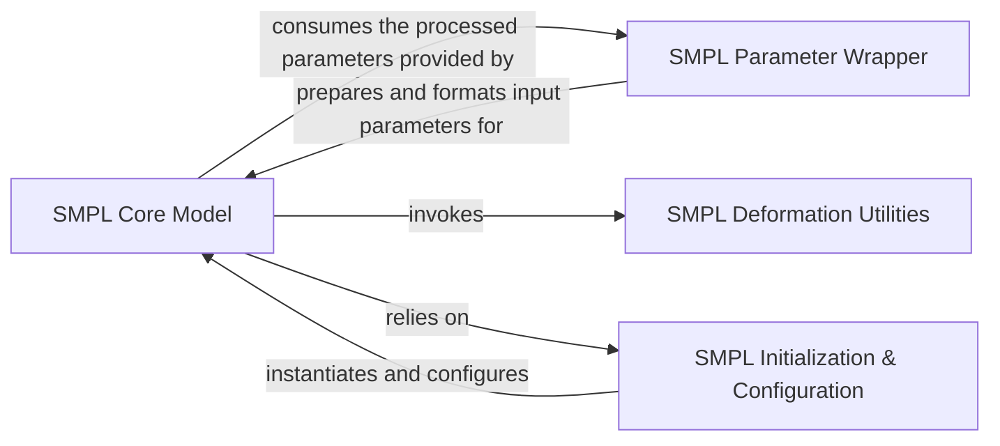

## Details

The `3D Body Model (SMPL)` subsystem is a critical part of the ROMP project, focusing on the representation and manipulation of 3D human body models. It adheres to the "Core Models" and "Data Processing Pipeline" architectural patterns, providing the foundational elements for 3D human pose and shape estimation.

### SMPL Core Model
This is the foundational component, embodying the SMPL mathematical model. It's responsible for generating 3D human meshes by applying pose and shape parameters and performing Linear Blend Skinning (LBS). It serves as the central representation of the 3D body.

**Related Classes/Methods**:

- <a href="https://github.com/Arthur151/ROMP/blob/master/romp/lib/smpl_family/smpl.py#L34-L100" target="_blank" rel="noopener noreferrer">`romp.lib.smpl_family.smpl.SMPL`:34-100</a>
- <a href="https://github.com/Arthur151/ROMP/blob/master/simple_romp/romp/smpl.py#L37-L108" target="_blank" rel="noopener noreferrer">`simple_romp.romp.smpl.SMPL`:37-108</a>
- <a href="https://github.com/Arthur151/ROMP/blob/master/romp/lib/smpl_family/smpl.py" target="_blank" rel="noopener noreferrer">`romp.lib.smpl_family.smpl.SMPL:__init__`</a>
- <a href="https://github.com/Arthur151/ROMP/blob/master/romp/lib/smpl_family/smpl.py" target="_blank" rel="noopener noreferrer">`romp.lib.smpl_family.smpl.SMPL:lbs`</a>

### SMPL Parameter Wrapper
This component acts as an interface for the SMPL Core Model. Its primary role is to process and format input parameters (e.g., pose, shape, and potentially age-related adjustments) into the precise structure required by the SMPL Core Model. It also includes granular functions for parameter pre-processing.

**Related Classes/Methods**:

- <a href="https://github.com/Arthur151/ROMP/blob/master/romp/lib/smpl_family/smpl_wrapper_relative.py" target="_blank" rel="noopener noreferrer">`romp.lib.smpl_family.smpl_wrapper_relative.SMPL_Wrapper_Relative`</a>
- <a href="https://github.com/Arthur151/ROMP/blob/master/romp/lib/smpl_family/smpl_wrapper_relative.py" target="_blank" rel="noopener noreferrer">`romp.lib.smpl_family.smpl_wrapper_relative.SMPL_Wrapper_Relative:forward`</a>
- <a href="https://github.com/Arthur151/ROMP/blob/master/romp/lib/smpl_family/smpl_wrapper_relative.py" target="_blank" rel="noopener noreferrer">`romp.lib.smpl_family.smpl_wrapper_relative.SMPL_Wrapper_Relative:process_betas`</a>
- <a href="https://github.com/Arthur151/ROMP/blob/master/romp/lib/smpl_family/smpl_wrapper_relative.py" target="_blank" rel="noopener noreferrer">`romp.lib.smpl_family.smpl_wrapper_relative.SMPL_Wrapper_Relative:pack_params_dict`</a>

### SMPL Deformation Utilities
These are low-level, reusable functions that perform the core mathematical and geometric operations necessary for deforming the SMPL mesh. This includes transformations, rotations, and blending of vertex positions based on joint movements and body shape.

**Related Classes/Methods**:

- <a href="https://github.com/Arthur151/ROMP/blob/master/romp/lib/smpl_family/smpl.py#L183-L214" target="_blank" rel="noopener noreferrer">`romp.lib.smpl_family.smpl.batch_rodrigues`:183-214</a>
- <a href="https://github.com/Arthur151/ROMP/blob/master/romp/lib/smpl_family/smpl.py#L228-L282" target="_blank" rel="noopener noreferrer">`romp.lib.smpl_family.smpl.batch_rigid_transform`:228-282</a>
- <a href="https://github.com/Arthur151/ROMP/blob/master/romp/lib/smpl_family/smpl.py#L216-L226" target="_blank" rel="noopener noreferrer">`romp.lib.smpl_family.smpl.transform_mat`:216-226</a>

### SMPL Initialization & Configuration
This component is responsible for the initial setup of the SMPL model, including loading necessary assets (e.g., joint regressors, blend shapes) and configuring the model for operation. It ensures the SMPL Core Model is correctly instantiated and prepared for use within the broader system.

**Related Classes/Methods**:

- <a href="https://github.com/Arthur151/ROMP/blob/master/romp/lib/smpl_family/smpl.py#L14-L32" target="_blank" rel="noopener noreferrer">`romp.lib.smpl_family.smpl.VertexJointSelector`:14-32</a>
- <a href="https://github.com/Arthur151/ROMP/blob/master/romp/lib/smpl_family/smpl.py#L360-L363" target="_blank" rel="noopener noreferrer">`romp.lib.smpl_family.smpl.prepare_smpl_model`:360-363</a>

### [FAQ](https://github.com/CodeBoarding/GeneratedOnBoardings/tree/main?tab=readme-ov-file#faq)