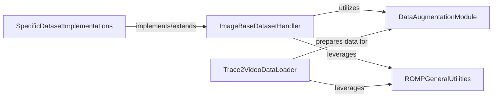

## Details

Data Input & Preprocessing

### ImageBaseDatasetHandler
Serves as the abstract base for handling single-frame image datasets, defining the interface and common logic for loading, standardizing, and preparing individual image frames for subsequent processing.

**Related Classes/Methods**:

- <a href="https://github.com/Arthur151/ROMP/blob/master/romp/lib/dataset/image_base.py#L1-L1000" target="_blank" rel="noopener noreferrer">`romp.lib.dataset.image_base`:1-1000</a>

### SpecificDatasetImplementations
Concrete dataset classes that inherit from or utilize `ImageBaseDatasetHandler`, providing dataset-specific logic for parsing annotations and locating files for various image datasets.

**Related Classes/Methods**:

- <a href="https://github.com/Arthur151/ROMP/blob/master/romp/lib/dataset/#L1-L1000" target="_blank" rel="noopener noreferrer">`romp.lib.dataset`:1-1000</a>

### DataAugmentationModule
Provides a comprehensive set of functions for augmenting image and pose data, crucial for increasing training data diversity and model robustness by applying various transformations.

**Related Classes/Methods**:

- <a href="https://github.com/Arthur151/ROMP/blob/master/romp/lib/utils/augments.py#L1-L1000" target="_blank" rel="noopener noreferrer">`romp.lib.utils.augments`:1-1000</a>

### ROMPGeneralUtilities
Offers general utility functions for the ROMP project, including fundamental image preprocessing, temporal smoothing, and extracting frame paths, which are leveraged across different data handling components.

**Related Classes/Methods**:

- <a href="https://github.com/Arthur151/ROMP/blob/master/simple_romp/romp/utils.py#L1-L1000" target="_blank" rel="noopener noreferrer">`simple_romp.romp.utils`:1-1000</a>

### Trace2VideoDataLoader
Specializes in loading and preparing video sequences specifically for the trace2 model, handling the complexities of video input and ensuring readiness for sequential model processing.

**Related Classes/Methods**:

- <a href="https://github.com/Arthur151/ROMP/blob/master/simple_romp/trace2/utils/load_data.py#L1-L1000" target="_blank" rel="noopener noreferrer">`simple_romp.trace2.utils.load_data`:1-1000</a>

### [FAQ](https://github.com/CodeBoarding/GeneratedOnBoardings/tree/main?tab=readme-ov-file#faq)