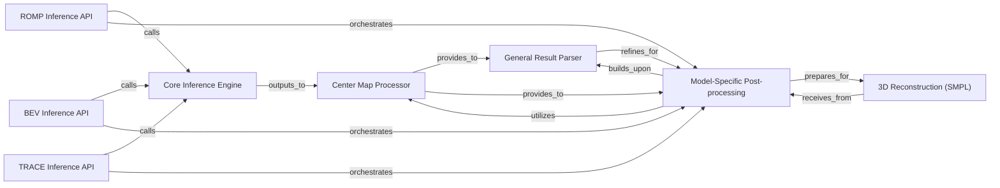

## Details

The Inference & 3D Reconstruction Pipeline subsystem orchestrates the complete process from raw input to final 3D human pose and shape results, serving as the primary user API.

### ROMP Inference API
Primary API for ROMP inference. Orchestrates the entire inference pipeline for the ROMP model, including model loading, executing the forward pass, and initiating model-specific post-processing.

**Related Classes/Methods**:

- <a href="https://github.com/Arthur151/ROMP/blob/master/simple_romp/romp/main.py" target="_blank" rel="noopener noreferrer">`simple_romp.romp.main.ROMP`</a>

### BEV Inference API
Primary API for BEV inference. Orchestrates the entire inference pipeline for the BEV model, including model loading, executing the forward pass, and initiating model-specific post-processing.

**Related Classes/Methods**:

- <a href="https://github.com/Arthur151/ROMP/blob/master/simple_romp/bev/main.py" target="_blank" rel="noopener noreferrer">`simple_romp.bev.main.BEV`</a>

### TRACE Inference API
Primary API for TRACE inference. Orchestrates the entire inference pipeline for the TRACE model, including model loading, executing the forward pass, and initiating model-specific post-processing.

**Related Classes/Methods**:

- <a href="https://github.com/Arthur151/ROMP/blob/master/simple_romp/trace2/main.py" target="_blank" rel="noopener noreferrer">`simple_romp.trace2.main.TRACE`</a>

### Core Inference Engine
Provides the fundamental prediction logic, preparing neural network modules and executing the forward pass to produce raw model outputs. This component is shared across different model APIs.

**Related Classes/Methods**:

- <a href="https://github.com/Arthur151/ROMP/blob/master/romp/predict/base_predictor.py" target="_blank" rel="noopener noreferrer">`romp.predict.base_predictor.BasePredictor`</a>

### Center Map Processor
Generates and parses 2D/3D center maps from the raw model outputs to identify and localize human instances, serving as an initial step in post-processing.

**Related Classes/Methods**:

- <a href="https://github.com/Arthur151/ROMP/blob/master/romp/lib/maps_utils/centermap.py" target="_blank" rel="noopener noreferrer">`romp.lib.maps_utils.centermap.CenterMap`</a>

### General Result Parser
Processes the initial parsed outputs, matches predicted parameters to instances, and suppresses duplicate detections to refine results before model-specific adjustments.

**Related Classes/Methods**:

- <a href="https://github.com/Arthur151/ROMP/blob/master/romp/lib/maps_utils/result_parser.py#L21-L292" target="_blank" rel="noopener noreferrer">`romp.lib.maps_utils.result_parser.ResultParser`:21-292</a>

### Model-Specific Post-processing
Performs specialized post-processing steps tailored to the unique outputs and requirements of their respective models (ROMP, BEV, TRACE), refining the general parsed results into a format suitable for 3D reconstruction.

**Related Classes/Methods**:

- <a href="https://github.com/Arthur151/ROMP/blob/master/simple_romp/romp/post_parser.py" target="_blank" rel="noopener noreferrer">`simple_romp.romp.post_parser.ROMPPostParser`</a>
- <a href="https://github.com/Arthur151/ROMP/blob/master/simple_romp/bev/post_parser.py" target="_blank" rel="noopener noreferrer">`simple_romp.bev.post_parser.BEVPostParser`</a>
- <a href="https://github.com/Arthur151/ROMP/blob/master/simple_romp/trace2/results_parser/temp_result_parser.py#L15-L68" target="_blank" rel="noopener noreferrer">`simple_romp.trace2.results_parser.temp_result_parser.TempResultParser`:15-68</a>

### 3D Reconstruction (SMPL)
Generates 3D human meshes and keypoints based on the processed SMPL parameters, forming the final output of the pipeline.

**Related Classes/Methods**:

- <a href="https://github.com/Arthur151/ROMP/blob/master/simple_romp/romp/smpl.py#L37-L108" target="_blank" rel="noopener noreferrer">`simple_romp.romp.smpl.SMPL`:37-108</a>

### [FAQ](https://github.com/CodeBoarding/GeneratedOnBoardings/tree/main?tab=readme-ov-file#faq)