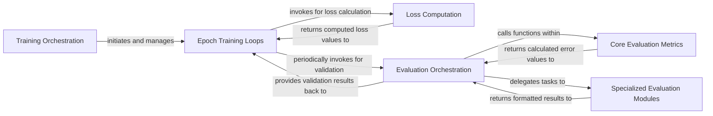

## Details

The `Model Training & Evaluation` subsystem is crucial for the development and refinement of deep learning models within the ROMP project. It encompasses the entire lifecycle from initiating training runs to comprehensive performance assessment.

### Training Orchestration
Manages the overall training process, including model and optimizer initialization, data loading setup, and the high-level coordination of training and validation epochs. It acts as the primary entry point for initiating training runs.

**Related Classes/Methods**:

- <a href="https://github.com/Arthur151/ROMP/blob/master/romp/pretrain.py#L64-L76" target="_blank" rel="noopener noreferrer">`train`:64-76</a>
- <a href="https://github.com/Arthur151/ROMP/blob/master/romp/pretrain.py#L1-L9999" target="_blank" rel="noopener noreferrer">`pretrain`:1-9999</a>
- <a href="https://github.com/Arthur151/ROMP/blob/master/trace/train_video.py#L1-L9999" target="_blank" rel="noopener noreferrer">`train_video`:1-9999</a>

### Epoch Training Loops
Implements the core iterative logic for a single training epoch. This includes performing forward passes, calculating loss, executing backward passes for gradient computation, and updating model parameters. It also manages calls to validation routines.

**Related Classes/Methods**:

- <a href="https://github.com/Arthur151/ROMP/blob/master/romp/pretrain.py#L64-L76" target="_blank" rel="noopener noreferrer">`train`:64-76</a>
- <a href="https://github.com/Arthur151/ROMP/blob/master/romp/pretrain.py#L1-L9999" target="_blank" rel="noopener noreferrer">`pretrain`:1-9999</a>
- <a href="https://github.com/Arthur151/ROMP/blob/master/trace/train_video.py#L1-L9999" target="_blank" rel="noopener noreferrer">`train_video`:1-9999</a>

### Loss Computation
Responsible for calculating various loss components (e.g., keypoint, parameter, detection, temporal, camera loss) by comparing model predictions against ground truth data. It aggregates these individual losses into a total loss value used for optimization.

**Related Classes/Methods**:

- <a href="https://github.com/Arthur151/ROMP/blob/master/romp/pretrain.py#L40-L55" target="_blank" rel="noopener noreferrer">`calc_loss`:40-55</a>
- <a href="https://github.com/Arthur151/ROMP/blob/master/romp/pretrain.py#L40-L55" target="_blank" rel="noopener noreferrer">`calc_loss`:40-55</a>

### Evaluation Orchestration
Serves as the primary entry point for model evaluation. It coordinates the inference process on validation or test datasets, manages the collection of predictions, and orchestrates the calculation and presentation of overall performance metrics.

**Related Classes/Methods**:

- <a href="https://github.com/Arthur151/ROMP/blob/master/romp/lib/dataset/cmu_panoptic_eval.py#L33-L111" target="_blank" rel="noopener noreferrer">`eval`:33-111</a>

### Core Evaluation Metrics
Provides a set of fundamental, reusable functions for computing standard evaluation metrics such as Mean Per Joint Position Error (MPJPE), Procrustes-aligned MPJPE (P-MPJPE), and vertex errors. These functions are designed for broad applicability across different evaluation scenarios.

**Related Classes/Methods**:

- <a href="https://github.com/Arthur151/ROMP/blob/master/romp/eval.py#L9-L90" target="_blank" rel="noopener noreferrer">`evaluation_matrix`:9-90</a>

### Specialized Evaluation Modules
Adapts the general evaluation framework to the unique characteristics, data formats, and ground truth annotations of specific datasets (e.g., AGORA, Relative Human, CMU Panoptic) and focuses on evaluating multi-person tracking algorithms in video sequences.

**Related Classes/Methods**:

- <a href="https://github.com/Arthur151/ROMP/blob/master/simple_romp/trace2/evaluation/evaluate_tracking.py#L1-L9999" target="_blank" rel="noopener noreferrer">`evaluate_tracking`:1-9999</a>
- <a href="https://github.com/Arthur151/ROMP/blob/master/simple_romp/evaluation/eval_AGORA.py#L1-L9999" target="_blank" rel="noopener noreferrer">`eval_AGORA`:1-9999</a>
- <a href="https://github.com/Arthur151/ROMP/blob/master/simple_romp/evaluation/eval_Relative_Human.py#L1-L9999" target="_blank" rel="noopener noreferrer">`eval_Relative_Human`:1-9999</a>
- <a href="https://github.com/Arthur151/ROMP/blob/master/simple_romp/evaluation/eval_cmu_panoptic.py#L1-L9999" target="_blank" rel="noopener noreferrer">`eval_cmu_panoptic`:1-9999</a>

### [FAQ](https://github.com/CodeBoarding/GeneratedOnBoardings/tree/main?tab=readme-ov-file#faq)