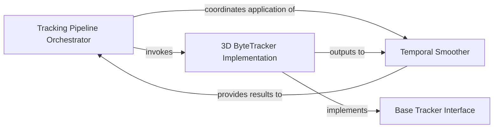

## Details

The Multi-person Tracking subsystem is a critical part of the ROMP project, focusing on identifying and tracking individuals across video sequences and refining their pose estimations over time.

### Tracking Pipeline Orchestrator
Manages the end-to-end multi-person tracking workflow. This includes loading video data, invoking the core tracking algorithms, and handling the final output, potentially integrating with visualization components. It acts as the control flow for the entire tracking process.

**Related Classes/Methods**:

- <a href="https://github.com/Arthur151/ROMP/blob/master/simple_romp/trace2/track.py" target="_blank" rel="noopener noreferrer">`simple_romp.trace2.track.Demo`</a>
- <a href="https://github.com/Arthur151/ROMP/blob/master/simple_romp/trace2/track.py" target="_blank" rel="noopener noreferrer">`simple_romp.trace2.track.TRACE`</a>

### 3D ByteTracker Implementation
The core tracking engine. It performs multi-person tracking by associating detections across frames, maintaining unique identities for individuals, and managing the state of each track (e.g., active, lost, removed). It implements or extends the Base Tracker Interface.

**Related Classes/Methods**:

- <a href="https://github.com/Arthur151/ROMP/blob/master/simple_romp/tracker/byte_tracker_3dcenter.py" target="_blank" rel="noopener noreferrer">`simple_romp.tracker.byte_tracker_3dcenter.ByteTracker3DCenter`</a>

### Temporal Smoother
Applies filtering and smoothing techniques to the raw, potentially noisy, pose estimations and temporal data generated by the tracking algorithm. This improves the consistency and reduces jitter in the tracked outputs, leading to more stable and visually appealing results.

**Related Classes/Methods**:

- <a href="https://github.com/Arthur151/ROMP/blob/master/romp/lib/utils/temporal_optimization.py#L49-L71" target="_blank" rel="noopener noreferrer">`romp.lib.utils.temporal_optimization.OneEuroFilter`:49-71</a>
- <a href="https://github.com/Arthur151/ROMP/blob/master/romp/lib/utils/temporal_optimization.py#L35-L47" target="_blank" rel="noopener noreferrer">`romp.lib.utils.temporal_optimization.LowPassFilter`:35-47</a>

### Base Tracker Interface
Defines the abstract contract and common operations for any tracker implementation within the system. It serves as a blueprint, ensuring that different tracking algorithms can be integrated and used interchangeably, promoting modularity and extensibility.

**Related Classes/Methods**:

- <a href="https://github.com/Arthur151/ROMP/blob/master/romp/lib/tracking/tracker.py#L131-L252" target="_blank" rel="noopener noreferrer">`romp.lib.tracking.tracker.Tracker`:131-252</a>

### [FAQ](https://github.com/CodeBoarding/GeneratedOnBoardings/tree/main?tab=readme-ov-file#faq)