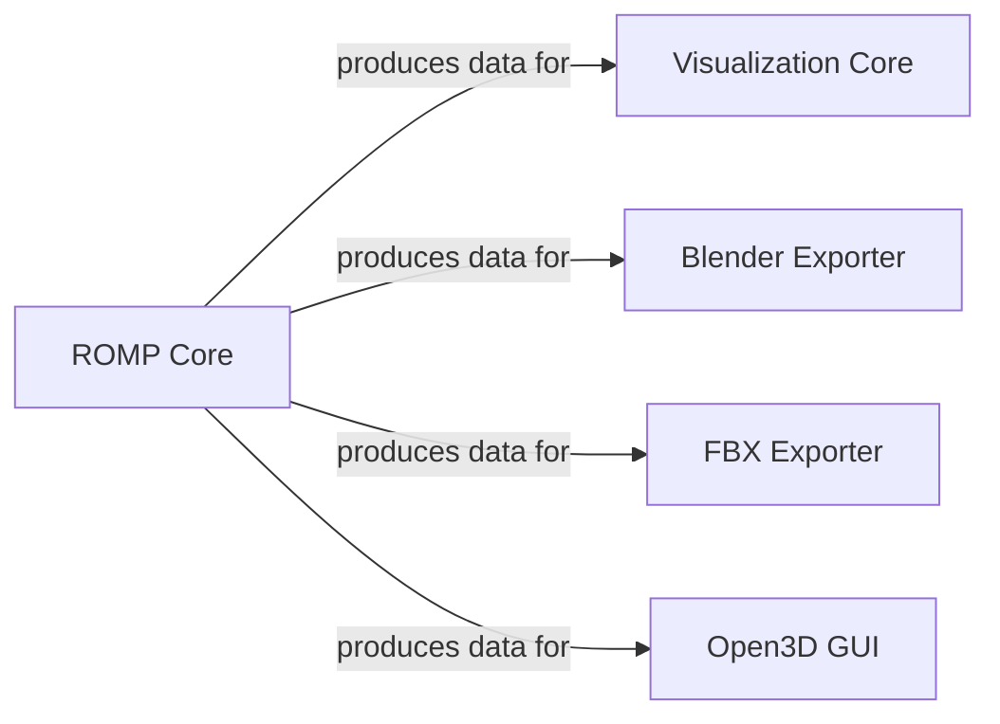

## Details

The ROMP system is architected around a central `ROMP Core` component, which serves as the primary processing engine for human pose estimation and 3D reconstruction. This core component generates all fundamental data, including 3D models, keypoints, and animation data. Downstream, the `Visualization Core` and `Open3D GUI` consume this processed data to provide comprehensive internal and interactive 3D visualizations, respectively. Concurrently, the `Blender Exporter` and `FBX Exporter` components receive data from `ROMP Core` to facilitate the export of motion capture and 3D mesh data into widely compatible formats for external 3D software and pipelines, ensuring broad utility of ROMP's outputs.

### ROMP Core
Serves as the central processing engine of the ROMP project, responsible for core functionalities such as human pose estimation, 3D reconstruction, and generating the foundational data (e.g., SMPL models, keypoints, meshes) that subsequent components utilize for visualization and export. It orchestrates the main computational pipeline.

**Related Classes/Methods**: _None_

### Visualization Core
Consumes data from `ROMP Core` to provide fundamental capabilities for internal 2D and 3D rendering. It handles the visualization of keypoints, meshes, heatmaps, and skeletons, and can overlay classification results onto images. This component serves as the primary utility for displaying intermediate and final results within the ROMP application.

**Related Classes/Methods**:

- <a href="https://github.com/Arthur151/ROMP/blob/master/romp/lib/visualization/visualization.py" target="_blank" rel="noopener noreferrer">`romp.lib.visualization.visualization`</a>

### Blender Exporter
Consumes processed data from `ROMP Core` to specialize in packaging and exporting motion capture data, specifically SMPL models and their corresponding poses, into a format optimized for Blender. This enables users to import ROMP's 3D outputs directly into Blender for advanced animation, rendering, and scene integration. This component, along with `FBX Exporter`, leverages common underlying export mechanisms.

**Related Classes/Methods**:

- <a href="https://github.com/Arthur151/ROMP/blob/master/romp/exports/blender_mocap.py" target="_blank" rel="noopener noreferrer">`romp.exports.blender_mocap`</a>

### FBX Exporter
Consumes processed data from `ROMP Core` to manage the conversion and export of animated 3D meshes and associated data into the widely adopted FBX format. This ensures broad compatibility with various 3D software, game engines, and animation pipelines, allowing for versatile use of ROMP's 3D outputs. This component, along with `Blender Exporter`, leverages common underlying export mechanisms.

**Related Classes/Methods**:

- <a href="https://github.com/Arthur151/ROMP/blob/master/simple_romp/tools/convert2fbx.py" target="_blank" rel="noopener noreferrer">`simple_romp.tools.convert2fbx`</a>

### Open3D GUI
Consumes data from `ROMP Core` to implement an interactive 3D graphical user interface leveraging Open3D. This component facilitates dynamic, real-time viewing and manipulation of 3D meshes, trajectories, and camera movements. It is primarily used for debugging, detailed analysis of temporal sequences, and interactive exploration of the 3D reconstruction results.

**Related Classes/Methods**:

- <a href="https://github.com/Arthur151/ROMP/blob/master/simple_romp/trace2/utils/open3d_gui.py" target="_blank" rel="noopener noreferrer">`simple_romp.trace2.utils.open3d_gui`</a>

### [FAQ](https://github.com/CodeBoarding/GeneratedOnBoardings/tree/main?tab=readme-ov-file#faq)