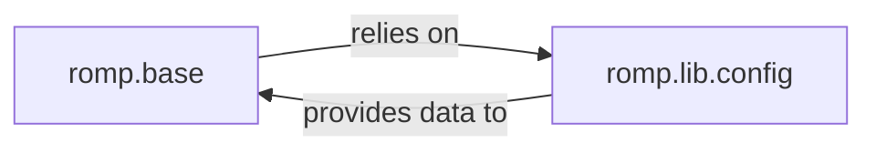

## Details

This subsystem is responsible for establishing the foundational operational environment for the entire ROMP system, focusing on global settings, logging, and initial parameter loading. It ensures that the system is correctly configured before any computer vision tasks or deep learning pipelines commence.

### romp.base
This component serves as the primary entry point for the ROMP system's initialization. It orchestrates the setup of the operational environment, including managing global settings, initializing the logging framework, and loading core parameters essential for the ML models and data processing pipelines. In the context of an ML Toolkit, it ensures that the system is correctly configured before any computer vision tasks (e.g., inference, data loading) commence.

**Related Classes/Methods**:

- <a href="https://github.com/Arthur151/ROMP/blob/master/romp/base.py" target="_blank" rel="noopener noreferrer">`romp.base`</a>

### romp.lib.config
This module is dedicated to the robust handling of configuration data. Its responsibilities include loading configuration settings from various sources (e.g., files, environment variables), managing their lifecycle (parsing, validation, and potential serialization), and ensuring proper cleanup of associated resources. For an ML Toolkit, it provides the foundational mechanism for defining and accessing parameters that govern model behavior, data paths, and processing options, ensuring reproducibility and flexibility.

**Related Classes/Methods**:

- <a href="https://github.com/Arthur151/ROMP/blob/master/romp/lib/config.py" target="_blank" rel="noopener noreferrer">`romp.lib.config`</a>

### [FAQ](https://github.com/CodeBoarding/GeneratedOnBoardings/tree/main?tab=readme-ov-file#faq)