```mermaid
graph LR
    System_Configuration["System Configuration"]
    Data_Input_Preprocessing["Data Input & Preprocessing"]
    Core_Deep_Learning_Models["Core Deep Learning Models"]
    3D_Body_Model_SMPL_["3D Body Model (SMPL)"]
    Inference_3D_Reconstruction_Pipeline["Inference & 3D Reconstruction Pipeline"]
    Model_Training_Evaluation["Model Training & Evaluation"]
    Multi_person_Tracking["Multi-person Tracking"]
    Results_Visualization_Export["Results Visualization & Export"]
    System_Configuration -- "provides configuration parameters to" --> Data_Input_Preprocessing
    System_Configuration -- "supplies model configuration and loaded weights to" --> Core_Deep_Learning_Models
    Data_Input_Preprocessing -- "feeds preprocessed data to" --> Core_Deep_Learning_Models
    Data_Input_Preprocessing -- "provides input data to" --> Inference_3D_Reconstruction_Pipeline
    Data_Input_Preprocessing -- "supplies training data and ground truth to" --> Model_Training_Evaluation
    Core_Deep_Learning_Models -- "outputs raw predictions to" --> Inference_3D_Reconstruction_Pipeline
    Inference_3D_Reconstruction_Pipeline -- "requests 3D mesh generation from" --> 3D_Body_Model_SMPL_
    3D_Body_Model_SMPL_ -- "returns 3D meshes and poses to" --> Inference_3D_Reconstruction_Pipeline
    Inference_3D_Reconstruction_Pipeline -- "sends detection results for tracking to" --> Multi_person_Tracking
    Multi_person_Tracking -- "returns smoothed 3D pose results to" --> Inference_3D_Reconstruction_Pipeline
    Inference_3D_Reconstruction_Pipeline -- "forwards final 3D results to" --> Results_Visualization_Export
    Model_Training_Evaluation -- "updates model weights of" --> Core_Deep_Learning_Models
    Model_Training_Evaluation -- "sends evaluation metrics to" --> Results_Visualization_Export
    Results_Visualization_Export -- "utilizes for 3D rendering" --> 3D_Body_Model_SMPL_
    click System_Configuration href "https://github.com/CodeBoarding/GeneratedOnBoardings/blob/main/ROMP/System_Configuration.md" "Details"
    click Data_Input_Preprocessing href "https://github.com/CodeBoarding/GeneratedOnBoardings/blob/main/ROMP/Data_Input_Preprocessing.md" "Details"
    click 3D_Body_Model_SMPL_ href "https://github.com/CodeBoarding/GeneratedOnBoardings/blob/main/ROMP/3D_Body_Model_SMPL_.md" "Details"
    click Inference_3D_Reconstruction_Pipeline href "https://github.com/CodeBoarding/GeneratedOnBoardings/blob/main/ROMP/Inference_3D_Reconstruction_Pipeline.md" "Details"
    click Model_Training_Evaluation href "https://github.com/CodeBoarding/GeneratedOnBoardings/blob/main/ROMP/Model_Training_Evaluation.md" "Details"
    click Multi_person_Tracking href "https://github.com/CodeBoarding/GeneratedOnBoardings/blob/main/ROMP/Multi_person_Tracking.md" "Details"
    click Results_Visualization_Export href "https://github.com/CodeBoarding/GeneratedOnBoardings/blob/main/ROMP/Results_Visualization_Export.md" "Details"
```

## Details

The ROMP (RObust Multi-person Pose) project is structured around a modular deep learning pipeline for 3D human pose and shape estimation. The System Configuration component initializes global settings and parameters, which are then consumed by various parts of the system. The Data Input & Preprocessing component is responsible for preparing diverse datasets, feeding preprocessed data to both the Core Deep Learning Models for training and the Inference & 3D Reconstruction Pipeline for real-time processing.

The Core Deep Learning Models house the neural network architectures (ROMP, BEV, TRACE) that perform the core task of feature extraction and pose/shape prediction. During training, the Model Training & Evaluation component orchestrates the learning process, calculating losses, updating model weights, and evaluating performance. For inference, the Inference & 3D Reconstruction Pipeline takes raw model outputs, leverages the 3D Body Model (SMPL) to generate 3D meshes, and, for video inputs, interacts with the Multi-person Tracking component to ensure consistent tracking across frames. Finally, the Results Visualization & Export component handles the rendering of 2D keypoints and 3D meshes, and facilitates the export of results for further analysis or integration with external tools. This architecture ensures a clear separation of concerns, enabling efficient development, training, and deployment of the human pose estimation system.

### System Configuration [[Expand]](./System_Configuration.md)
Manages global settings, logging, and initial parameter loading for the entire ROMP system.

**Related Classes/Methods**:

- <a href="https://github.com/Arthur151/ROMP/blob/master/romp/base.py" target="_blank" rel="noopener noreferrer">`romp/base.py`</a>
- <a href="https://github.com/Arthur151/ROMP/blob/master/romp/lib/config.py" target="_blank" rel="noopener noreferrer">`romp/lib/config.py`</a>

### Data Input & Preprocessing [[Expand]](./Data_Input_Preprocessing.md)
Handles loading, augmentation, and preparation of image and video datasets, providing standardized inputs for both training and inference.

**Related Classes/Methods**:

- <a href="https://github.com/Arthur151/ROMP/blob/master/romp/lib/dataset/image_base.py" target="_blank" rel="noopener noreferrer">`romp/lib/dataset/image_base.py`</a>
- <a href="https://github.com/Arthur151/ROMP/blob/master/romp/lib/utils/augments.py" target="_blank" rel="noopener noreferrer">`romp/lib/utils/augments.py`</a>
- <a href="https://github.com/Arthur151/ROMP/blob/master/simple_romp/romp/utils.py" target="_blank" rel="noopener noreferrer">`simple_romp/romp/utils.py`</a>
- <a href="https://github.com/Arthur151/ROMP/blob/master/simple_romp/trace2/utils/load_data.py" target="_blank" rel="noopener noreferrer">`simple_romp/trace2/utils/load_data.py`</a>

### Core Deep Learning Models
Encapsulates the main neural network architectures (ROMP, BEV, TRACE) responsible for extracting features and predicting human pose and shape parameters.

**Related Classes/Methods**:

- <a href="https://github.com/Arthur151/ROMP/blob/master/romp/lib/models/romp_model.py" target="_blank" rel="noopener noreferrer">`romp/lib/models/romp_model.py`</a>
- <a href="https://github.com/Arthur151/ROMP/blob/master/simple_romp/bev/model.py" target="_blank" rel="noopener noreferrer">`simple_romp/bev/model.py`</a>
- <a href="https://github.com/Arthur151/ROMP/blob/master/simple_romp/romp/model.py" target="_blank" rel="noopener noreferrer">`simple_romp/romp/model.py`</a>
- <a href="https://github.com/Arthur151/ROMP/blob/master/simple_romp/trace2/models/model.py" target="_blank" rel="noopener noreferrer">`simple_romp/trace2/models/model.py`</a>
- <a href="https://github.com/Arthur151/ROMP/blob/master/romp/lib/models/base.py" target="_blank" rel="noopener noreferrer">`romp/lib/models/base.py`</a>

### 3D Body Model (SMPL) [[Expand]](./3D_Body_Model_SMPL_.md)
Manages the SMPL (Skinned Multi-Person Linear) model, fundamental for representing 3D human body shape and pose, and generating 3D meshes.

**Related Classes/Methods**:

- <a href="https://github.com/Arthur151/ROMP/blob/master/romp/lib/smpl_family/smpl.py" target="_blank" rel="noopener noreferrer">`romp/lib/smpl_family/smpl.py`</a>
- <a href="https://github.com/Arthur151/ROMP/blob/master/romp/lib/smpl_family/smpl_wrapper_relative.py" target="_blank" rel="noopener noreferrer">`romp/lib/smpl_family/smpl_wrapper_relative.py`</a>
- <a href="https://github.com/Arthur151/ROMP/blob/master/simple_romp/romp/smpl.py" target="_blank" rel="noopener noreferrer">`simple_romp/romp/smpl.py`</a>

### Inference & 3D Reconstruction Pipeline [[Expand]](./Inference_3D_Reconstruction_Pipeline.md)
Orchestrates the end-to-end inference process, from raw input to final 3D human pose and shape results, including processing raw model outputs and generating 3D meshes. This component also serves as the primary user API.

**Related Classes/Methods**:

- <a href="https://github.com/Arthur151/ROMP/blob/master/romp/predict/base_predictor.py" target="_blank" rel="noopener noreferrer">`romp/predict/base_predictor.py`</a>
- <a href="https://github.com/Arthur151/ROMP/blob/master/simple_romp/bev/main.py" target="_blank" rel="noopener noreferrer">`simple_romp/bev/main.py`</a>
- <a href="https://github.com/Arthur151/ROMP/blob/master/simple_romp/romp/main.py" target="_blank" rel="noopener noreferrer">`simple_romp/romp/main.py`</a>
- <a href="https://github.com/Arthur151/ROMP/blob/master/simple_romp/trace2/main.py" target="_blank" rel="noopener noreferrer">`simple_romp/trace2/main.py`</a>
- <a href="https://github.com/Arthur151/ROMP/blob/master/romp/lib/maps_utils/centermap.py" target="_blank" rel="noopener noreferrer">`romp/lib/maps_utils/centermap.py`</a>
- <a href="https://github.com/Arthur151/ROMP/blob/master/romp/lib/maps_utils/result_parser.py" target="_blank" rel="noopener noreferrer">`romp/lib/maps_utils/result_parser.py`</a>
- <a href="https://github.com/Arthur151/ROMP/blob/master/simple_romp/bev/post_parser.py" target="_blank" rel="noopener noreferrer">`simple_romp/bev/post_parser.py`</a>
- <a href="https://github.com/Arthur151/ROMP/blob/master/simple_romp/romp/post_parser.py" target="_blank" rel="noopener noreferrer">`simple_romp/romp/post_parser.py`</a>
- <a href="https://github.com/Arthur151/ROMP/blob/master/simple_romp/trace2/results_parser/temp_result_parser.py" target="_blank" rel="noopener noreferrer">`simple_romp/trace2/results_parser/temp_result_parser.py`</a>

### Model Training & Evaluation [[Expand]](./Model_Training_Evaluation.md)
Manages the training loops for pre-training and fine-tuning deep learning models, including loss calculation and performance evaluation against ground truth data.

**Related Classes/Methods**:

- <a href="https://github.com/Arthur151/ROMP/blob/master/romp/train.py" target="_blank" rel="noopener noreferrer">`romp/train.py`</a>
- <a href="https://github.com/Arthur151/ROMP/blob/master/romp/pretrain.py" target="_blank" rel="noopener noreferrer">`romp/pretrain.py`</a>
- <a href="https://github.com/Arthur151/ROMP/blob/master/romp/lib/loss_funcs/calc_loss.py" target="_blank" rel="noopener noreferrer">`romp/lib/loss_funcs/calc_loss.py`</a>
- <a href="https://github.com/Arthur151/ROMP/blob/master/trace/train_video.py" target="_blank" rel="noopener noreferrer">`trace/train_video.py`</a>
- <a href="https://github.com/Arthur151/ROMP/blob/master/romp/eval.py" target="_blank" rel="noopener noreferrer">`romp/eval.py`</a>
- <a href="https://github.com/Arthur151/ROMP/blob/master/romp/lib/evaluation/evaluation_matrix.py" target="_blank" rel="noopener noreferrer">`romp/lib/evaluation/evaluation_matrix.py`</a>
- <a href="https://github.com/Arthur151/ROMP/blob/master/simple_romp/trace2/evaluation/evaluate_tracking.py" target="_blank" rel="noopener noreferrer">`simple_romp/trace2/evaluation/evaluate_tracking.py`</a>
- <a href="https://github.com/Arthur151/ROMP/blob/master/simple_romp/evaluation/eval_AGORA.py" target="_blank" rel="noopener noreferrer">`simple_romp/evaluation/eval_AGORA.py`</a>
- <a href="https://github.com/Arthur151/ROMP/blob/master/simple_romp/evaluation/eval_Relative_Human.py" target="_blank" rel="noopener noreferrer">`simple_romp/evaluation/eval_Relative_Human.py`</a>
- <a href="https://github.com/Arthur151/ROMP/blob/master/simple_romp/evaluation/eval_cmu_panoptic.py" target="_blank" rel="noopener noreferrer">`simple_romp/evaluation/eval_cmu_panoptic.py`</a>

### Multi-person Tracking [[Expand]](./Multi_person_Tracking.md)
Implements algorithms for tracking multiple individuals across video frames and applying temporal optimization techniques to smooth inconsistencies in pose estimations.

**Related Classes/Methods**:

- <a href="https://github.com/Arthur151/ROMP/blob/master/romp/lib/tracking/tracker.py" target="_blank" rel="noopener noreferrer">`romp/lib/tracking/tracker.py`</a>
- <a href="https://github.com/Arthur151/ROMP/blob/master/romp/lib/utils/temporal_optimization.py" target="_blank" rel="noopener noreferrer">`romp/lib/utils/temporal_optimization.py`</a>
- <a href="https://github.com/Arthur151/ROMP/blob/master/simple_romp/trace2/track.py" target="_blank" rel="noopener noreferrer">`simple_romp/trace2/track.py`</a>
- <a href="https://github.com/Arthur151/ROMP/blob/master/simple_romp/tracker/byte_tracker_3dcenter.py" target="_blank" rel="noopener noreferrer">`simple_romp/tracker/byte_tracker_3dcenter.py`</a>

### Results Visualization & Export [[Expand]](./Results_Visualization_Export.md)
Handles the rendering of 2D keypoints, 3D meshes, and heatmaps, and provides functionalities to export results to external tools and formats (e.g., Blender).

**Related Classes/Methods**:

- <a href="https://github.com/Arthur151/ROMP/blob/master/romp/lib/visualization/visualization.py" target="_blank" rel="noopener noreferrer">`romp/lib/visualization/visualization.py`</a>
- <a href="https://github.com/Arthur151/ROMP/blob/master/romp/exports/blender_mocap.py" target="_blank" rel="noopener noreferrer">`romp/exports/blender_mocap.py`</a>
- <a href="https://github.com/Arthur151/ROMP/blob/master/simple_romp/trace2/utils/open3d_gui.py" target="_blank" rel="noopener noreferrer">`simple_romp/trace2/utils/open3d_gui.py`</a>
- <a href="https://github.com/Arthur151/ROMP/blob/master/simple_romp/tools/convert2fbx.py" target="_blank" rel="noopener noreferrer">`simple_romp/tools/convert2fbx.py`</a>

### [FAQ](https://github.com/CodeBoarding/GeneratedOnBoardings/tree/main?tab=readme-ov-file#faq)