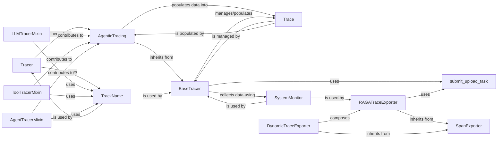

## Component Details

Overview of Abstract Components in Agentic Tracing

### Tracer
The primary user-facing interface for initiating and managing tracing sessions. It acts as the main orchestrator, inheriting and leveraging the AgenticTracing capabilities to set up and manage the entire trace lifecycle, from start to stop. It also allows for registering post-processors and masking functions, providing a high-level API for users.

**Related Classes/Methods**:

- <a href="https://github.com/raga-ai-hub/RagaAI-Catalyst/blob/master/ragaai_catalyst/tracers/tracer.py#L38-L895" target="_blank" rel="noopener noreferrer">`Tracer` (38:895)</a>

### AgenticTracing
The core component for agentic tracing, providing a unified mechanism for complex AI workflows. It combines functionalities from various mixins (LLM, Tool, Agent, Custom, Network, User Interaction tracers) to manage the collection, processing, and finalization of trace data before submission. It's the central hub for instrumenting and capturing diverse events within an AI application.

**Related Classes/Methods**:

- <a href="https://github.com/raga-ai-hub/RagaAI-Catalyst/blob/master/ragaai_catalyst/tracers/agentic_tracing/tracers/main_tracer.py#L47-L396" target="_blank" rel="noopener noreferrer">`ragaai_catalyst.tracers.agentic_tracing.tracers.main_tracer.AgenticTracing` (47:396)</a>

### BaseTracer
Provides the foundational logic and common utilities for all tracing activities within the agentic tracing module. This includes managing the Trace data structure, collecting system information, processing resource metrics, and handling the submission of trace data. It serves as the base for specialized tracers, ensuring consistent core functionalities.

**Related Classes/Methods**:

- `BaseTracer` (1:1)

### LLMTracerMixin
A mixin class responsible for instrumenting and capturing detailed information from LLM (Large Language Model) calls across various popular frameworks (e.g., OpenAI, Anthropic, Google GenAI, LlamaIndex, Langchain). It extracts input, output, model parameters, and token usage, providing deep insights into LLM interactions.

**Related Classes/Methods**:

- `LLMTracerMixin` (1:1)

### ToolTracerMixin
A mixin class dedicated to instrumenting and capturing data from tool executions within AI applications, particularly focusing on integrations with frameworks like Langchain. It records tool inputs, outputs, and execution details, enabling visibility into tool usage and performance.

**Related Classes/Methods**:

- `ToolTracerMixin` (1:1)

### AgentTracerMixin
A mixin class that provides functionalities for tracing agent-specific components and their execution flow. It helps in understanding the steps an AI agent takes, including its inputs and outputs at each stage, crucial for debugging and analyzing complex agent behaviors.

**Related Classes/Methods**:

- `AgentTracerMixin` (1:1)

### Trace
The central data model that encapsulates all information related to a single tracing session. It holds metadata, system information, and a hierarchical structure of "spans" representing individual components (LLM calls, tool executions, agent steps, custom functions) within the trace. This is the blueprint for the collected observability data.

**Related Classes/Methods**:

- `Trace` (1:1)

### TrackName
A utility class responsible for tracking and managing file names associated with the traced code. This is crucial for providing context and linking trace data back to the specific source files where the traced events occurred, especially in dynamic environments like notebooks, enhancing traceability.

**Related Classes/Methods**:

- `TrackName` (1:1)

### SystemMonitor
A utility class that collects system-level resource usage metrics (CPU, memory, disk, network) during the tracing period. This data provides valuable insights into the performance and resource consumption of the traced application, essential for identifying bottlenecks and optimizing resource usage.

**Related Classes/Methods**:

- <a href="https://github.com/raga-ai-hub/RagaAI-Catalyst/blob/master/ragaai_catalyst/tracers/agentic_tracing/utils/system_monitor.py#L23-L214" target="_blank" rel="noopener noreferrer">`SystemMonitor` (23:214)</a>

### RAGATraceExporter
A set of functions and classes responsible for managing the asynchronous submission of processed trace data to the RagaAI platform. It ensures that trace data is efficiently and reliably uploaded for storage and analysis, completing the observability loop.

**Related Classes/Methods**:

- `RAGATraceExporter` (1:1)

### DynamicTraceExporter
A component involved in exporting trace data.

**Related Classes/Methods**: _None_

### SpanExporter
A component responsible for exporting spans.

**Related Classes/Methods**: _None_

### submit_upload_task
A function or utility for submitting upload tasks.

**Related Classes/Methods**: _None_

### [FAQ](https://github.com/CodeBoarding/GeneratedOnBoardings/tree/main?tab=readme-ov-file#faq)