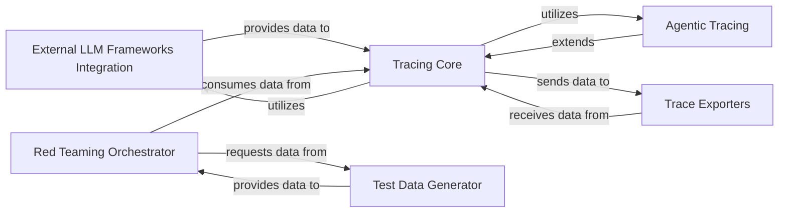

## Component Details

This document outlines the core components of RagaAI Catalyst, focusing on the External LLM Frameworks Integration and its interactions within the system, including Tracing Core, Agentic Tracing, Trace Exporters, Red Teaming Orchestrator, and Test Data Generator.

### External LLM Frameworks Integration
Provides the necessary adapters and instrumentation to integrate RagaAI Catalyst with external LLM frameworks like Langchain and LlamaIndex, capturing framework-specific events and converting them into a standardized trace format.

**Related Classes/Methods**:

- <a href="https://github.com/raga-ai-hub/RagaAI-Catalyst/blob/master/ragaai_catalyst/tracers/langchain_callback.py#L0-L0" target="_blank" rel="noopener noreferrer">`ragaai_catalyst.tracers.langchain_callback.LangchainCallback` (0:0)</a>
- <a href="https://github.com/raga-ai-hub/RagaAI-Catalyst/blob/master/ragaai_catalyst/tracers/llamaindex_callback.py#L22-L360" target="_blank" rel="noopener noreferrer">`ragaai_catalyst.tracers.llamaindex_callback.LlamaIndexTracer` (22:360)</a>
- <a href="https://github.com/raga-ai-hub/RagaAI-Catalyst/blob/master/ragaai_catalyst/tracers/llamaindex_instrumentation.py#L367-L423" target="_blank" rel="noopener noreferrer">`ragaai_catalyst.tracers.llamaindex_instrumentation.LlamaIndexInstrumentationTracer` (367:423)</a>
- <a href="https://github.com/raga-ai-hub/RagaAI-Catalyst/blob/master/ragaai_catalyst/tracers/langchain_callback.py#L0-L0" target="_blank" rel="noopener noreferrer">`ragaai_catalyst.tracers.langchain_callback.convert_langchain_callbacks_output` (0:0)</a>
- <a href="https://github.com/raga-ai-hub/RagaAI-Catalyst/blob/master/ragaai_catalyst/tracers/llamaindex_instrumentation.py#L0-L0" target="_blank" rel="noopener noreferrer">`ragaai_catalyst.tracers.llamaindex_instrumentation.convert_llama_instru_callback` (0:0)</a>
- <a href="https://github.com/raga-ai-hub/RagaAI-Catalyst/blob/master/ragaai_catalyst/tracers/llamaindex_instrumentation.py#L0-L0" target="_blank" rel="noopener noreferrer">`ragaai_catalyst.tracers.llamaindex_instrumentation.extraction_logic_llama_index` (0:0)</a>
- <a href="https://github.com/raga-ai-hub/RagaAI-Catalyst/blob/master/ragaai_catalyst/tracers/langchain_callback.py#L0-L0" target="_blank" rel="noopener noreferrer">`ragaai_catalyst.tracers.langchain_callback.langchain_tracer_extraction_logic` (0:0)</a>

### Tracing Core
The central component for collecting, processing, and managing trace data. It defines the core Tracer class, which orchestrates the entire tracing process, including span creation, context propagation, and interaction with exporters.

**Related Classes/Methods**:

- <a href="https://github.com/raga-ai-hub/RagaAI-Catalyst/blob/master/ragaai_catalyst/tracers/tracer.py#L38-L895" target="_blank" rel="noopener noreferrer">`ragaai_catalyst.tracers.tracer.Tracer` (38:895)</a>
- <a href="https://github.com/raga-ai-hub/RagaAI-Catalyst/blob/master/ragaai_catalyst/tracers/distributed.py#L0-L0" target="_blank" rel="noopener noreferrer">`ragaai_catalyst/tracers/distributed.py` (0:0)</a>

### Agentic Tracing
A specialized extension of Tracing Core, focusing on capturing granular details of AI agent execution. This includes tracking agent decisions, tool usage, and interactions, providing deep insights into complex agentic workflows.

**Related Classes/Methods**:

- <a href="https://github.com/raga-ai-hub/RagaAI-Catalyst/blob/master/ragaai_catalyst/tracers/agentic_tracing/tracers/main_tracer.py#L0-L0" target="_blank" rel="noopener noreferrer">`ragaai_catalyst/tracers/agentic_tracing/tracers/main_tracer.py` (0:0)</a>
- <a href="https://github.com/raga-ai-hub/RagaAI-Catalyst/blob/master/ragaai_catalyst/tracers/agentic_tracing/data/data_structure.py#L0-L0" target="_blank" rel="noopener noreferrer">`ragaai_catalyst/tracers/agentic_tracing/data/data_structure.py` (0:0)</a>

### Trace Exporters
Responsible for persisting and transmitting collected trace data to various destinations, such as the RagaAI platform or local storage. It ensures that the valuable trace information is made available for analysis, visualization, and long-term storage.

**Related Classes/Methods**:

- <a href="https://github.com/raga-ai-hub/RagaAI-Catalyst/blob/master/ragaai_catalyst/tracers/exporters/dynamic_trace_exporter.py#L0-L0" target="_blank" rel="noopener noreferrer">`ragaai_catalyst/tracers/exporters/dynamic_trace_exporter.py` (0:0)</a>
- <a href="https://github.com/raga-ai-hub/RagaAI-Catalyst/blob/master/ragaai_catalyst/tracers/exporters/file_span_exporter.py#L0-L0" target="_blank" rel="noopener noreferrer">`ragaai_catalyst/tracers/exporters/file_span_exporter.py` (0:0)</a>
- <a href="https://github.com/raga-ai-hub/RagaAI-Catalyst/blob/master/ragaai_catalyst/tracers/exporters/ragaai_trace_exporter.py#L0-L0" target="_blank" rel="noopener noreferrer">`ragaai_catalyst/tracers/exporters/ragaai_trace_exporter.py` (0:0)</a>

### Red Teaming Orchestrator
Manages the overall red teaming process, from defining evaluation criteria to orchestrating test case generation and result analysis. It ensures a systematic approach to identifying vulnerabilities and biases in AI models.

**Related Classes/Methods**:

- <a href="https://github.com/raga-ai-hub/RagaAI-Catalyst/blob/master/ragaai_catalyst/redteaming/red_teaming.py#L0-L0" target="_blank" rel="noopener noreferrer">`ragaai_catalyst/redteaming/red_teaming.py` (0:0)</a>
- <a href="https://github.com/raga-ai-hub/RagaAI-Catalyst/blob/master/ragaai_catalyst/redteaming/evaluator.py#L0-L0" target="_blank" rel="noopener noreferrer">`ragaai_catalyst/redteaming/evaluator.py` (0:0)</a>

### Test Data Generator
A sub-component of Red Teaming responsible for creating diverse and challenging test cases, including adversarial inputs, to thoroughly evaluate AI model robustness and identify edge cases.

**Related Classes/Methods**:

- <a href="https://github.com/raga-ai-hub/RagaAI-Catalyst/blob/master/ragaai_catalyst/redteaming/llm_generator.py#L0-L0" target="_blank" rel="noopener noreferrer">`ragaai_catalyst/redteaming/llm_generator.py` (0:0)</a>
- `ragaai_catalyst/redteaming/scenario_generator.py` (0:0)
- `ragaai_catalyst/redteaming/test_case_generator.py` (0:0)

### [FAQ](https://github.com/CodeBoarding/GeneratedOnBoardings/tree/main?tab=readme-ov-file#faq)