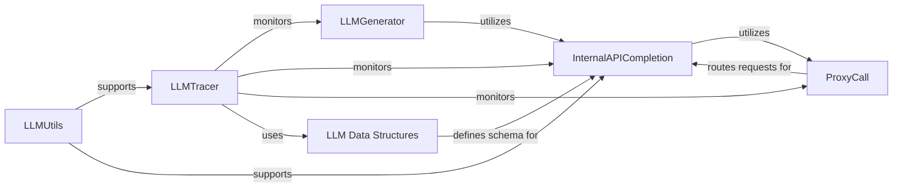

## Component Details

This subsystem is designed to facilitate robust and traceable interactions with various external Large Language Models (LLMs). It provides a structured approach for generating LLM-based content, abstracting API complexities, routing requests, and meticulously tracing all LLM interactions for analysis and auditing.

### LLMGenerator
This component is primarily responsible for orchestrating calls to external LLMs, particularly within the context of red teaming. It encapsulates the logic for generating adversarial inputs, test cases, or responses by interacting with configured LLM providers. It acts as a high-level interface for initiating LLM-driven tasks.

**Related Classes/Methods**:

- <a href="https://github.com/raga-ai-hub/RagaAI-Catalyst/blob/master/ragaai_catalyst/redteaming/llm_generator.py#L6-L135" target="_blank" rel="noopener noreferrer">`ragaai_catalyst.redteaming.llm_generator.LLMGenerator` (6:135)</a>

### InternalAPICompletion
This component serves as an internal abstraction layer for making completion requests to various LLM providers. It standardizes the interface for interacting with different external LLMs, abstracting away the specifics of each provider's API (e.g., OpenAI, Anthropic, Google GenAI). This ensures a consistent way to request LLM outputs regardless of the underlying model.

**Related Classes/Methods**:

- <a href="https://github.com/raga-ai-hub/RagaAI-Catalyst/blob/master/ragaai_catalyst/internal_api_completion.py#L1-L1" target="_blank" rel="noopener noreferrer">`ragaai_catalyst.internal_api_completion.InternalAPICompletion` (1:1)</a>

### ProxyCall
This component acts as a centralized proxy or routing mechanism for all external API calls, especially those directed at LLMs. It can handle cross-cutting concerns such as authentication, rate limiting, caching, and logging before forwarding requests to the actual LLM endpoints. It ensures secure and managed access to external services.

**Related Classes/Methods**:

- <a href="https://github.com/raga-ai-hub/RagaAI-Catalyst/blob/master/ragaai_catalyst/proxy_call.py#L1-L1" target="_blank" rel="noopener noreferrer">`ragaai_catalyst.proxy_call.ProxyCall` (1:1)</a>

### LLMTracer
A specialized sub-component within the `AgenticTracing` framework, specifically designed to capture and record interactions with LLMs. This includes logging prompts, responses, token usage, costs, and other relevant metadata. It is crucial for debugging, performance analysis, cost tracking, and auditing of LLM operations.

**Related Classes/Methods**:

- <a href="https://github.com/raga-ai-hub/RagaAI-Catalyst/blob/master/ragaai_catalyst/tracers/agentic_tracing/tracers/llm_tracer.py#L1-L1" target="_blank" rel="noopener noreferrer">`ragaai_catalyst.tracers.agentic_tracing.tracers.llm_tracer.LLMTracer` (1:1)</a>

### LLMUtils
This utility component provides helper functions and common logic related to LLM operations. This includes functionalities like parsing LLM responses, managing model configurations, handling LLM-specific data transformations, and potentially calculating costs or token usage. It centralizes common LLM-related helper logic.

**Related Classes/Methods**:

- <a href="https://github.com/raga-ai-hub/RagaAI-Catalyst/blob/master/ragaai_catalyst/tracers/agentic_tracing/utils/llm_utils.py#L1-L1" target="_blank" rel="noopener noreferrer">`ragaai_catalyst.tracers.agentic_tracing.utils.llm_utils.LLMUtils` (1:1)</a>

### LLM Data Structures
These are a collection of data structures (e.g., `LLMComponent`, `LLMParameters`, `TokenUsage`, `Cost`) that define the schema for storing and exchanging information related to LLM interactions. They ensure standardized data representation across the platform for model details, input/output parameters, token consumption, and associated costs, facilitating consistent data handling and analysis.

**Related Classes/Methods**:

- <a href="https://github.com/raga-ai-hub/RagaAI-Catalyst/blob/master/ragaai_catalyst/tracers/agentic_tracing/data/data_structure.py#L1-L1" target="_blank" rel="noopener noreferrer">`ragaai_catalyst.tracers.agentic_tracing.data.data_structure` (1:1)</a>

### [FAQ](https://github.com/CodeBoarding/GeneratedOnBoardings/tree/main?tab=readme-ov-file#faq)