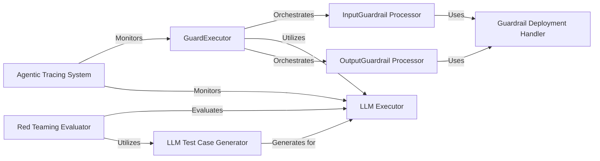

## Component Details

The Guardrail Execution Engine is a critical subsystem within ragaai_catalyst responsible for enforcing policies and ensuring adherence to safety and performance criteria during interactions with Large Language Models (LLMs). It acts as a central control point, orchestrating the application of rules to both inputs and outputs of LLM processes.

### GuardExecutor
The core orchestrator of the guardrail system. It defines the sequential flow for applying input guardrails, executing the LLM, and then applying output guardrails. It ensures that all LLM interactions are compliant with defined policies.

**Related Classes/Methods**:

- <a href="https://github.com/raga-ai-hub/RagaAI-Catalyst/blob/master/ragaai_catalyst/guard_executor.py#L11-L268" target="_blank" rel="noopener noreferrer">`ragaai_catalyst.guard_executor.GuardExecutor` (11:268)</a>

### InputGuardrail Processor
This component is responsible for executing all pre-LLM checks and transformations. It validates and sanitizes the input prompt before it is sent to the LLM, ensuring adherence to input policies.

**Related Classes/Methods**:

- <a href="https://github.com/raga-ai-hub/RagaAI-Catalyst/blob/master/ragaai_catalyst/guard_executor.py#L165-L174" target="_blank" rel="noopener noreferrer">`ragaai_catalyst.guard_executor.GuardExecutor:execute_input_guardrails` (165:174)</a>

### LLM Executor
This component serves as the direct interface to the underlying Large Language Model. It handles the communication, sending the processed input and receiving the raw output from the LLM.

**Related Classes/Methods**:

- <a href="https://github.com/raga-ai-hub/RagaAI-Catalyst/blob/master/ragaai_catalyst/guard_executor.py#L64-L101" target="_blank" rel="noopener noreferrer">`ragaai_catalyst.guard_executor.GuardExecutor:llm_executor` (64:101)</a>

### OutputGuardrail Processor
This component is responsible for executing all post-LLM checks and transformations on the LLM's response. It validates the output against defined policies, potentially redacting sensitive information, checking for harmful content, or reformatting the output.

**Related Classes/Methods**:

- <a href="https://github.com/raga-ai-hub/RagaAI-Catalyst/blob/master/ragaai_catalyst/guard_executor.py#L176-L268" target="_blank" rel="noopener noreferrer">`ragaai_catalyst.guard_executor.GuardExecutor:execute_output_guardrails` (176:268)</a>

### Guardrail Deployment Handler
A utility component that encapsulates the logic for setting up necessary variables and executing individual guardrail rules or "deployments." It provides a modular and reusable way to define and run specific guardrail checks.

**Related Classes/Methods**:

- <a href="https://github.com/raga-ai-hub/RagaAI-Catalyst/blob/master/ragaai_catalyst/guard_executor.py#L150-L163" target="_blank" rel="noopener noreferrer">`ragaai_catalyst.guard_executor.GuardExecutor:set_variables` (150:163)</a>
- <a href="https://github.com/raga-ai-hub/RagaAI-Catalyst/blob/master/ragaai_catalyst/guard_executor.py#L41-L62" target="_blank" rel="noopener noreferrer">`ragaai_catalyst.guard_executor.GuardExecutor:execute_deployment` (41:62)</a>

### Agentic Tracing System
A comprehensive system for monitoring and recording the entire lifecycle of LLM interactions, including the execution of guardrails, LLM calls, and resource usage. It provides crucial observability and debugging capabilities for the guardrail execution.

**Related Classes/Methods**:

- <a href="https://github.com/raga-ai-hub/RagaAI-Catalyst/blob/master/ragaai_catalyst/tracers/agentic_tracing/tracers/main_tracer.py#L47-L396" target="_blank" rel="noopener noreferrer">`ragaai_catalyst.tracers.agentic_tracing.tracers.main_tracer.AgenticTracing` (47:396)</a>

### Red Teaming Evaluator
A component within the red-teaming framework responsible for evaluating the performance and safety of LLM responses, particularly in the context of testing guardrails. It assesses how well the system handles adversarial or challenging inputs.

**Related Classes/Methods**:

- <a href="https://github.com/raga-ai-hub/RagaAI-Catalyst/blob/master/ragaai_catalyst/redteaming/evaluator.py#L22-L97" target="_blank" rel="noopener noreferrer">`ragaai_catalyst.redteaming.evaluator.Evaluator` (22:97)</a>

### LLM Test Case Generator
A component within the red-teaming framework that generates diverse and challenging inputs or scenarios for LLMs. These generated test cases are used to proactively test the robustness and effectiveness of the guardrail system.

**Related Classes/Methods**:

- <a href="https://github.com/raga-ai-hub/RagaAI-Catalyst/blob/master/ragaai_catalyst/redteaming/llm_generator.py#L6-L135" target="_blank" rel="noopener noreferrer">`ragaai_catalyst.redteaming.llm_generator.LLMGenerator` (6:135)</a>

### [FAQ](https://github.com/CodeBoarding/GeneratedOnBoardings/tree/main?tab=readme-ov-file#faq)