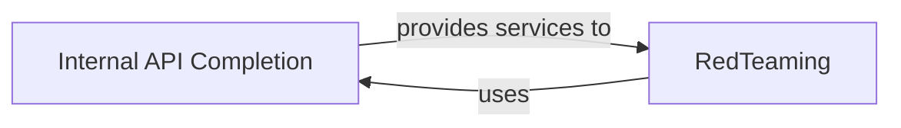

## Component Details

These two components, `Internal API Completion` and `RedTeaming`, are fundamental to the RagaAI Catalyst platform. `Internal API Completion` is the core backend service for API requests and data persistence, while `RedTeaming` ensures system security and robustness by identifying vulnerabilities. Their interdependency is crucial, as `RedTeaming` relies on `Internal API Completion` for testing, and its findings inform improvements to the API, creating a vital feedback loop for system enhancement.

### Internal API Completion
The `Internal API Completion` component is the central backend service responsible for processing all internal API requests and managing data persistence within the RagaAI Catalyst platform. It acts as a critical communication hub, facilitating data exchange and operations across various client-side and internal components.

**Related Classes/Methods**:

- <a href="https://github.com/raga-ai-hub/RagaAI-Catalyst/blob/master/ragaai_catalyst/internal_api_completion.py#L1-L1" target="_blank" rel="noopener noreferrer">`ragaai_catalyst.internal_api_completion` (1:1)</a>

### RedTeaming
The `RedTeaming` component is designed to evaluate the security and robustness of the RagaAI Catalyst system. It achieves this by simulating various attack scenarios and identifying potential vulnerabilities, thereby enhancing the system's resilience.

**Related Classes/Methods**:

- <a href="https://github.com/raga-ai-hub/RagaAI-Catalyst/blob/master/ragaai_catalyst/redteaming/red_teaming.py#L1-L1" target="_blank" rel="noopener noreferrer">`ragaai_catalyst.redteaming.red_teaming` (1:1)</a>

### [FAQ](https://github.com/CodeBoarding/GeneratedOnBoardings/tree/main?tab=readme-ov-file#faq)