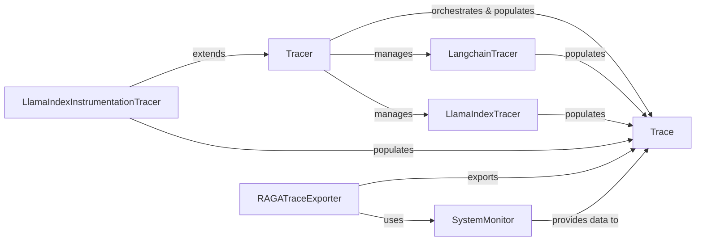

## Component Details

This component provides specialized mechanisms to seamlessly integrate RagaAI Catalyst's tracing capabilities with popular external LLM frameworks such as Langchain and LlamaIndex. This is achieved by implementing their respective callback or instrumentation mechanisms to automatically capture relevant events.

### Tracer
This is the central and most comprehensive tracing component. It extends `AgenticTracing` to provide holistic tracing for complex agentic AI systems, aggregating functionalities from various mixins. It acts as a central orchestrator for collecting diverse trace data and is the primary entry point for users to initiate and control tracing, including the integration with external LLM frameworks.

**Related Classes/Methods**:

- <a href="https://github.com/raga-ai-hub/RagaAI-Catalyst/blob/master/ragaai_catalyst/tracers/tracer.py#L38-L895" target="_blank" rel="noopener noreferrer">`Tracer` (38:895)</a>

### LangchainTracer
A specialized callback handler designed to integrate with Langchain applications. It intercepts various events (LLM calls, chain runs, tool usage, agent actions) within a Langchain workflow to capture a detailed trace of the execution. It uses monkey-patching to achieve this seamless integration.

**Related Classes/Methods**:

- `LangchainTracer` (1:1)

### LlamaIndexTracer
Similar to `LangchainTracer`, this component focuses on tracing operations within LlamaIndex applications using a callback mechanism. It captures query traces, LLM interactions, and data processing steps, providing insights into how LlamaIndex-based systems operate. It also employs monkey-patching for integration.

**Related Classes/Methods**:

- `LlamaIndexTracer` (1:1)

### LlamaIndexInstrumentationTracer
This is a specific implementation of the `Tracer` for LlamaIndex, leveraging `EventHandler` and `SpanHandler` for its internal workings. It provides a more granular or alternative integration with LlamaIndex compared to `LlamaIndexTracer` (the callback-based one), offering flexibility in how tracing is achieved.

**Related Classes/Methods**:

- `LlamaIndexInstrumentationTracer` (1:1)

### Trace
The fundamental data model that encapsulates all the collected tracing information. It's a structured representation of an AI application's execution, including events, metadata, system information, and resource usage. All tracer components populate instances of this structure, ensuring a standardized format for data aggregation and export.

**Related Classes/Methods**:

- `Trace` (1:1)

### RAGATraceExporter
The primary component responsible for data egress. It takes the collected trace data (represented by `Trace` objects) and securely transmits it to the RagaAI platform for storage, analysis, and visualization. It inherits from `DynamicTraceExporter` and integrates system metrics from `SystemMonitor` into the exported traces.

**Related Classes/Methods**:

- `RAGATraceExporter` (1:1)

### SystemMonitor
This utility component is responsible for collecting real-time system resource metrics (e.g., CPU usage, memory consumption, disk I/O, network activity) during the tracing period. This data enriches the traces, providing crucial context about the performance and resource footprint of the AI application. It is utilized by both the core tracing logic and the exporter.

**Related Classes/Methods**:

- <a href="https://github.com/raga-ai-hub/RagaAI-Catalyst/blob/master/ragaai_catalyst/tracers/agentic_tracing/utils/system_monitor.py#L23-L214" target="_blank" rel="noopener noreferrer">`SystemMonitor` (23:214)</a>

### [FAQ](https://github.com/CodeBoarding/GeneratedOnBoardings/tree/main?tab=readme-ov-file#faq)