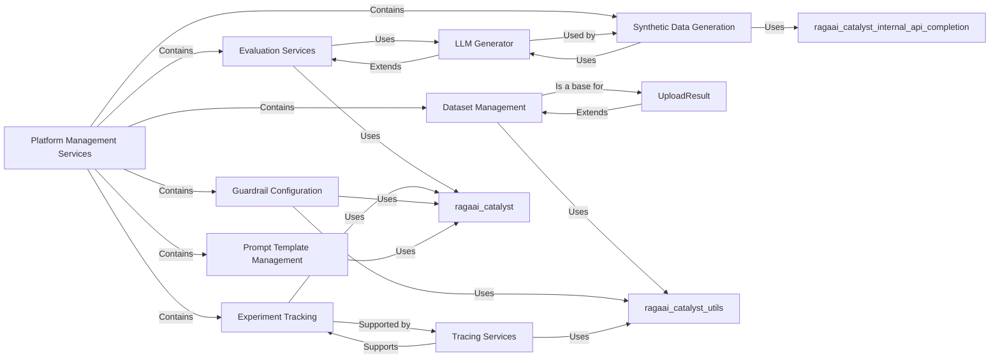

## Component Details

The selection of these components is based on their explicit mention in the `Platform Management Services` description, their direct representation in the `ragaai_catalyst` package structure, and the insights gained from the `getClassHierarchy` output.

1.  **Platform Management Services**: This is the top-level component as defined, acting as an aggregator for related functionalities.
2.  **Dataset Management, Evaluation Services, Experiment Tracking, Guardrail Configuration, Prompt Template Management, Synthetic Data Generation**: These are the core functional areas explicitly listed as part of `Platform Management Services`. They represent distinct, high-level capabilities of the RagaAI Catalyst platform.
3.  **UploadResult**: The `getClassHierarchy` revealed that `ragaai_catalyst.redteaming.upload_result.UploadResult` inherits from `ragaai_catalyst.dataset.Dataset`. This makes `UploadResult` a fundamental, specialized part of dataset management, indicating how results are integrated back into the data ecosystem.
4.  **LLM Generator**: `ragaai_catalyst.redteaming.llm_generator.LLMGenerator` inherits from `ragaai_catalyst.redteaming.evaluator.Evaluator`. This highlights its critical role in both evaluation (by generating evaluation-related content) and synthetic data generation, making it a bridge between these two core services.
5.  **Tracing Services**: The presence of `ragaai_catalyst.tracers.tracer.Tracer` and `ragaai_catalyst.tracers.agentic_tracing.tracers.main_tracer.AgenticTracing` in the class hierarchy indicates a dedicated tracing infrastructure. This is fundamental for `Experiment Tracking` as it provides the necessary observability and data collection for monitoring and analyzing experimental runs.

These components are fundamental because they directly address the stated purpose of `Platform Management Services` by providing the necessary abstractions and concrete implementations for managing data, evaluating models, tracking experiments, enforcing policies, handling prompts, and generating synthetic data. Their relationships, particularly inheritance and usage, illustrate a cohesive and modular architecture.

### Platform Management Services
A comprehensive suite of core services responsible for managing key aspects of the RagaAI Catalyst platform. This umbrella component groups functionalities for dataset management, model evaluation, experiment tracking, guardrail configuration, prompt template management, and synthetic data generation, providing a modular and scalable architecture for platform operations.

**Related Classes/Methods**:

- <a href="https://github.com/raga-ai-hub/RagaAI-Catalyst/blob/master/ragaai_catalyst/dataset.py#L1-L1" target="_blank" rel="noopener noreferrer">`ragaai_catalyst.dataset` (1:1)</a>
- <a href="https://github.com/raga-ai-hub/RagaAI-Catalyst/blob/master/ragaai_catalyst/evaluation.py#L1-L1" target="_blank" rel="noopener noreferrer">`ragaai_catalyst.evaluation` (1:1)</a>
- <a href="https://github.com/raga-ai-hub/RagaAI-Catalyst/blob/master/ragaai_catalyst/experiment.py#L1-L1" target="_blank" rel="noopener noreferrer">`ragaai_catalyst.experiment` (1:1)</a>
- <a href="https://github.com/raga-ai-hub/RagaAI-Catalyst/blob/master/ragaai_catalyst/guardrails_manager.py#L1-L1" target="_blank" rel="noopener noreferrer">`ragaai_catalyst.guardrails_manager` (1:1)</a>
- <a href="https://github.com/raga-ai-hub/RagaAI-Catalyst/blob/master/ragaai_catalyst/prompt_manager.py#L1-L1" target="_blank" rel="noopener noreferrer">`ragaai_catalyst.prompt_manager` (1:1)</a>
- <a href="https://github.com/raga-ai-hub/RagaAI-Catalyst/blob/master/ragaai_catalyst/synthetic_data_generation.py#L1-L1" target="_blank" rel="noopener noreferrer">`ragaai_catalyst.synthetic_data_generation` (1:1)</a>

### Dataset Management
Provides core functionalities for managing datasets, including listing existing datasets and creating new ones from structured data. It serves as a foundational abstraction for data handling, with other components building upon its capabilities.

**Related Classes/Methods**:

- <a href="https://github.com/raga-ai-hub/RagaAI-Catalyst/blob/master/ragaai_catalyst/dataset.py#L18-L733" target="_blank" rel="noopener noreferrer">`ragaai_catalyst.dataset.Dataset` (18:733)</a>
- <a href="https://github.com/raga-ai-hub/RagaAI-Catalyst/blob/master/ragaai_catalyst/redteaming/upload_result.py#L2-L28" target="_blank" rel="noopener noreferrer">`ragaai_catalyst.redteaming.upload_result.UploadResult` (2:28)</a>

### Evaluation Services
Encapsulates the logic and processes for evaluating models and conversations based on defined criteria. This module is crucial for assessing the performance and behavior of AI systems.

**Related Classes/Methods**:

- <a href="https://github.com/raga-ai-hub/RagaAI-Catalyst/blob/master/ragaai_catalyst/evaluation.py#L1-L1" target="_blank" rel="noopener noreferrer">`ragaai_catalyst.evaluation` (1:1)</a>
- <a href="https://github.com/raga-ai-hub/RagaAI-Catalyst/blob/master/ragaai_catalyst/redteaming/evaluator.py#L22-L97" target="_blank" rel="noopener noreferrer">`ragaai_catalyst.redteaming.evaluator.Evaluator` (22:97)</a>

### Experiment Tracking
Manages the lifecycle of experiments, including logging configurations, parameters, metrics, and results. It provides the necessary tools for reproducibility and analysis of experimental runs.

**Related Classes/Methods**:

- <a href="https://github.com/raga-ai-hub/RagaAI-Catalyst/blob/master/ragaai_catalyst/experiment.py#L1-L1" target="_blank" rel="noopener noreferrer">`ragaai_catalyst.experiment` (1:1)</a>
- <a href="https://github.com/raga-ai-hub/RagaAI-Catalyst/blob/master/ragaai_catalyst/tracers/tracer.py#L1-L1" target="_blank" rel="noopener noreferrer">`ragaai_catalyst.tracers.tracer` (1:1)</a>
- <a href="https://github.com/raga-ai-hub/RagaAI-Catalyst/blob/master/ragaai_catalyst/tracers/agentic_tracing/tracers/main_tracer.py#L1-L1" target="_blank" rel="noopener noreferrer">`ragaai_catalyst.tracers.agentic_tracing.tracers.main_tracer` (1:1)</a>

### Guardrail Configuration
Responsible for defining, configuring, and managing guardrails—rules and policies that ensure AI models operate within desired safety and ethical boundaries.

**Related Classes/Methods**:

- <a href="https://github.com/raga-ai-hub/RagaAI-Catalyst/blob/master/ragaai_catalyst/guardrails_manager.py#L1-L1" target="_blank" rel="noopener noreferrer">`ragaai_catalyst.guardrails_manager` (1:1)</a>

### Prompt Template Management
Facilitates the creation, storage, retrieval, and versioning of prompt templates. This component is vital for consistent and effective interaction with Large Language Models.

**Related Classes/Methods**:

- <a href="https://github.com/raga-ai-hub/RagaAI-Catalyst/blob/master/ragaai_catalyst/prompt_manager.py#L1-L1" target="_blank" rel="noopener noreferrer">`ragaai_catalyst.prompt_manager` (1:1)</a>

### Synthetic Data Generation
Provides capabilities for generating synthetic datasets, which can be used to augment real data, create diverse test cases, or train models in data-scarce scenarios.

**Related Classes/Methods**:

- <a href="https://github.com/raga-ai-hub/RagaAI-Catalyst/blob/master/ragaai_catalyst/synthetic_data_generation.py#L1-L1" target="_blank" rel="noopener noreferrer">`ragaai_catalyst.synthetic_data_generation` (1:1)</a>
- <a href="https://github.com/raga-ai-hub/RagaAI-Catalyst/blob/master/ragaai_catalyst/redteaming/llm_generator.py#L1-L1" target="_blank" rel="noopener noreferrer">`ragaai_catalyst.redteaming.llm_generator` (1:1)</a>

### UploadResult
A specialized component for uploading results, which directly builds upon the functionalities provided by the Dataset Management component.

**Related Classes/Methods**:

- <a href="https://github.com/raga-ai-hub/RagaAI-Catalyst/blob/master/ragaai_catalyst/redteaming/upload_result.py#L2-L28" target="_blank" rel="noopener noreferrer">`ragaai_catalyst.redteaming.upload_result.UploadResult` (2:28)</a>

### LLM Generator
A component responsible for generating content using Large Language Models, often utilized in synthetic data generation and specific evaluation scenarios.

**Related Classes/Methods**:

- <a href="https://github.com/raga-ai-hub/RagaAI-Catalyst/blob/master/ragaai_catalyst/redteaming/llm_generator.py#L1-L1" target="_blank" rel="noopener noreferrer">`ragaai_catalyst.redteaming.llm_generator` (1:1)</a>

### Tracing Services
Provides mechanisms for tracing the execution flow and collecting performance metrics, crucial for debugging, monitoring, and supporting experiment tracking within the platform.

**Related Classes/Methods**:

- <a href="https://github.com/raga-ai-hub/RagaAI-Catalyst/blob/master/ragaai_catalyst/tracers/tracer.py#L1-L1" target="_blank" rel="noopener noreferrer">`ragaai_catalyst.tracers.tracer` (1:1)</a>
- <a href="https://github.com/raga-ai-hub/RagaAI-Catalyst/blob/master/ragaai_catalyst/tracers/agentic_tracing/tracers/main_tracer.py#L1-L1" target="_blank" rel="noopener noreferrer">`ragaai_catalyst.tracers.agentic_tracing.tracers.main_tracer` (1:1)</a>

### [FAQ](https://github.com/CodeBoarding/GeneratedOnBoardings/tree/main?tab=readme-ov-file#faq)