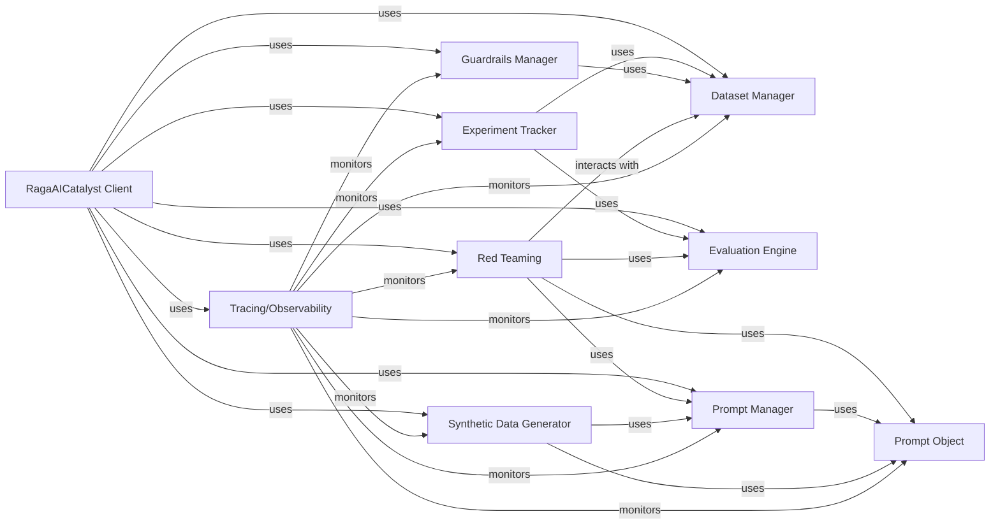

## Component Details

One paragraph explaining the functionality which is represented by this graph. What the main flow is and what is its purpose.

### RagaAICatalyst Client
The primary user-facing interface for the RagaAI Catalyst platform. It serves as the central orchestrator, handling initial setup, user authentication, and providing a unified entry point to access and coordinate various platform functionalities.

**Related Classes/Methods**:

- <a href="https://github.com/raga-ai-hub/RagaAI-Catalyst/blob/master/ragaai_catalyst/ragaai_catalyst.py#L11-L468" target="_blank" rel="noopener noreferrer">`ragaai_catalyst.ragaai_catalyst.RagaAICatalyst` (11:468)</a>

### Dataset Manager
Responsible for managing datasets within the RagaAI-Catalyst platform. It provides functionalities for listing existing datasets, creating new datasets from various sources (CSV, JSONL, Pandas DataFrames), and adding new rows to existing datasets. It handles the underlying mechanisms for data upload and schema generation.

**Related Classes/Methods**:

- <a href="https://github.com/raga-ai-hub/RagaAI-Catalyst/blob/master/ragaai_catalyst/dataset.py#L18-L733" target="_blank" rel="noopener noreferrer">`ragaai_catalyst.dataset.Dataset` (18:733)</a>

### Evaluation Engine
Orchestrates the evaluation of models and datasets. It allows users to define and add various metrics for evaluation, retrieve dataset schemas, map variables, and ultimately fetch the evaluation results. It interacts with internal services to get metric configurations and process evaluation requests.

**Related Classes/Methods**:

- <a href="https://github.com/raga-ai-hub/RagaAI-Catalyst/blob/master/ragaai_catalyst/evaluation.py#L15-L519" target="_blank" rel="noopener noreferrer">`ragaai_catalyst.evaluation.Evaluation` (15:519)</a>

### Experiment Tracker
Manages and monitors machine learning experiments. It verifies the existence of projects and datasets, lists ongoing or completed experiments, and retrieves the results of specific experiments. It handles potential failures during result retrieval.

**Related Classes/Methods**:

- <a href="https://github.com/raga-ai-hub/RagaAI-Catalyst/blob/master/ragaai_catalyst/experiment.py#L13-L481" target="_blank" rel="noopener noreferrer">`ragaai_catalyst.experiment.Experiment` (13:481)</a>

### Guardrails Manager
This component is responsible for managing guardrails, which are mechanisms to ensure model safety, fairness, or performance. It allows for listing datasets, creating deployments for guardrails, and adding specific guardrail configurations. It interacts with internal services to retrieve project lists and guardrail details.

**Related Classes/Methods**:

- <a href="https://github.com/raga-ai-hub/RagaAI-Catalyst/blob/master/ragaai_catalyst/guardrails_manager.py#L9-L323" target="_blank" rel="noopener noreferrer">`ragaai_catalyst.guardrails_manager.GuardrailsManager` (9:323)</a>

### Prompt Manager
Provides an interface for managing prompts, which are crucial for interacting with large language models. It enables listing available prompts, retrieving specific prompts by name or version, and listing all versions of a prompt.

**Related Classes/Methods**:

- <a href="https://github.com/raga-ai-hub/RagaAI-Catalyst/blob/master/ragaai_catalyst/prompt_manager.py#L7-L140" target="_blank" rel="noopener noreferrer">`ragaai_catalyst.prompt_manager.PromptManager` (7:140)</a>

### Prompt Object
Represents a single prompt and its associated functionalities. It handles the extraction of variables from prompt content, compilation of prompts by substituting variable values, and retrieval of model parameters associated with the prompt. It serves as a data structure and utility for prompt manipulation.

**Related Classes/Methods**:

- <a href="https://github.com/raga-ai-hub/RagaAI-Catalyst/blob/master/ragaai_catalyst/prompt_manager.py#L314-L444" target="_blank" rel="noopener noreferrer">`ragaai_catalyst.prompt_manager.PromptObject` (314:444)</a>

### Synthetic Data Generator
Dedicated to generating synthetic data, including Q&A pairs and examples, from various document types (PDF, text, markdown, CSV). It validates input, initializes LLM clients, and manages the process of generating responses and examples using language models.

**Related Classes/Methods**:

- <a href="https://github.com/raga-ai-hub/RagaAI-Catalyst/blob/master/ragaai_catalyst/synthetic_data_generation.py#L25-L827" target="_blank" rel="noopener noreferrer">`ragaai_catalyst.synthetic_data_generation.SyntheticDataGeneration` (25:827)</a>

### Red Teaming
A specialized subsystem focused on evaluating the robustness and safety of models against adversarial inputs. It facilitates the generation of challenging conversations and scenarios, and provides mechanisms for evaluating model responses within these contexts. This component includes functionalities for generating LLM-based attacks and evaluating their impact.

**Related Classes/Methods**:

- <a href="https://github.com/raga-ai-hub/RagaAI-Catalyst/blob/master/ragaai_catalyst/redteaming/red_teaming.py#L16-L330" target="_blank" rel="noopener noreferrer">`ragaai_catalyst.redteaming.red_teaming.RedTeaming` (16:330)</a>
- <a href="https://github.com/raga-ai-hub/RagaAI-Catalyst/blob/master/ragaai_catalyst/redteaming/evaluator.py#L22-L97" target="_blank" rel="noopener noreferrer">`ragaai_catalyst.redteaming.evaluator.Evaluator` (22:97)</a>
- <a href="https://github.com/raga-ai-hub/RagaAI-Catalyst/blob/master/ragaai_catalyst/redteaming/llm_generator.py#L6-L135" target="_blank" rel="noopener noreferrer">`ragaai_catalyst.redteaming.llm_generator.LLMGenerator` (6:135)</a>
- <a href="https://github.com/raga-ai-hub/RagaAI-Catalyst/blob/master/ragaai_catalyst/redteaming/data_generator/scenario_generator.py#L0-L0" target="_blank" rel="noopener noreferrer">`ragaai_catalyst.redteaming.data_generator.scenario_generator` (0:0)</a>
- <a href="https://github.com/raga-ai-hub/RagaAI-Catalyst/blob/master/ragaai_catalyst/redteaming/data_generator/test_case_generator.py#L0-L0" target="_blank" rel="noopener noreferrer">`ragaai_catalyst.redteaming.data_generator.test_case_generator` (0:0)</a>

### Tracing/Observability
Provides comprehensive tracing and observability capabilities across the RagaAI Catalyst platform. It captures detailed execution flows, resource utilization, and performance metrics, which are crucial for debugging, performance optimization, and monitoring the behavior of LLM-powered applications and agents. This component includes a robust tracing mechanism that can integrate with various parts of the system.

**Related Classes/Methods**:

- <a href="https://github.com/raga-ai-hub/RagaAI-Catalyst/blob/master/ragaai_catalyst/tracers/tracer.py#L38-L895" target="_blank" rel="noopener noreferrer">`ragaai_catalyst.tracers.tracer.Tracer` (38:895)</a>
- <a href="https://github.com/raga-ai-hub/RagaAI-Catalyst/blob/master/ragaai_catalyst/ragaai_catalyst.py#L0-L0" target="_blank" rel="noopener noreferrer">`ragaai_catalyst.tracers.agentic_tracing` (0:0)</a>
- <a href="https://github.com/raga-ai-hub/RagaAI-Catalyst/blob/master/ragaai_catalyst/ragaai_catalyst.py#L0-L0" target="_blank" rel="noopener noreferrer">`ragaai_catalyst.tracers.exporters` (0:0)</a>
- <a href="https://github.com/raga-ai-hub/RagaAI-Catalyst/blob/master/ragaai_catalyst/tracers/langchain_callback.py#L0-L0" target="_blank" rel="noopener noreferrer">`ragaai_catalyst.tracers.langchain_callback` (0:0)</a>
- <a href="https://github.com/raga-ai-hub/RagaAI-Catalyst/blob/master/ragaai_catalyst/tracers/llamaindex_callback.py#L0-L0" target="_blank" rel="noopener noreferrer">`ragaai_catalyst.tracers.llamaindex_callback` (0:0)</a>
- <a href="https://github.com/raga-ai-hub/RagaAI-Catalyst/blob/master/ragaai_catalyst/tracers/llamaindex_instrumentation.py#L0-L0" target="_blank" rel="noopener noreferrer">`ragaai_catalyst.tracers.llamaindex_instrumentation` (0:0)</a>
- <a href="https://github.com/raga-ai-hub/RagaAI-Catalyst/blob/master/ragaai_catalyst/tracers/upload_traces.py#L0-L0" target="_blank" rel="noopener noreferrer">`ragaai_catalyst.tracers.upload_traces` (0:0)</a>
- <a href="https://github.com/raga-ai-hub/RagaAI-Catalyst/blob/master/ragaai_catalyst/tracers/distributed.py#L0-L0" target="_blank" rel="noopener noreferrer">`ragaai_catalyst.tracers.distributed` (0:0)</a>

### [FAQ](https://github.com/CodeBoarding/GeneratedOnBoardings/tree/main?tab=readme-ov-file#faq)