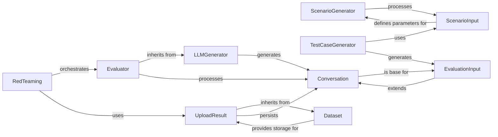

## Component Details

The Red Teaming Orchestration subsystem is designed to manage the entire lifecycle of red teaming exercises, from generating adversarial scenarios and test cases to interacting with LLMs, evaluating outcomes, and uploading results. The selected components are fundamental because they represent the core functional blocks and data structures necessary for this process.

### RedTeaming
The primary orchestrator of the red teaming process. It initiates and manages red teaming runs, coordinating the various stages from data generation to evaluation and result saving.

**Related Classes/Methods**:

- <a href="https://github.com/raga-ai-hub/RagaAI-Catalyst/blob/master/ragaai_catalyst/redteaming/red_teaming.py#L16-L330" target="_blank" rel="noopener noreferrer">`RedTeaming` (16:330)</a>

### Evaluator
Responsible for assessing conversational outcomes against predefined criteria. It encapsulates the logic for evaluating LLM responses and determining their adherence to safety or performance benchmarks.

**Related Classes/Methods**:

- <a href="https://github.com/raga-ai-hub/RagaAI-Catalyst/blob/master/ragaai_catalyst/redteaming/evaluator.py#L22-L97" target="_blank" rel="noopener noreferrer">`Evaluator` (22:97)</a>

### LLMGenerator
Abstracts and manages all interactions with various Large Language Models. It handles API key validation, provider-specific configurations, and the actual generation of LLM responses.

**Related Classes/Methods**:

- `LLMGenerator` (1:1)

### ScenarioGenerator
Focuses on creating diverse and relevant scenarios that serve as the foundational context for red teaming test cases. It defines the high-level adversarial situations.

**Related Classes/Methods**:

- <a href="https://github.com/raga-ai-hub/RagaAI-Catalyst/blob/master/ragaai_catalyst/redteaming/data_generator/scenario_generator.py#L14-L78" target="_blank" rel="noopener noreferrer">`ScenarioGenerator` (14:78)</a>

### TestCaseGenerator
Generates specific, actionable test cases based on the broader scenarios. These test cases are designed to directly probe the LLM's behavior under various conditions.

**Related Classes/Methods**:

- <a href="https://github.com/raga-ai-hub/RagaAI-Catalyst/blob/master/ragaai_catalyst/redteaming/data_generator/test_case_generator.py#L17-L97" target="_blank" rel="noopener noreferrer">`TestCaseGenerator` (17:97)</a>

### UploadResult
Manages the process of uploading red teaming results, typically in a structured format like CSV, to a designated dataset within the platform.

**Related Classes/Methods**:

- <a href="https://github.com/raga-ai-hub/RagaAI-Catalyst/blob/master/ragaai_catalyst/redteaming/upload_result.py#L2-L28" target="_blank" rel="noopener noreferrer">`UploadResult` (2:28)</a>

### Dataset
Provides core functionalities for managing datasets, including listing existing datasets and creating new ones from structured data. It acts as a fundamental data storage and retrieval utility.

**Related Classes/Methods**:

- <a href="https://github.com/raga-ai-hub/RagaAI-Catalyst/blob/master/ragaai_catalyst/dataset.py#L18-L733" target="_blank" rel="noopener noreferrer">`Dataset` (18:733)</a>

### Conversation
A fundamental data structure that represents a sequence of interactions (turns) between participants in a dialogue. It encapsulates the content and flow of a conversation.

**Related Classes/Methods**:

- `Conversation` (1:1)

### EvaluationInput
A specialized data structure that defines the specific input parameters and context required for the evaluation process. It guides how conversations are assessed.

**Related Classes/Methods**:

- `EvaluationInput` (1:1)

### ScenarioInput
A data structure that defines the input parameters and constraints for the ScenarioGenerator, guiding the creation of new adversarial scenarios.

**Related Classes/Methods**:

- `ScenarioInput` (1:1)

### [FAQ](https://github.com/CodeBoarding/GeneratedOnBoardings/tree/main?tab=readme-ov-file#faq)