```mermaid
graph LR
    Trace_Data_Structures["Trace Data Structures"]
    RagaAI_API_Interaction["RagaAI API Interaction"]
    Trace_Upload_Orchestrator["Trace Upload Orchestrator"]
    Agentic_Trace_Uploader["Agentic Trace Uploader"]
    RagaAI_Trace_Exporter["RagaAI Trace Exporter"]
    Dynamic_Trace_Exporter["Dynamic Trace Exporter"]
    Legacy_Trace_Uploader["Legacy Trace Uploader"]
    File_Span_Exporter["File Span Exporter"]
    Trace_Data_Structures -- "Defines data processed by" --> RagaAI_Trace_Exporter
    Trace_Data_Structures -- "Defines data processed by" --> Agentic_Trace_Uploader
    RagaAI_API_Interaction -- "Provides API access to" --> Agentic_Trace_Uploader
    RagaAI_API_Interaction -- "Provides API access to" --> Legacy_Trace_Uploader
    Trace_Upload_Orchestrator -- "Orchestrates" --> Agentic_Trace_Uploader
    RagaAI_Trace_Exporter -- "Submits upload tasks to" --> Trace_Upload_Orchestrator
    Agentic_Trace_Uploader -- "Utilizes" --> RagaAI_API_Interaction
    Agentic_Trace_Uploader -- "Orchestrated by" --> Trace_Upload_Orchestrator
    RagaAI_Trace_Exporter -- "Processes data from" --> Trace_Data_Structures
    RagaAI_Trace_Exporter -- "Submits upload tasks to" --> Trace_Upload_Orchestrator
    RagaAI_Trace_Exporter -- "Utilizes" --> Legacy_Trace_Uploader
    Dynamic_Trace_Exporter -- "Wraps" --> RagaAI_Trace_Exporter
    Dynamic_Trace_Exporter -- "Delegates export calls to" --> RagaAI_Trace_Exporter
    Legacy_Trace_Uploader -- "Utilizes" --> RagaAI_API_Interaction
    RagaAI_Trace_Exporter -- "Uses" --> Legacy_Trace_Uploader
    File_Span_Exporter -- "Processes" --> Trace_Data_Structures
```

## Component Details

This component is responsible for defining the internal data structures used for traces, organizing all collected trace information, and managing the packaging, uploading, and exporting of this trace data (including associated code and calculated metrics) to the RagaAI platform or other destinations.

### Trace Data Structures
This foundational component defines the internal data models for representing various aspects of traces, including `Component` (base for `LLM`, `Agent`, `Tool` components), `Interaction`, `Trace`, and `Metadata`. It also encompasses detailed sub-structures for system resources and LLM-specific details. These structures are critical for standardizing the collected trace data.

**Related Classes/Methods**:

- <a href="https://github.com/raga-ai-hub/RagaAI-Catalyst/blob/master/ragaai_catalyst/tracers/agentic_tracing/data/data_structure.py#L1-L1" target="_blank" rel="noopener noreferrer">`ragaai_catalyst.tracers.agentic_tracing.data.data_structure` (1:1)</a>

### RagaAI API Interaction
This component serves as the primary interface for low-level interactions with the RagaAI platform's API. Its responsibilities include managing API authentication, checking and creating dataset schemas, obtaining presigned URLs for secure file uploads, streaming trace data, and handling the actual file uploads. It acts as a robust and reliable communication layer.

**Related Classes/Methods**:

- <a href="https://github.com/raga-ai-hub/RagaAI-Catalyst/blob/master/ragaai_catalyst/tracers/exporters/raga_exporter.py#L1-L1" target="_blank" rel="noopener noreferrer">`ragaai_catalyst.tracers.exporters.raga_exporter` (1:1)</a>

### Trace Upload Orchestrator
This component is responsible for managing the asynchronous submission and processing of trace upload tasks. It ensures that trace data, once prepared, is efficiently uploaded to the RagaAI platform in the background, handling task queuing, execution, and status monitoring. It acts as a central coordinator for upload operations.

**Related Classes/Methods**:

- <a href="https://github.com/raga-ai-hub/RagaAI-Catalyst/blob/master/ragaai_catalyst/tracers/agentic_tracing/upload/trace_uploader.py#L1-L1" target="_blank" rel="noopener noreferrer">`ragaai_catalyst.tracers.agentic_tracing.upload.trace_uploader` (1:1)</a>

### Agentic Trace Uploader
This specialized component handles the specific logic for uploading agentic traces. It works in conjunction with the `RagaAI API Interaction` component to obtain presigned URLs, prepare dataset spans, and insert the processed agentic trace data into the RagaAI platform. It focuses on the unique requirements of agentic trace data.

**Related Classes/Methods**:

- <a href="https://github.com/raga-ai-hub/RagaAI-Catalyst/blob/master/ragaai_catalyst/tracers/agentic_tracing/upload/upload_agentic_traces.py#L1-L1" target="_blank" rel="noopener noreferrer">`ragaai_catalyst.tracers.agentic_tracing.upload.upload_agentic_traces` (1:1)</a>

### RagaAI Trace Exporter
This is a comprehensive exporter responsible for processing and preparing various types of traces (general and RAG-specific) for upload. It integrates with system monitoring, data conversion utilities, and the trace upload mechanism. It acts as a central point for transforming raw trace data into a format suitable for the RagaAI platform and initiating the upload process.

**Related Classes/Methods**:

- <a href="https://github.com/raga-ai-hub/RagaAI-Catalyst/blob/master/ragaai_catalyst/tracers/exporters/ragaai_trace_exporter.py#L1-L1" target="_blank" rel="noopener noreferrer">`ragaai_catalyst.tracers.exporters.ragaai_trace_exporter` (1:1)</a>

### Dynamic Trace Exporter
This component acts as a flexible wrapper around the `RagaAI Trace Exporter`. It allows for dynamic updates to its properties (e.g., project name, dataset name) during runtime, which are then propagated to the underlying `RAGATraceExporter`. This provides adaptability and reconfigurability to the trace export process without needing to reinitialize the core exporter.

**Related Classes/Methods**:

- <a href="https://github.com/raga-ai-hub/RagaAI-Catalyst/blob/master/ragaai_catalyst/tracers/exporters/dynamic_trace_exporter.py#L1-L1" target="_blank" rel="noopener noreferrer">`ragaai_catalyst.tracers.exporters.dynamic_trace_exporter` (1:1)</a>

### Legacy Trace Uploader
This component provides a more general-purpose mechanism for uploading traces, including creating dataset schemas and managing presigned URLs for file uploads. While `UploadAgenticTraces` focuses specifically on agentic traces, this component appears to handle broader trace upload scenarios and is still actively used by the `RagaAI Trace Exporter`.

**Related Classes/Methods**:

- <a href="https://github.com/raga-ai-hub/RagaAI-Catalyst/blob/master/ragaai_catalyst/tracers/upload_traces.py#L1-L1" target="_blank" rel="noopener noreferrer">`ragaai_catalyst.tracers.upload_traces` (1:1)</a>

### File Span Exporter
This component is responsible for exporting trace spans directly to a local file. It provides an alternative or supplementary export mechanism for debugging, local analysis, or scenarios where direct platform upload isn't desired or possible.

**Related Classes/Methods**:

- <a href="https://github.com/raga-ai-hub/RagaAI-Catalyst/blob/master/ragaai_catalyst/tracers/exporters/file_span_exporter.py#L1-L1" target="_blank" rel="noopener noreferrer">`ragaai_catalyst.tracers.exporters.file_span_exporter` (1:1)</a>

### [FAQ](https://github.com/CodeBoarding/GeneratedOnBoardings/tree/main?tab=readme-ov-file#faq)