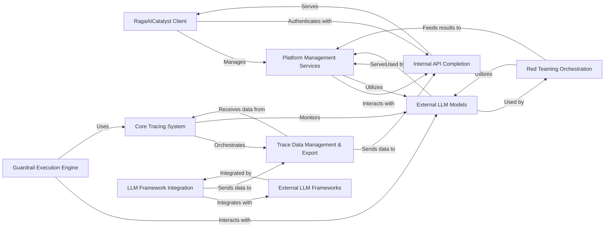

## Component Details

Final architecture analysis for RagaAI-Catalyst, consolidating insights from the Control Flow Graph (CFG) and source code analysis.

### RagaAICatalyst Client
The primary user-facing interface for the RagaAI Catalyst platform. It handles initial setup, user authentication, and orchestrates access to various platform functionalities, providing a unified entry point for users.

**Related Classes/Methods**:

- <a href="https://github.com/raga-ai-hub/RagaAI-Catalyst/blob/master/ragaai_catalyst/ragaai_catalyst.py#L1-L1" target="_blank" rel="noopener noreferrer">`ragaai_catalyst.ragaai_catalyst` (1:1)</a>

### Platform Management Services
A comprehensive suite of core services responsible for managing key aspects of the RagaAI Catalyst platform. This includes functionalities for dataset management, model evaluation, experiment tracking, guardrail configuration, prompt template management, and synthetic data generation.

**Related Classes/Methods**:

- <a href="https://github.com/raga-ai-hub/RagaAI-Catalyst/blob/master/ragaai_catalyst/dataset.py#L18-L733" target="_blank" rel="noopener noreferrer">`ragaai_catalyst.dataset.Dataset` (18:733)</a>
- <a href="https://github.com/raga-ai-hub/RagaAI-Catalyst/blob/master/ragaai_catalyst/evaluation.py#L1-L1" target="_blank" rel="noopener noreferrer">`ragaai_catalyst.evaluation` (1:1)</a>
- <a href="https://github.com/raga-ai-hub/RagaAI-Catalyst/blob/master/ragaai_catalyst/experiment.py#L1-L1" target="_blank" rel="noopener noreferrer">`ragaai_catalyst.experiment` (1:1)</a>
- <a href="https://github.com/raga-ai-hub/RagaAI-Catalyst/blob/master/ragaai_catalyst/guardrails_manager.py#L1-L1" target="_blank" rel="noopener noreferrer">`ragaai_catalyst.guardrails_manager` (1:1)</a>
- <a href="https://github.com/raga-ai-hub/RagaAI-Catalyst/blob/master/ragaai_catalyst/prompt_manager.py#L1-L1" target="_blank" rel="noopener noreferrer">`ragaai_catalyst.prompt_manager` (1:1)</a>
- <a href="https://github.com/raga-ai-hub/RagaAI-Catalyst/blob/master/ragaai_catalyst/synthetic_data_generation.py#L1-L1" target="_blank" rel="noopener noreferrer">`ragaai_catalyst.synthetic_data_generation` (1:1)</a>

### Internal API Completion
The central backend service that processes all internal API requests and manages data persistence for the RagaAI Catalyst platform. It acts as the critical communication hub, facilitating data exchange and operations across various client-side and internal components.

**Related Classes/Methods**: _None_

### Red Teaming Orchestration
Manages the entire lifecycle of red teaming exercises. This includes coordinating the generation of adversarial scenarios and test cases, facilitating interactions with LLMs for red teaming, evaluating conversational outcomes, and uploading the results back into the platform.

**Related Classes/Methods**:

- <a href="https://github.com/raga-ai-hub/RagaAI-Catalyst/blob/master/ragaai_catalyst/redteaming/red_teaming.py#L1-L1" target="_blank" rel="noopener noreferrer">`ragaai_catalyst.redteaming.red_teaming` (1:1)</a>
- <a href="https://github.com/raga-ai-hub/RagaAI-Catalyst/blob/master/ragaai_catalyst/redteaming/data_generator/scenario_generator.py#L1-L1" target="_blank" rel="noopener noreferrer">`ragaai_catalyst.redteaming.data_generator.scenario_generator` (1:1)</a>
- <a href="https://github.com/raga-ai-hub/RagaAI-Catalyst/blob/master/ragaai_catalyst/redteaming/data_generator/test_case_generator.py#L1-L1" target="_blank" rel="noopener noreferrer">`ragaai_catalyst.redteaming.data_generator.test_case_generator` (1:1)</a>
- <a href="https://github.com/raga-ai-hub/RagaAI-Catalyst/blob/master/ragaai_catalyst/redteaming/evaluator.py#L1-L1" target="_blank" rel="noopener noreferrer">`ragaai_catalyst.redteaming.evaluator` (1:1)</a>
- <a href="https://github.com/raga-ai-hub/RagaAI-Catalyst/blob/master/ragaai_catalyst/redteaming/llm_generator.py#L1-L1" target="_blank" rel="noopener noreferrer">`ragaai_catalyst.redteaming.llm_generator` (1:1)</a>
- <a href="https://github.com/raga-ai-hub/RagaAI-Catalyst/blob/master/ragaai_catalyst/redteaming/upload_result.py#L1-L1" target="_blank" rel="noopener noreferrer">`ragaai_catalyst.redteaming.upload_result` (1:1)</a>

### Core Tracing System
The foundational component for all observability and tracing activities within RagaAI Catalyst. It orchestrates the lifecycle of traces, collects detailed system and component-specific information (e.g., LLM interactions, agent/tool executions, custom code), and prepares this data for further processing and export.

**Related Classes/Methods**:

- <a href="https://github.com/raga-ai-hub/RagaAI-Catalyst/blob/master/ragaai_catalyst/tracers/tracer.py#L1-L1" target="_blank" rel="noopener noreferrer">`ragaai_catalyst.tracers.tracer` (1:1)</a>
- <a href="https://github.com/raga-ai-hub/RagaAI-Catalyst/blob/master/ragaai_catalyst/tracers/agentic_tracing/tracers/main_tracer.py#L1-L1" target="_blank" rel="noopener noreferrer">`ragaai_catalyst.tracers.agentic_tracing.tracers.main_tracer` (1:1)</a>
- <a href="https://github.com/raga-ai-hub/RagaAI-Catalyst/blob/master/ragaai_catalyst/tracers/agentic_tracing/tracers/base.py#L1-L1" target="_blank" rel="noopener noreferrer">`ragaai_catalyst.tracers.agentic_tracing.tracers.base` (1:1)</a>
- <a href="https://github.com/raga-ai-hub/RagaAI-Catalyst/blob/master/ragaai_catalyst/tracers/agentic_tracing/tracers/llm_tracer.py#L1-L1" target="_blank" rel="noopener noreferrer">`ragaai_catalyst.tracers.agentic_tracing.tracers.llm_tracer` (1:1)</a>
- <a href="https://github.com/raga-ai-hub/RagaAI-Catalyst/blob/master/ragaai_catalyst/tracers/agentic_tracing/tracers/agent_tracer.py#L1-L1" target="_blank" rel="noopener noreferrer">`ragaai_catalyst.tracers.agentic_tracing.tracers.agent_tracer` (1:1)</a>
- <a href="https://github.com/raga-ai-hub/RagaAI-Catalyst/blob/master/ragaai_catalyst/tracers/agentic_tracing/tracers/tool_tracer.py#L1-L1" target="_blank" rel="noopener noreferrer">`ragaai_catalyst.tracers.agentic_tracing.tracers.tool_tracer` (1:1)</a>
- <a href="https://github.com/raga-ai-hub/RagaAI-Catalyst/blob/master/ragaai_catalyst/tracers/agentic_tracing/tracers/custom_tracer.py#L1-L1" target="_blank" rel="noopener noreferrer">`ragaai_catalyst.tracers.agentic_tracing.tracers.custom_tracer` (1:1)</a>
- <a href="https://github.com/raga-ai-hub/RagaAI-Catalyst/blob/master/ragaai_catalyst/tracers/agentic_tracing/utils/file_name_tracker.py#L1-L1" target="_blank" rel="noopener noreferrer">`ragaai_catalyst.tracers.agentic_tracing.utils.file_name_tracker` (1:1)</a>
- <a href="https://github.com/raga-ai-hub/RagaAI-Catalyst/blob/master/ragaai_catalyst/tracers/agentic_tracing/utils/system_monitor.py#L1-L1" target="_blank" rel="noopener noreferrer">`ragaai_catalyst.tracers.agentic_tracing.utils.system_monitor` (1:1)</a>
- <a href="https://github.com/raga-ai-hub/RagaAI-Catalyst/blob/master/ragaai_catalyst/tracers/agentic_tracing/utils/llm_utils.py#L1-L1" target="_blank" rel="noopener noreferrer">`ragaai_catalyst.tracers.agentic_tracing.utils.llm_utils` (1:1)</a>
- <a href="https://github.com/raga-ai-hub/RagaAI-Catalyst/blob/master/ragaai_catalyst/tracers/utils/trace_json_converter.py#L1-L1" target="_blank" rel="noopener noreferrer">`ragaai_catalyst.tracers.utils.trace_json_converter` (1:1)</a>

### Trace Data Management & Export
Responsible for defining the internal data structures used for traces, organizing all collected trace information, and managing the packaging, uploading, and exporting of this trace data (including associated code and calculated metrics) to the RagaAI platform.

**Related Classes/Methods**:

- <a href="https://github.com/raga-ai-hub/RagaAI-Catalyst/blob/master/ragaai_catalyst/tracers/agentic_tracing/data/data_structure.py#L1-L1" target="_blank" rel="noopener noreferrer">`ragaai_catalyst.tracers.agentic_tracing.data.data_structure` (1:1)</a>
- <a href="https://github.com/raga-ai-hub/RagaAI-Catalyst/blob/master/ragaai_catalyst/tracers/upload_traces.py#L1-L1" target="_blank" rel="noopener noreferrer">`ragaai_catalyst.tracers.upload_traces` (1:1)</a>
- <a href="https://github.com/raga-ai-hub/RagaAI-Catalyst/blob/master/ragaai_catalyst/tracers/agentic_tracing/upload/trace_uploader.py#L1-L1" target="_blank" rel="noopener noreferrer">`ragaai_catalyst.tracers.agentic_tracing.upload.trace_uploader` (1:1)</a>
- <a href="https://github.com/raga-ai-hub/RagaAI-Catalyst/blob/master/ragaai_catalyst/tracers/agentic_tracing/upload/upload_agentic_traces.py#L1-L1" target="_blank" rel="noopener noreferrer">`ragaai_catalyst.tracers.agentic_tracing.upload.upload_agentic_traces` (1:1)</a>
- <a href="https://github.com/raga-ai-hub/RagaAI-Catalyst/blob/master/ragaai_catalyst/tracers/exporters/ragaai_trace_exporter.py#L1-L1" target="_blank" rel="noopener noreferrer">`ragaai_catalyst.tracers.exporters.ragaai_trace_exporter` (1:1)</a>
- <a href="https://github.com/raga-ai-hub/RagaAI-Catalyst/blob/master/ragaai_catalyst/tracers/exporters/raga_exporter.py#L1-L1" target="_blank" rel="noopener noreferrer">`ragaai_catalyst.tracers.exporters.raga_exporter` (1:1)</a>
- <a href="https://github.com/raga-ai-hub/RagaAI-Catalyst/blob/master/ragaai_catalyst/tracers/exporters/dynamic_trace_exporter.py#L1-L1" target="_blank" rel="noopener noreferrer">`ragaai_catalyst.tracers.exporters.dynamic_trace_exporter` (1:1)</a>
- <a href="https://github.com/raga-ai-hub/RagaAI-Catalyst/blob/master/ragaai_catalyst/tracers/exporters/file_span_exporter.py#L1-L1" target="_blank" rel="noopener noreferrer">`ragaai_catalyst.tracers.exporters.file_span_exporter` (1:1)</a>

### LLM Framework Integration
Provides specialized mechanisms to seamlessly integrate RagaAI Catalyst's tracing capabilities with popular external LLM frameworks such as Langchain and LlamaIndex. This is achieved by implementing their respective callback or instrumentation mechanisms to automatically capture relevant events.

**Related Classes/Methods**:

- <a href="https://github.com/raga-ai-hub/RagaAI-Catalyst/blob/master/ragaai_catalyst/tracers/langchain_callback.py#L1-L1" target="_blank" rel="noopener noreferrer">`ragaai_catalyst.tracers.langchain_callback` (1:1)</a>
- <a href="https://github.com/raga-ai-hub/RagaAI-Catalyst/blob/master/ragaai_catalyst/tracers/llamaindex_callback.py#L1-L1" target="_blank" rel="noopener noreferrer">`ragaai_catalyst.tracers.llamaindex_callback` (1:1)</a>
- <a href="https://github.com/raga-ai-hub/RagaAI-Catalyst/blob/master/ragaai_catalyst/tracers/llamaindex_instrumentation.py#L367-L423" target="_blank" rel="noopener noreferrer">`ragaai_catalyst.tracers.llamaindex_instrumentation.LlamaIndexInstrumentationTracer` (367:423)</a>

### External LLM Models
Represents various Large Language Models (LLMs) hosted externally (e.g., OpenAI, Anthropic, Google GenAI, Vertex AI). These models are utilized by the RagaAI Catalyst platform for a wide range of tasks, including generative AI, analytical processing, and guardrail enforcement.

**Related Classes/Methods**: _None_

### External LLM Frameworks
Represents popular open-source or commercial LLM frameworks (e.g., Langchain, LlamaIndex) that provide structured approaches for building applications with Large Language Models. RagaAI Catalyst integrates with these frameworks to offer enhanced tracing and monitoring capabilities.

**Related Classes/Methods**: _None_

### Guardrail Execution Engine
A dedicated component responsible for executing defined guardrails. It applies specified rules to both inputs and outputs of LLM interactions and other processes, interacting directly with Large Language Models to enforce policies and ensure adherence to safety and performance criteria.

**Related Classes/Methods**:

- <a href="https://github.com/raga-ai-hub/RagaAI-Catalyst/blob/master/ragaai_catalyst/guard_executor.py#L1-L1" target="_blank" rel="noopener noreferrer">`ragaai_catalyst.guard_executor` (1:1)</a>

### [FAQ](https://github.com/CodeBoarding/GeneratedOnBoardings/tree/main?tab=readme-ov-file#faq)