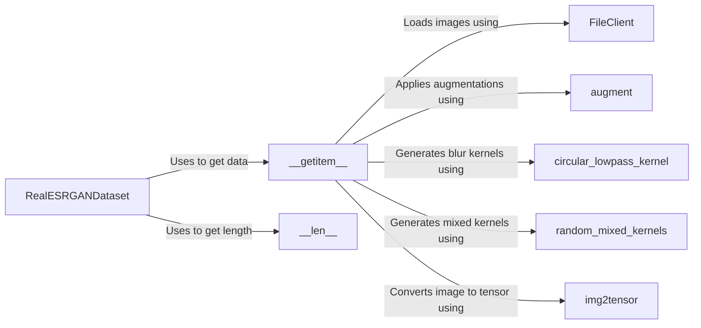

## Component Details

### RealESRGANDataset
The RealESRGANDataset class is a PyTorch Dataset responsible for preparing training data for Real-ESRGAN. It loads high-resolution ground truth images, applies augmentations to increase data diversity, and simulates low-quality images by applying blur and sinc kernels. This class is central to the data loading and pre-processing pipeline for training.
- **Related Classes/Methods**: `realesrgan.data.realesrgan_dataset.RealESRGANDataset`

### __getitem__
The __getitem__ method of the RealESRGANDataset class retrieves a single data item from the dataset. It loads the ground truth image, applies augmentations, generates blur and sinc kernels to simulate low-quality versions, and returns a dictionary containing the processed data. This method is crucial for providing training data to the model.
- **Related Classes/Methods**: `realesrgan.data.realesrgan_dataset.RealESRGANDataset:__getitem__`

### __len__
The __len__ method of the RealESRGANDataset class returns the total number of images in the dataset. This information is used by the data loader to iterate through the entire dataset during training.
- **Related Classes/Methods**: `realesrgan.data.realesrgan_dataset.RealESRGANDataset.__len__`

### FileClient
The FileClient class handles the actual reading of image files from disk or LMDB databases. It is used by the __getitem__ method of the RealESRGANDataset to load the ground truth images. This component abstracts the file I/O operations.
- **Related Classes/Methods**: `realesrgan.data.realesrgan_dataset.RealESRGANDataset`

### augment
The augment function applies data augmentation techniques such as horizontal flips and rotations to the ground truth images. This function is called within __getitem__ to increase the diversity of the training data and improve the model's generalization ability.
- **Related Classes/Methods**: `realesrgan.data.realesrgan_dataset.RealESRGANDataset`

### circular_lowpass_kernel
The circular_lowpass_kernel function generates a circular low-pass filter kernel, which is used to simulate blur in the low-quality images. It's used within __getitem__ as part of the degradation simulation process.
- **Related Classes/Methods**: `realesrgan.data.realesrgan_dataset.RealESRGANDataset`

### random_mixed_kernels
The random_mixed_kernels function generates a random mixture of different blur kernels. It's used within __getitem__ to create diverse blur effects for training, making the model more robust to different types of degradation.
- **Related Classes/Methods**: `realesrgan.data.realesrgan_dataset.RealESRGANDataset`

### img2tensor
The img2tensor function converts a NumPy image to a PyTorch tensor. It's used within __getitem__ to prepare the ground truth image for input to the neural network.
- **Related Classes/Methods**: `realesrgan.data.realesrgan_dataset.RealESRGANDataset`
