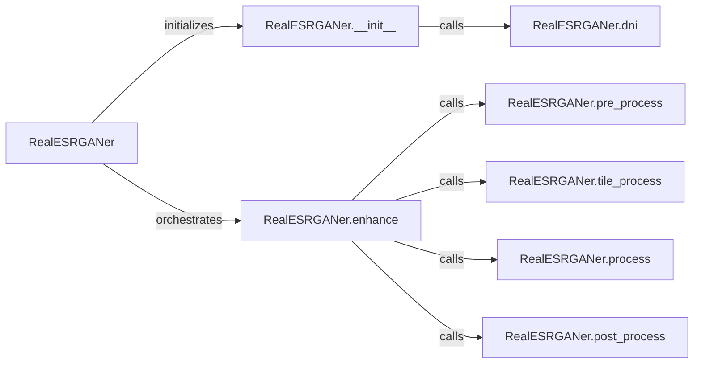

## Component Details

### RealESRGANer
A helper class for upsampling images with RealESRGAN. It encapsulates the entire enhancement process, including initialization, pre-processing, tile processing, actual model processing, and post-processing. It provides a high-level interface for enhancing images, abstracting away the complexities of the underlying model and tiling mechanisms.
- **Related Classes/Methods**: `realesrgan.utils.RealESRGANer`

### RealESRGANer.__init__
Initializes the RealESRGANer class, setting up the model, device, and other necessary configurations such as scale, tile size, padding, and half-precision settings. It also loads the pre-trained model and handles dynamic network interpolation (DNI) if multiple model paths are provided.
- **Related Classes/Methods**: `realesrgan.utils.RealESRGANer:__init__`

### RealESRGANer.enhance
The main function of the RealESRGANer class that orchestrates the enhancement process. It takes an image as input, converts it to the appropriate format, preprocesses it, applies tile processing if enabled, performs the actual model processing, post-processes the image, and returns the enhanced image.
- **Related Classes/Methods**: `realesrgan.utils.RealESRGANer:enhance`

### RealESRGANer.pre_process
Prepares the input image for enhancement by converting it to a torch tensor, moving it to the specified device, applying pre-padding and mod-padding to ensure the image dimensions are divisible by the scale factor.
- **Related Classes/Methods**: `realesrgan.utils.RealESRGANer:pre_process`

### RealESRGANer.tile_process
Splits the input image into tiles and processes each tile individually to handle large images that may exceed GPU memory capacity. It reconstructs the enhanced image from the processed tiles.
- **Related Classes/Methods**: `realesrgan.utils.RealESRGANer:tile_process`

### RealESRGANer.process
Applies the Real-ESRGAN model to the (potentially tiled) input image to perform the actual enhancement.
- **Related Classes/Methods**: `realesrgan.utils.RealESRGANer:process`

### RealESRGANer.post_process
Performs post-processing steps on the enhanced image, such as removing the extra padding added during pre-processing.
- **Related Classes/Methods**: `realesrgan.utils.RealESRGANer:post_process`

### RealESRGANer.dni
Performs dynamic network interpolation (DNI) to combine two pre-trained models with specified weights, allowing for a continuous transition between different imagery effects.
- **Related Classes/Methods**: `realesrgan.utils.RealESRGANer:dni`
