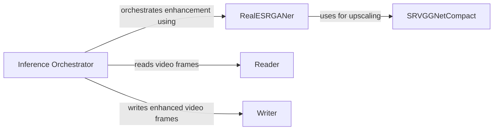

## Component Details

### Inference Orchestrator
The Inference Orchestrator is the central component responsible for managing the image and video enhancement pipeline. It initializes and loads the necessary Real-ESRGAN models, handles input data (images or video frames), delegates the enhancement process to the RealESRGANer, and manages the output, including writing enhanced frames to video files when processing videos. It coordinates the flow of data between the input source, enhancement processor, and output destination.
- **Related Classes/Methods**: `repos.Real-ESRGAN.inference_realesrgan`, `repos.Real-ESRGAN.inference_realesrgan_video`

### RealESRGANer
The RealESRGANer class is a utility that encapsulates the core image enhancement functionality using the Real-ESRGAN model. It handles pre-processing, inference, and post-processing of images. It can process images in tiles to handle large images and manages color space conversions and alpha channels.
- **Related Classes/Methods**: `realesrgan.utils.RealESRGANer`

### SRVGGNetCompact
SRVGGNetCompact defines the neural network architecture used for image upscaling. It consists of convolutional layers, activation functions, and a pixel shuffle operation for upsampling. The network learns the residual between the input and the upscaled output.
- **Related Classes/Methods**: `realesrgan.archs.srvgg_arch.SRVGGNetCompact`

### Reader
The Reader component is responsible for reading video frames from a video source. It can read from a video stream or a list of image frames, providing a consistent interface for accessing video data.
- **Related Classes/Methods**: `repos.Real-ESRGAN.inference_realesrgan_video.Reader`

### Writer
The Writer component handles writing enhanced video frames to an output video file. It provides the functionality to encode and save the processed frames into a video.
- **Related Classes/Methods**: `repos.Real-ESRGAN.inference_realesrgan_video.Writer`
