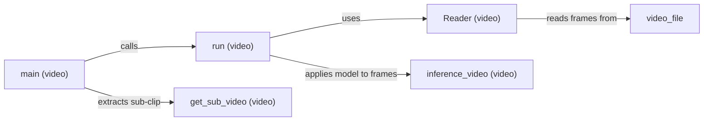

## Component Details

The Inference Orchestrator manages the process of enhancing images and videos using Real-ESRGAN. It handles both single images and videos, loading the Real-ESRGAN Enhancer and managing pre and post-processing steps. For videos, it extracts frames, enhances each frame individually, and reassembles the enhanced frames back into a video. The orchestrator serves as the primary entry point for utilizing Real-ESRGAN enhancement capabilities.

### main (video)
The main function orchestrates the video enhancement process. It parses command-line arguments, initializes the video reader and writer, and calls the run function to process the video.
- **Related Classes/Methods**: `inference_realesrgan_video.py:main`

### run (video)
This function contains the core logic for processing the video. It reads frames from the input video using the Reader class, applies the Real-ESRGAN model to each frame using the inference_video function, and writes the enhanced frames to the output video.
- **Related Classes/Methods**: `inference_realesrgan_video.py:run`

### Reader (video)
A class responsible for reading video frames from the input video file. It uses OpenCV (cv2) to decode the video and provide frames. The __init__ method initializes the video capture, and the get_frame method retrieves the next frame.
- **Related Classes/Methods**: `inference_realesrgan_video.py:Reader:__init__`, `inference_realesrgan_video.py:Reader:get_frame`

### get_sub_video (video)
This function extracts a sub-clip from the input video, based on start and end times provided as arguments. It modifies the video reader to only process frames within the specified time range.
- **Related Classes/Methods**: `inference_realesrgan_video.py:get_sub_video`

### inference_video (video)
This function applies the Real-ESRGAN model to each frame of the video. It takes a frame as input and returns the enhanced frame. It encapsulates the core image enhancement logic.
- **Related Classes/Methods**: `inference_realesrgan_video.py:inference_video`
