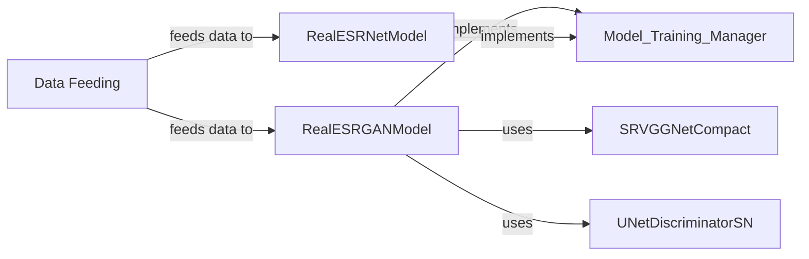

## Component Details

### RealESRGANModel
The RealESRGANModel class implements the Real-ESRGAN model for image super-resolution. It encapsulates the network architecture, loss functions, and optimization methods used for training. It also provides methods for data feeding, training, and evaluation. The model uses SRVGGNetCompact as the core architecture and UNetDiscriminatorSN for adversarial training.
- **Related Classes/Methods**: `realesrgan.models.realesrgan_model.RealESRGANModel`

### RealESRNetModel
The RealESRNetModel class implements the Real-ESRNet model for image super-resolution. Similar to RealESRGANModel, it manages the network architecture, loss functions, and optimization process. It also includes methods for feeding data, training, and evaluating the model. It differs in the network architecture used, employing a different structure than RealESRGANModel.
- **Related Classes/Methods**: `realesrgan.models.realesrnet_model.RealESRNetModel`

### SRVGGNetCompact
The SRVGGNetCompact class defines the compact SRVGG network architecture, which is a core component of the Real-ESRGAN model. It's responsible for generating the enhanced image from the input low-resolution image. It's a convolutional neural network designed for efficient and effective image super-resolution.
- **Related Classes/Methods**: `realesrgan.archs.srvgg_arch.SRVGGNetCompact`

### UNetDiscriminatorSN
The UNetDiscriminatorSN class defines the UNet-based discriminator network with spectral normalization. It's used in the adversarial training process of Real-ESRGAN to distinguish between real and generated images, helping to improve the realism of the super-resolved images. It provides feedback to the generator (SRVGGNetCompact) during training.
- **Related Classes/Methods**: `realesrgan.archs.discriminator_arch.UNetDiscriminatorSN`

### Data Feeding
The data feeding mechanism is responsible for preparing and enqueueing data for processing by the models. It involves functions like `feed_data` and `_dequeue_and_enqueue` within both RealESRGANModel and RealESRNetModel. These functions manage the data pipeline, ensuring a smooth flow of data during training and evaluation.
- **Related Classes/Methods**: `realesrgan.models.realesrnet_model.RealESRNetModel.feed_data`, `realesrgan.models.realesrnet_model.RealESRNetModel._dequeue_and_enqueue`, `realesrgan.models.realesrgan_model.RealESRGANModel.feed_data`, `realesrgan.models.realesrgan_model.RealESRGANModel._dequeue_and_enqueue`
