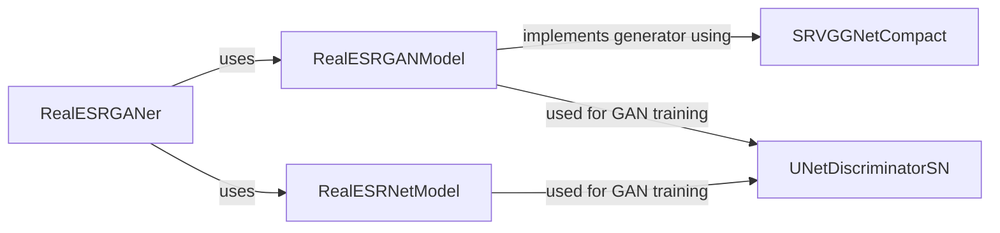

## Component Details

The Real-ESRGAN architecture enhances images using a generator-discriminator (GAN) setup or a single generator network. The generator, often based on SRVGGNetCompact or RealESRNet, upsamples and refines the input image. The discriminator, UNetDiscriminatorSN, distinguishes between real and generated images, guiding the generator to produce more realistic outputs. RealESRGANer provides a high-level interface for using these models.

### RealESRGANer
A utility class that provides a high-level interface for enhancing images using Real-ESRGAN models. It initializes the model and handles the image processing pipeline, including pre-processing and post-processing steps.
- **Related Classes/Methods**: `realesrgan/utils/RealESRGANer.py`

### RealESRGANModel
Defines the Real-ESRGAN architecture. It handles the forward pass of the model and the loss calculation during training. It incorporates elements from the SRVGGNetCompact architecture.
- **Related Classes/Methods**: `realesrgan/models/realesrgan_model.py`

### RealESRNetModel
Defines the Real-ESRNet architecture. It handles the forward pass of the model. It's an alternative generator architecture to RealESRGANModel.
- **Related Classes/Methods**: `realesrgan/models/realesrnet_model.py`

### SRVGGNetCompact
A compact SRVGG (Super-Resolution VGG) network architecture used as a building block within the RealESRGAN generator. It provides efficient upsampling and feature extraction capabilities.
- **Related Classes/Methods**: `realesrgan/archs/srvgg_arch.py`

### UNetDiscriminatorSN
A UNet-based discriminator network with spectral normalization (SN). It's used in the GAN training process to distinguish between real and generated images, thereby improving the realism of the generated images.
- **Related Classes/Methods**: `realesrgan/archs/discriminator_arch.py`
