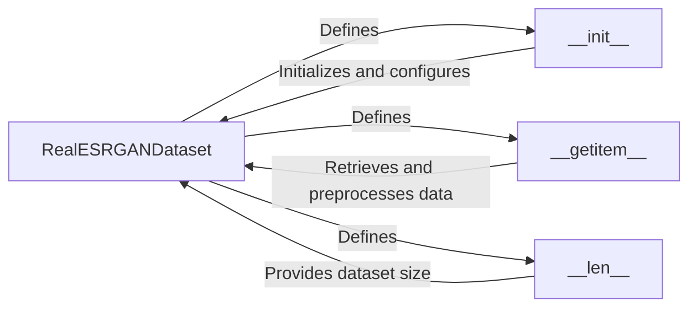

## Component Details

The RealESRGAN Dataset component is responsible for providing training and validation data to the RealESRGAN model. It loads and preprocesses low-resolution (LR) and high-resolution (HR) image pairs, applies data augmentations, and prepares the data in a format suitable for model training. The dataset class handles the complexities of data loading, augmentation, and organization, allowing the model to focus on learning the super-resolution task.

### RealESRGANDataset
The core class that defines the dataset structure and loading mechanism. It initializes with data paths, image sizes, and augmentation settings. It orchestrates the loading, preprocessing, and augmentation of image pairs.
- **Related Classes/Methods**: `realesrgan/data/realesrgan_dataset.py`

### __init__
The constructor of the RealESRGANDataset class. It takes configurations such as data paths, image sizes, and augmentation settings as input and initializes the dataset accordingly. It sets up the necessary data structures and transformations for data loading and preprocessing.
- **Related Classes/Methods**: `realesrgan/data/realesrgan_dataset.py`

### __getitem__
This method retrieves a data sample (LR and HR image pair) from the dataset at a given index. It performs the necessary data loading, preprocessing (e.g., resizing, normalization), and augmentation steps to prepare the data for training or inference. It returns the processed image pair as a tuple or dictionary.
- **Related Classes/Methods**: `realesrgan/data/realesrgan_dataset.py`

### __len__
This method returns the total number of samples (image pairs) in the dataset. It is used by the data loader to determine the size of the dataset and to iterate over all the samples during training or validation.
- **Related Classes/Methods**: `realesrgan/data/realesrgan_dataset.py`
