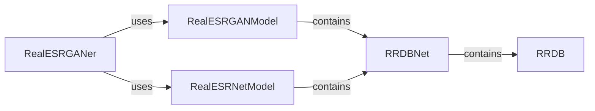

## Component Details

The RealESRGAN enhancer system focuses on enhancing image resolution and quality using deep learning models. The process begins with the RealESRGANer, which serves as the primary interface for image enhancement. It preprocesses the input image, feeds it to either the RealESRGANModel or RealESRNetModel (depending on the configuration), and then post-processes the enhanced output. The core of the enhancement lies within the RRDBNet architecture, which is composed of multiple RRDB blocks. These blocks perform feature extraction and refinement, ultimately leading to a higher-resolution and visually appealing image.

### RealESRGANer
The RealESRGANer class provides a high-level interface for enhancing images using Real-ESRGAN models. It encapsulates the model initialization, image preprocessing, enhancement, and post-processing steps, providing a simplified way to use the underlying models.
- **Related Classes/Methods**: `realesrgan/utils.py`

### RealESRGANModel
The RealESRGANModel class defines the Real-ESRGAN architecture. It handles the forward pass of the model and the loss calculation during training. It inherits from the basic PyTorch nn.Module and uses RRDBNet for feature extraction.
- **Related Classes/Methods**: `realesrgan/models/realesrgan_model.py`

### RealESRNetModel
The RealESRNetModel class defines the Real-ESRNet architecture. It handles the forward pass of the model. It inherits from the basic PyTorch nn.Module and uses RRDBNet for feature extraction.
- **Related Classes/Methods**: `realesrgan/models/realesrnet_model.py`

### RRDBNet
RRDBNet (Residual in Residual Dense Block) is a core component of RealESRGAN and RealESRNet models. It consists of multiple RRDB blocks stacked together to extract features from the input image. It's responsible for the primary feature extraction and upsampling within the models.
- **Related Classes/Methods**: `realesrgan/archs/rrdbnet_arch.py`

### RRDB
RRDB (Residual in Residual Dense Block) is a basic building block of RRDBNet. It contains multiple dense layers with residual connections to improve the information flow and training stability. It performs the fundamental feature transformation within the network.
- **Related Classes/Methods**: `realesrgan/archs/rrdbnet_arch.py`
