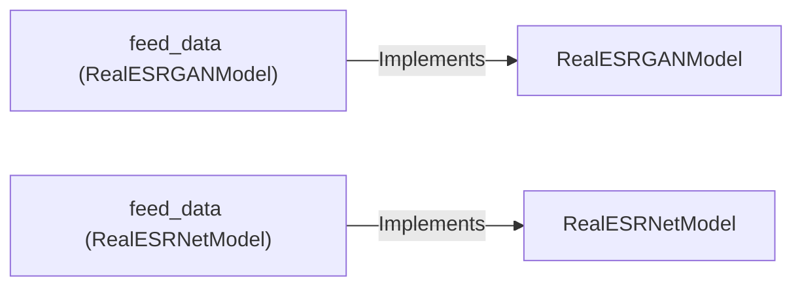

## Component Details

The RealESRGAN model enhances low-resolution images using deep learning. The process begins with feeding input data to either the RealESRGANModel or RealESRNetModel, where it undergoes preprocessing. The selected model then performs a forward pass, generating a high-resolution output. The core of this enhancement lies within the model architectures and the learned weights that transform the input data into a visually improved image.

### RealESRGANModel
This class implements the Real-ESRGAN model. It is responsible for defining the model architecture (SRVGGNetCompact), handling the forward pass that transforms the low-resolution input into a high-resolution output, and managing the model's internal state (weights, biases, etc.).
- **Related Classes/Methods**: `realesrgan/models/realesrgan_model.py`

### RealESRNetModel
This class implements the Real-ESRNet model, an alternative architecture for super-resolution. It contains network definition, training, and inference logic, potentially differing in the network structure and training strategies compared to RealESRGANModel.
- **Related Classes/Methods**: `realesrgan/models/realesrnet_model.py`

### feed_data (RealESRGANModel)
This method is responsible for receiving and preprocessing input data for the RealESRGAN model. It prepares the data for the forward pass through the network. This might involve normalization, channel manipulation, or other data-specific transformations.
- **Related Classes/Methods**: `realesrgan/models/realesrgan_model.py:RealESRGANModel:feed_data`

### feed_data (RealESRNetModel)
This method performs the same function as `feed_data` in RealESRGANModel, but specifically for the RealESRNet model. It handles the input data and prepares it for the forward pass of the RealESRNet network, potentially using different preprocessing steps than RealESRGANModel.
- **Related Classes/Methods**: `realesrgan/models/realesrnet_model.py:RealESRNetModel:feed_data`
