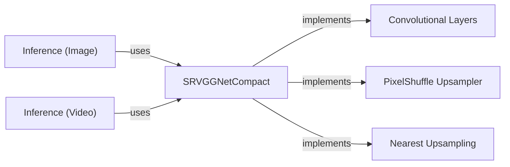

## Component Details

### SRVGGNetCompact
The SRVGGNetCompact model is a compact VGG-style network designed for image super-resolution. It employs a series of convolutional layers with ReLU activations to extract features from low-resolution input images. A pixel shuffle upsampler then increases the spatial resolution of the feature maps. The network learns the residual image, which is added to the nearest-neighbor upsampled input to produce the final high-resolution output. This architecture balances performance and computational efficiency, making it suitable for real-time image enhancement tasks.
- **Related Classes/Methods**: `realesrgan.archs.srvgg_arch.SRVGGNetCompact`

### Convolutional Layers
The convolutional layers within SRVGGNetCompact form the core feature extraction component. These layers apply convolutional filters to the input image, capturing spatial patterns and textures. The number of layers and the number of feature channels in each layer are configurable, allowing the network to adapt to different image characteristics and upscaling factors. ReLU activation functions introduce non-linearity, enabling the network to learn complex relationships between pixels.
- **Related Classes/Methods**: `realesrgan.archs.srvgg_arch.SRVGGNetCompact`

### PixelShuffle Upsampler
The PixelShuffle layer is responsible for increasing the spatial resolution of the feature maps generated by the convolutional layers. It rearranges the channels of the feature map into spatial dimensions, effectively upsampling the image. This technique allows the network to learn how to generate high-resolution details from low-resolution features, without relying on traditional interpolation methods.
- **Related Classes/Methods**: `realesrgan.archs.srvgg_arch.SRVGGNetCompact`

### Nearest Upsampling
Nearest Neighbor Upsampling is used to scale the low-resolution input image to the desired output size. This upsampled image serves as a base upon which the residual learned by the SRVGGNetCompact model is added. This helps to stabilize the training process and improve the overall quality of the enhanced image.
- **Related Classes/Methods**: `realesrgan.archs.srvgg_arch.SRVGGNetCompact`

### Inference (Image)
The main function in `inference_realesrgan.py` orchestrates the image upscaling process. It loads the SRVGGNetCompact model, preprocesses the input image, performs inference using the model, and saves the resulting high-resolution image. This component demonstrates how to use the SRVGGNetCompact model for single image enhancement.
- **Related Classes/Methods**: `repos.Real-ESRGAN.inference_realesrgan:main`

### Inference (Video)
The `inference_video` function in `inference_realesrgan_video.py` extends the image upscaling process to video files. It splits the video into individual frames, applies the SRVGGNetCompact model to each frame to enhance its resolution, and then reconstructs the enhanced video from the upscaled frames. This component showcases the application of SRVGGNetCompact for video enhancement.
- **Related Classes/Methods**: `repos.Real-ESRGAN.inference_realesrgan_video:inference_video`
