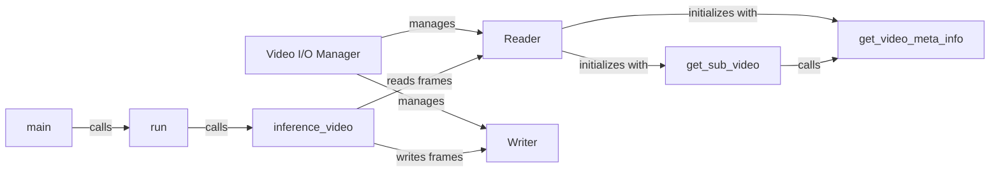

## Component Details

### Video I/O Manager
The Video I/O Manager is responsible for handling all video input and output operations. It encapsulates the functionalities for reading video frames from a source (using the Reader component) and writing enhanced video frames to an output file (using the Writer component). It also manages video metadata such as FPS and resolution, ensuring that the output video maintains the correct properties.
- **Related Classes/Methods**: `repos.Real-ESRGAN.inference_realesrgan_video.Reader`, `repos.Real-ESRGAN.inference_realesrgan_video.Writer`

### Reader
The Reader class handles video input. It initializes the video stream using OpenCV, retrieves video metadata (FPS, resolution, audio), and provides methods for reading individual frames from the video. It supports reading from video files or lists of images and also extracts audio from the video.
- **Related Classes/Methods**: `repos.Real-ESRGAN.inference_realesrgan_video.Reader`, `repos.Real-ESRGAN.inference_realesrgan_video.Reader.__init__`, `repos.Real-ESRGAN.inference_realesrgan_video.Reader.get_frame`, `repos.Real-ESRGAN.inference_realesrgan_video.Reader.get_frame_from_stream`, `repos.Real-ESRGAN.inference_realesrgan_video.Reader.get_frame_from_list`, `repos.Real-ESRGAN.inference_realesrgan_video.Reader.get_audio`, `repos.Real-ESRGAN.inference_realesrgan_video.Reader.get_resolution`, `repos.Real-ESRGAN.inference_realesrgan_video.Reader.get_fps`, `repos.Real-ESRGAN.inference_realesrgan_video.Reader.close`

### Writer
The Writer class handles video output. It initializes the video writer with the appropriate settings (codec, FPS, resolution) using OpenCV and provides a method for writing processed frames to the output video. It ensures that the output video is properly encoded and saved to disk.
- **Related Classes/Methods**: `repos.Real-ESRGAN.inference_realesrgan_video.Writer`, `repos.Real-ESRGAN.inference_realesrgan_video.Writer.write_frame`, `repos.Real-ESRGAN.inference_realesrgan_video.Writer.close`

### inference_video
This function performs the core video inference. It reads frames from the Reader, applies Real-ESRGAN to each frame, and writes the enhanced frames to the Writer. It orchestrates the entire video processing pipeline.
- **Related Classes/Methods**: `repos.Real-ESRGAN.inference_realesrgan_video.inference_video`

### run
This function sets up the arguments and calls the inference_video function. It parses command-line arguments, configures the Real-ESRGAN model, and prepares the input and output paths for video processing.
- **Related Classes/Methods**: `repos.Real-ESRGAN.inference_realesrgan_video.run`

### main
This is the main entry point of the script. It calls the run function to start the video inference process. It's the starting point of the application.
- **Related Classes/Methods**: `repos.Real-ESRGAN.inference_realesrgan_video.main`

### get_sub_video
This function extracts a sub-video from a larger video based on specified start and end times. It is used to process only a portion of the video if needed.
- **Related Classes/Methods**: `repos.Real-ESRGAN.inference_realesrgan_video.get_sub_video`

### get_video_meta_info
This function retrieves metadata information from a video file, such as frame count, FPS, and resolution. It uses OpenCV to extract the video properties.
- **Related Classes/Methods**: `repos.Real-ESRGAN.inference_realesrgan_video.get_video_meta_info`
