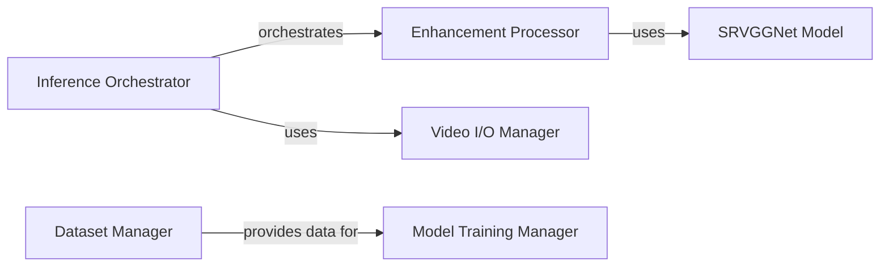

## Component Details

### Inference Orchestrator
This component manages the entire image and video enhancement pipeline. It handles loading the appropriate models, pre-processing input data, delegating the actual enhancement to the Enhancement Processor, and managing the output of the enhanced results. It also coordinates video input and output through the Video I/O Handler.
- **Related Classes/Methods**: `repos.Real-ESRGAN.inference_realesrgan`, `repos.Real-ESRGAN.inference_realesrgan_video`

### Enhancement Processor
This component is the core image enhancement engine. It encapsulates the pre-processing, tile-based processing, enhancement using the SRVGGNetCompact model, and post-processing steps. It provides a high-level interface for enhancing images, abstracting away the complexities of the underlying model and tiling mechanisms.
- **Related Classes/Methods**: `realesrgan.utils.RealESRGANer`

### SRVGGNet Model
This component represents the SRVGGNetCompact neural network architecture, which is the core model used for image enhancement. It takes low-resolution images as input and outputs high-resolution enhanced images. It is the primary model used by the Enhancement Processor.
- **Related Classes/Methods**: `realesrgan.archs.srvgg_arch.SRVGGNetCompact`

### Video I/O Manager
This component handles all video input and output operations. It provides functionalities for reading video frames from a source and writing enhanced video frames to an output file. It also manages video metadata such as FPS and resolution.
- **Related Classes/Methods**: `repos.Real-ESRGAN.inference_realesrgan_video.Reader`, `repos.Real-ESRGAN.inference_realesrgan_video.Writer`

### Dataset Manager
This component manages the datasets used for training the Real-ESRGAN models. It handles loading, pre-processing, and providing training image pairs to the model training components.
- **Related Classes/Methods**: `realesrgan.data.realesrgan_dataset.RealESRGANDataset`

### Model Training Manager
This component encapsulates the training and evaluation processes for the Real-ESRGAN and RealESRNet models. It includes the network architecture, loss functions, optimization methods, and provides methods for training and evaluating the models.
- **Related Classes/Methods**: `realesrgan.models.realesrgan_model.RealESRGANModel`, `realesrgan.models.realesrnet_model.RealESRNetModel`